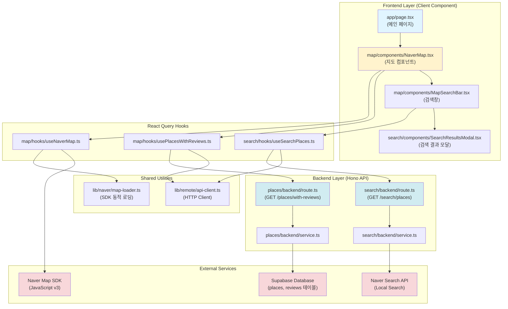

# 메인 페이지 구현 계획서

## 개요

본 문서는 맛집 리뷰 플랫폼의 메인 페이지 구현을 위한 모듈화 설계 및 구현 계획입니다.

### 관련 유스케이스
- UC-001: 메인 페이지 로딩 및 지도 표시
- UC-002: 장소 검색 및 선택

### 목표
- 네이버 지도 SDK를 통한 지도 표시
- 리뷰가 있는 장소에 마커 표시
- 장소 검색 기능
- 검색 결과 선택 및 지도 이동
- 마커 클릭 시 장소 세부정보 페이지 이동

---

## 모듈 구조

### 1. 백엔드 모듈 (Backend API)

#### 1.1 장소 조회 API (`src/features/places/`)
- **위치**: `src/features/places/backend/`
- **설명**: 리뷰가 있는 장소 목록을 조회하는 API

**파일 구조**:
```
src/features/places/
├── backend/
│   ├── route.ts       # Hono 라우터 (GET /places/with-reviews)
│   ├── service.ts     # Supabase 쿼리 로직
│   ├── schema.ts      # 요청/응답 zod 스키마
│   └── error.ts       # 에러 코드 정의
├── lib/
│   └── dto.ts         # 프론트엔드용 DTO 재노출
```

**API 엔드포인트**:
- `GET /api/places/with-reviews`: 리뷰가 있는 모든 장소 반환

#### 1.2 네이버 검색 API 프록시 (`src/features/search/`)
- **위치**: `src/features/search/backend/`
- **설명**: 네이버 Local Search API를 프록시하여 장소 검색 결과 제공

**파일 구조**:
```
src/features/search/
├── backend/
│   ├── route.ts       # Hono 라우터 (GET /search/places)
│   ├── service.ts     # 네이버 API 호출 로직
│   ├── schema.ts      # 요청/응답 zod 스키마
│   └── error.ts       # 에러 코드 정의
├── lib/
│   └── dto.ts         # 프론트엔드용 DTO 재노출
```

**API 엔드포인트**:
- `GET /api/search/places?query={검색어}`: 네이버 API를 통한 장소 검색

---

### 2. 프론트엔드 모듈 (Frontend Components & Hooks)

#### 2.1 지도 컴포넌트 (`src/features/map/`)
- **위치**: `src/features/map/components/`
- **설명**: 네이버 지도 SDK를 통합하고 마커를 관리하는 컴포넌트

**파일 구조**:
```
src/features/map/
├── components/
│   ├── NaverMap.tsx              # 지도 메인 컴포넌트
│   ├── MapMarker.tsx             # 마커 컴포넌트 (선택사항, 추상화 필요 시)
│   └── MapSearchBar.tsx          # 지도 상단 검색창 컴포넌트
├── hooks/
│   ├── useNaverMap.ts            # 네이버 지도 SDK 초기화 훅
│   ├── usePlacesWithReviews.ts  # 리뷰 있는 장소 목록 조회 훅
│   └── useMapMarkers.ts          # 마커 생성 및 관리 훅
├── lib/
│   ├── naver-map-sdk.ts          # 네이버 지도 SDK 로딩 유틸리티
│   └── marker-utils.ts           # 마커 생성 유틸리티 함수
└── types.ts                       # 지도 관련 타입 정의
```

**컴포넌트 설명**:
- `NaverMap.tsx`:
  - 지도 컨테이너 렌더링
  - 네이버 지도 SDK 초기화
  - 마커 표시 및 클릭 이벤트 처리

- `MapSearchBar.tsx`:
  - 검색창 UI
  - 검색 입력 처리
  - 검색 결과 팝업 트리거

#### 2.2 검색 기능 (`src/features/search/`)
- **위치**: `src/features/search/components/`
- **설명**: 장소 검색 UI 및 결과 표시

**파일 구조**:
```
src/features/search/
├── components/
│   ├── SearchResultsModal.tsx   # 검색 결과 모달
│   └── SearchResultItem.tsx     # 검색 결과 개별 항목
├── hooks/
│   └── useSearchPlaces.ts       # 장소 검색 React Query 훅
└── types.ts                      # 검색 관련 타입
```

**컴포넌트 설명**:
- `SearchResultsModal.tsx`:
  - 검색 결과 목록 표시
  - 장소 선택 이벤트 처리
  - 로딩 상태 및 에러 처리

- `SearchResultItem.tsx`:
  - 장소명, 주소, 카테고리 표시
  - 클릭 시 선택 이벤트 발생

---

### 3. 공통 모듈 (Shared Modules)

#### 3.1 네이버 지도 SDK 통합 (`src/lib/naver/`)
- **위치**: `src/lib/naver/`
- **설명**: 네이버 지도 및 검색 API 공통 유틸리티

**파일 구조**:
```
src/lib/naver/
├── map-loader.ts       # 네이버 지도 SDK 동적 로딩
├── map-types.ts        # 네이버 지도 타입 정의 (window.naver 등)
└── api-config.ts       # 네이버 API 설정 (Client ID 등)
```

#### 3.2 장소 공통 타입 (`src/types/`)
- **위치**: `src/types/place.ts`
- **설명**: 장소 관련 공통 타입 정의

**파일 구조**:
```
src/types/
└── place.ts            # Place, Location, Marker 등 공통 타입
```

---

## 모듈 간 관계 (Mermaid Diagram)



---

## Implementation Plan

### Phase 1: 백엔드 API 구현

#### 1.1 장소 조회 API (`/api/places/with-reviews`)

**파일**: `src/features/places/backend/schema.ts`
```typescript
import { z } from 'zod';

// 데이터베이스 테이블 스키마
export const PlaceRowSchema = z.object({
  id: z.number(),
  naver_place_id: z.string(),
  name: z.string(),
  address: z.string(),
  latitude: z.number(),
  longitude: z.number(),
  category: z.string().nullable(),
  review_count: z.number(),
});

// API 응답 스키마
export const PlacesWithReviewsResponseSchema = z.object({
  places: z.array(PlaceRowSchema),
});

export type PlaceRow = z.infer<typeof PlaceRowSchema>;
export type PlacesWithReviewsResponse = z.infer<typeof PlacesWithReviewsResponseSchema>;
```

**파일**: `src/features/places/backend/error.ts`
```typescript
export const placesErrorCodes = {
  fetchError: 'PLACES_FETCH_ERROR',
  validationError: 'PLACES_VALIDATION_ERROR',
} as const;

export type PlacesServiceError = typeof placesErrorCodes[keyof typeof placesErrorCodes];
```

**파일**: `src/features/places/backend/service.ts`
```typescript
import type { SupabaseClient } from '@supabase/supabase-js';
import { failure, success, type HandlerResult } from '@/backend/http/response';
import { PlaceRowSchema, type PlacesWithReviewsResponse } from './schema';
import { placesErrorCodes, type PlacesServiceError } from './error';

export const getPlacesWithReviews = async (
  client: SupabaseClient
): Promise<HandlerResult<PlacesWithReviewsResponse, PlacesServiceError, unknown>> => {
  const { data, error } = await client.rpc('get_places_with_reviews');

  if (error) {
    return failure(500, placesErrorCodes.fetchError, error.message);
  }

  // 각 행 검증
  const validatedPlaces = [];
  for (const row of data ?? []) {
    const parsed = PlaceRowSchema.safeParse(row);
    if (!parsed.success) {
      return failure(
        500,
        placesErrorCodes.validationError,
        'Place row validation failed',
        parsed.error.format()
      );
    }
    validatedPlaces.push(parsed.data);
  }

  return success({ places: validatedPlaces });
};
```

**파일**: `src/features/places/backend/route.ts`
```typescript
import type { Hono } from 'hono';
import { respond } from '@/backend/http/response';
import { getSupabase, getLogger, type AppEnv } from '@/backend/hono/context';
import { getPlacesWithReviews } from './service';

export const registerPlacesRoutes = (app: Hono<AppEnv>) => {
  app.get('/places/with-reviews', async (c) => {
    const supabase = getSupabase(c);
    const logger = getLogger(c);

    const result = await getPlacesWithReviews(supabase);

    if (!result.ok) {
      logger.error('Failed to fetch places with reviews', result.error);
    }

    return respond(c, result);
  });
};
```

**파일**: `src/features/places/lib/dto.ts`
```typescript
export {
  PlacesWithReviewsResponseSchema,
  type PlacesWithReviewsResponse,
  type PlaceRow,
} from '../backend/schema';
```

**Unit Test**:
```typescript
// src/features/places/backend/service.test.ts
describe('getPlacesWithReviews', () => {
  it('should return places with reviews', async () => {
    // Mock Supabase client
    const mockClient = {
      rpc: jest.fn().mockResolvedValue({
        data: [
          {
            id: 1,
            naver_place_id: '12345',
            name: '맛있는 식당',
            address: '서울시 강남구',
            latitude: 37.5,
            longitude: 127.0,
            category: '한식',
            review_count: 5,
          },
        ],
        error: null,
      }),
    };

    const result = await getPlacesWithReviews(mockClient as any);

    expect(result.ok).toBe(true);
    if (result.ok) {
      expect(result.data.places).toHaveLength(1);
      expect(result.data.places[0].name).toBe('맛있는 식당');
    }
  });

  it('should handle database error', async () => {
    const mockClient = {
      rpc: jest.fn().mockResolvedValue({
        data: null,
        error: { message: 'Database connection failed' },
      }),
    };

    const result = await getPlacesWithReviews(mockClient as any);

    expect(result.ok).toBe(false);
    if (!result.ok) {
      expect(result.error.code).toBe('PLACES_FETCH_ERROR');
    }
  });
});
```

#### 1.2 네이버 검색 API 프록시 (`/api/search/places`)

**파일**: `src/features/search/backend/schema.ts`
```typescript
import { z } from 'zod';

// 요청 스키마
export const SearchPlacesQuerySchema = z.object({
  query: z.string().min(1, 'Search query is required'),
});

// 네이버 API 응답 항목 스키마
export const NaverSearchItemSchema = z.object({
  title: z.string(),
  address: z.string(),
  category: z.string(),
  mapx: z.string(),
  mapy: z.string(),
  link: z.string(),
});

// 변환된 응답 스키마
export const SearchPlaceItemSchema = z.object({
  title: z.string(),
  address: z.string(),
  category: z.string(),
  latitude: z.number(),
  longitude: z.number(),
  naver_place_id: z.string(),
});

export const SearchPlacesResponseSchema = z.object({
  items: z.array(SearchPlaceItemSchema),
});

export type SearchPlacesQuery = z.infer<typeof SearchPlacesQuerySchema>;
export type SearchPlaceItem = z.infer<typeof SearchPlaceItemSchema>;
export type SearchPlacesResponse = z.infer<typeof SearchPlacesResponseSchema>;
```

**파일**: `src/features/search/backend/error.ts`
```typescript
export const searchErrorCodes = {
  naverApiFailed: 'NAVER_API_FAILED',
  rateLimitExceeded: 'RATE_LIMIT_EXCEEDED',
  validationError: 'SEARCH_VALIDATION_ERROR',
} as const;

export type SearchServiceError = typeof searchErrorCodes[keyof typeof searchErrorCodes];
```

**파일**: `src/features/search/backend/service.ts`
```typescript
import axios from 'axios';
import { failure, success, type HandlerResult } from '@/backend/http/response';
import {
  NaverSearchItemSchema,
  type SearchPlacesResponse,
  type SearchPlacesQuery,
} from './schema';
import { searchErrorCodes, type SearchServiceError } from './error';

// 좌표 변환 (네이버 카텍 좌표 -> 위경도)
const convertCoordinates = (mapx: string, mapy: string) => {
  const x = parseFloat(mapx);
  const y = parseFloat(mapy);
  return {
    longitude: x / 10000000,
    latitude: y / 10000000,
  };
};

// Place ID 추출 (link 필드에서)
const extractPlaceId = (link: string): string => {
  const match = link.match(/place\/(\d+)/);
  return match ? match[1] : `${link}_fallback`;
};

// HTML 태그 제거
const stripHtml = (text: string): string => {
  return text.replace(/<[^>]*>/g, '');
};

export const searchPlaces = async (
  query: SearchPlacesQuery,
  clientId: string,
  clientSecret: string
): Promise<HandlerResult<SearchPlacesResponse, SearchServiceError, unknown>> => {
  try {
    const response = await axios.get(
      'https://openapi.naver.com/v1/search/local.json',
      {
        params: {
          query: query.query,
          display: 5,
        },
        headers: {
          'X-Naver-Client-Id': clientId,
          'X-Naver-Client-Secret': clientSecret,
        },
        timeout: 5000,
      }
    );

    const { items } = response.data;

    const transformedItems = [];
    for (const item of items ?? []) {
      const parsed = NaverSearchItemSchema.safeParse(item);
      if (!parsed.success) {
        continue; // 유효하지 않은 항목은 건너뜀
      }

      const { latitude, longitude } = convertCoordinates(
        parsed.data.mapx,
        parsed.data.mapy
      );

      // 좌표가 유효한지 확인
      if (latitude === 0 || longitude === 0) {
        continue;
      }

      transformedItems.push({
        title: stripHtml(parsed.data.title),
        address: stripHtml(parsed.data.address),
        category: parsed.data.category,
        latitude,
        longitude,
        naver_place_id: extractPlaceId(parsed.data.link),
      });
    }

    return success({ items: transformedItems });
  } catch (error) {
    if (axios.isAxiosError(error)) {
      if (error.response?.status === 429) {
        return failure(
          429,
          searchErrorCodes.rateLimitExceeded,
          'Rate limit exceeded'
        );
      }
      return failure(
        502,
        searchErrorCodes.naverApiFailed,
        error.message
      );
    }
    return failure(
      500,
      searchErrorCodes.naverApiFailed,
      'Unknown error occurred'
    );
  }
};
```

**파일**: `src/features/search/backend/route.ts`
```typescript
import type { Hono } from 'hono';
import { respond, failure } from '@/backend/http/response';
import { getLogger, getConfig, type AppEnv } from '@/backend/hono/context';
import { SearchPlacesQuerySchema } from './schema';
import { searchPlaces } from './service';

export const registerSearchRoutes = (app: Hono<AppEnv>) => {
  app.get('/search/places', async (c) => {
    const logger = getLogger(c);
    const config = getConfig(c);

    const parsedQuery = SearchPlacesQuerySchema.safeParse({
      query: c.req.query('query'),
    });

    if (!parsedQuery.success) {
      return respond(
        c,
        failure(
          400,
          'INVALID_SEARCH_QUERY',
          'Search query is required',
          parsedQuery.error.format()
        )
      );
    }

    // 네이버 API 키는 환경 변수에서 가져옴
    if (!config.naver?.search) {
      logger.error('Naver API credentials not configured');
      return respond(
        c,
        failure(500, 'CONFIG_ERROR', 'API credentials not configured')
      );
    }

    const { clientId, clientSecret } = config.naver.search;

    const result = await searchPlaces(parsedQuery.data, clientId, clientSecret);

    if (!result.ok) {
      logger.error('Search places failed', result.error);
    }

    return respond(c, result);
  });
};
```

**파일**: `src/features/search/lib/dto.ts`
```typescript
export {
  SearchPlacesResponseSchema,
  type SearchPlacesResponse,
  type SearchPlaceItem,
} from '../backend/schema';
```

**Unit Test**:
```typescript
// src/features/search/backend/service.test.ts
describe('searchPlaces', () => {
  it('should transform naver API response correctly', async () => {
    // Mock axios
    jest.spyOn(axios, 'get').mockResolvedValue({
      data: {
        items: [
          {
            title: '<b>맛있는</b> 식당',
            address: '서울시 강남구',
            category: '한식>육류,고기요리',
            mapx: '1270000000',
            mapy: '375000000',
            link: 'https://map.naver.com/v5/entry/place/1234567890',
          },
        ],
      },
    });

    const result = await searchPlaces(
      { query: '맛집' },
      'test_id',
      'test_secret'
    );

    expect(result.ok).toBe(true);
    if (result.ok) {
      expect(result.data.items).toHaveLength(1);
      expect(result.data.items[0].title).toBe('맛있는 식당');
      expect(result.data.items[0].naver_place_id).toBe('1234567890');
    }
  });
});
```

### Phase 2: 프론트엔드 구현

#### 2.1 네이버 지도 SDK 로더

**파일**: `src/lib/naver/map-loader.ts`
```typescript
// 네이버 지도 SDK 동적 로딩
let isMapSdkLoaded = false;
let isMapSdkLoading = false;
let loadPromise: Promise<void> | null = null;

export const loadNaverMapSdk = (): Promise<void> => {
  // 이미 로드됨
  if (isMapSdkLoaded) {
    return Promise.resolve();
  }

  // 로딩 중
  if (isMapSdkLoading && loadPromise) {
    return loadPromise;
  }

  isMapSdkLoading = true;

  loadPromise = new Promise((resolve, reject) => {
    const script = document.createElement('script');
    script.type = 'text/javascript';
    script.src = `https://oapi.map.naver.com/openapi/v3/maps.js?ncpKeyId=${process.env.NEXT_PUBLIC_NAVER_MAP_CLIENT_ID}`;
    script.async = true;

    script.onload = () => {
      isMapSdkLoaded = true;
      isMapSdkLoading = false;
      resolve();
    };

    script.onerror = () => {
      isMapSdkLoading = false;
      loadPromise = null;
      reject(new Error('Failed to load Naver Map SDK'));
    };

    document.head.appendChild(script);
  });

  return loadPromise;
};

// 인증 실패 핸들러 설정
export const setMapAuthFailureHandler = (handler?: (errorCode?: number) => void) => {
  (window as any).navermap_authFailure = (error?: any) => {
    // 네이버 지도 SDK는 에러 객체를 전달하지 않으므로 콘솔에 로그만 남김
    console.error('네이버 지도 인증 실패');

    if (handler) {
      handler(error?.code);
    } else {
      // 기본 처리 - 사용자 친화적 메시지
      alert(
        '지도를 불러올 수 없습니다.\n\n' +
        '가능한 원인:\n' +
        '1. 클라이언트 ID가 올바르지 않습니다\n' +
        '2. 웹 서비스 URL이 등록되지 않았습니다\n' +
        '   (네이버 클라우드 플랫폼 콘솔에서 http://localhost 등록 필요)\n' +
        '3. Dynamic Map API가 선택되지 않았습니다\n' +
        '4. 일일 호출 한도를 초과했습니다\n\n' +
        '네이버 클라우드 플랫폼 콘솔에서 설정을 확인해주세요.'
      );
    }
  };
};
```

**파일**: `src/lib/naver/map-types.ts`
```typescript
// 네이버 지도 SDK 타입 정의
export interface NaverMap {
  setCenter(latLng: NaverLatLng): void;
  setZoom(level: number, animate?: boolean): void;
  // ... 필요한 메서드 추가
}

export interface NaverLatLng {
  lat(): number;
  lng(): number;
}

export interface NaverMarker {
  setMap(map: NaverMap | null): void;
  setPosition(latLng: NaverLatLng): void;
  // ... 필요한 메서드 추가
}

declare global {
  interface Window {
    naver: {
      maps: {
        Map: new (element: HTMLElement, options: any) => NaverMap;
        LatLng: new (lat: number, lng: number) => NaverLatLng;
        Marker: new (options: any) => NaverMarker;
        // ... 필요한 타입 추가
      };
    };
    navermap_authFailure?: () => void;
  }
}

export {};
```

#### 2.2 지도 컴포넌트

**파일**: `src/features/map/hooks/useNaverMap.ts`
```typescript
'use client';

import { useEffect, useRef, useState } from 'react';
import { loadNaverMapSdk, setMapAuthFailureHandler } from '@/lib/naver/map-loader';
import type { NaverMap } from '@/lib/naver/map-types';

interface UseNaverMapOptions {
  center?: { lat: number; lng: number };
  zoom?: number;
  onAuthFailed?: () => void;
}

export const useNaverMap = (options: UseNaverMapOptions = {}) => {
  const mapRef = useRef<HTMLDivElement>(null);
  const [map, setMap] = useState<NaverMap | null>(null);
  const [isLoading, setIsLoading] = useState(true);
  const [error, setError] = useState<string | null>(null);

  const {
    center = { lat: 37.5665, lng: 126.978 },
    zoom = 13,
    onAuthFailed,
  } = options;

  useEffect(() => {
    const initMap = async () => {
      try {
        // 인증 실패 핸들러 설정
        if (onAuthFailed) {
          setMapAuthFailureHandler(onAuthFailed);
        }

        // SDK 로드
        await loadNaverMapSdk();

        // 지도 생성
        if (mapRef.current) {
          const mapInstance = new window.naver.maps.Map(mapRef.current, {
            center: new window.naver.maps.LatLng(center.lat, center.lng),
            zoom,
          });

          setMap(mapInstance);
          setIsLoading(false);
        }
      } catch (err) {
        setError(err instanceof Error ? err.message : 'Failed to load map');
        setIsLoading(false);
      }
    };

    initMap();
  }, []); // 최초 1회만 실행

  return { mapRef, map, isLoading, error };
};
```

**파일**: `src/features/map/hooks/usePlacesWithReviews.ts`
```typescript
'use client';

import { useQuery } from '@tanstack/react-query';
import { apiClient } from '@/lib/remote/api-client';
import { PlacesWithReviewsResponseSchema } from '@/features/places/lib/dto';

export const usePlacesWithReviews = () => {
  return useQuery({
    queryKey: ['places', 'with-reviews'],
    queryFn: async () => {
      const response = await apiClient.get('/api/places/with-reviews');
      const parsed = PlacesWithReviewsResponseSchema.safeParse(response.data);

      if (!parsed.success) {
        throw new Error('Invalid response format');
      }

      return parsed.data;
    },
    retry: 3,
    staleTime: 5 * 60 * 1000, // 5분
  });
};
```

**파일**: `src/features/map/hooks/useMapMarkers.ts`
```typescript
'use client';

import { useEffect, useState } from 'react';
import type { NaverMap, NaverMarker } from '@/lib/naver/map-types';
import type { PlaceRow } from '@/features/places/lib/dto';

interface UseMapMarkersOptions {
  map: NaverMap | null;
  places: PlaceRow[];
  onMarkerClick?: (place: PlaceRow) => void;
}

export const useMapMarkers = (options: UseMapMarkersOptions) => {
  const { map, places, onMarkerClick } = options;
  const [markers, setMarkers] = useState<NaverMarker[]>([]);

  useEffect(() => {
    if (!map || !window.naver) return;

    // 기존 마커 제거
    markers.forEach((marker) => marker.setMap(null));

    // 새 마커 생성
    const newMarkers = places.map((place) => {
      const marker = new window.naver.maps.Marker({
        position: new window.naver.maps.LatLng(place.latitude, place.longitude),
        map,
        title: place.name,
      });

      // 마커 클릭 이벤트
      if (onMarkerClick) {
        window.naver.maps.Event.addListener(marker, 'click', () => {
          onMarkerClick(place);
        });
      }

      return marker;
    });

    setMarkers(newMarkers);

    // 클린업
    return () => {
      newMarkers.forEach((marker) => marker.setMap(null));
    };
  }, [map, places, onMarkerClick]);

  return { markers };
};
```

**파일**: `src/features/map/components/NaverMap.tsx`
```typescript
'use client';

import { useCallback } from 'react';
import { useRouter } from 'next/navigation';
import { useNaverMap } from '../hooks/useNaverMap';
import { usePlacesWithReviews } from '../hooks/usePlacesWithReviews';
import { useMapMarkers } from '../hooks/useMapMarkers';
import { MapSearchBar } from './MapSearchBar';
import type { PlaceRow } from '@/features/places/lib/dto';

export const NaverMap = () => {
  const router = useRouter();

  // 지도 초기화
  const { mapRef, map, isLoading: isMapLoading, error: mapError } = useNaverMap({
    onAuthFailed: () => {
      alert('지도를 불러올 수 없습니다. 관리자에게 문의하세요.');
    },
  });

  // 리뷰가 있는 장소 조회
  const {
    data: placesData,
    isLoading: isPlacesLoading,
    error: placesError,
  } = usePlacesWithReviews();

  // 마커 클릭 핸들러
  const handleMarkerClick = useCallback(
    (place: PlaceRow) => {
      router.push(`/places/${place.id}`);
    },
    [router]
  );

  // 마커 생성
  useMapMarkers({
    map,
    places: placesData?.places ?? [],
    onMarkerClick: handleMarkerClick,
  });

  // 로딩 상태
  if (isMapLoading) {
    return (
      <div className="flex h-screen items-center justify-center">
        <div className="text-lg">지도를 불러오는 중...</div>
      </div>
    );
  }

  // 에러 상태
  if (mapError) {
    return (
      <div className="flex h-screen items-center justify-center">
        <div className="text-red-600">
          지도 로딩 실패: {mapError}
          <button
            onClick={() => window.location.reload()}
            className="ml-4 rounded bg-blue-500 px-4 py-2 text-white"
          >
            다시 시도
          </button>
        </div>
      </div>
    );
  }

  return (
    <div className="relative h-screen w-full">
      {/* 지도 컨테이너 */}
      <div ref={mapRef} className="h-full w-full" />

      {/* 검색창 */}
      <MapSearchBar map={map} />

      {/* 리뷰 장소 로딩 에러 */}
      {placesError && (
        <div className="absolute bottom-4 left-4 rounded bg-red-100 p-4 text-red-700">
          리뷰 정보를 불러오는 데 실패했습니다.
        </div>
      )}
    </div>
  );
};
```

**파일**: `src/features/map/components/MapSearchBar.tsx`
```typescript
'use client';

import { useState } from 'react';
import { SearchResultsModal } from '@/features/search/components/SearchResultsModal';
import type { NaverMap } from '@/lib/naver/map-types';
import type { SearchPlaceItem } from '@/features/search/lib/dto';

interface MapSearchBarProps {
  map: NaverMap | null;
}

export const MapSearchBar = ({ map }: MapSearchBarProps) => {
  const [query, setQuery] = useState('');
  const [isModalOpen, setIsModalOpen] = useState(false);
  const [selectedPlace, setSelectedPlace] = useState<SearchPlaceItem | null>(null);

  const handleSearch = () => {
    if (query.trim()) {
      setIsModalOpen(true);
    }
  };

  const handlePlaceSelect = (place: SearchPlaceItem) => {
    setSelectedPlace(place);
    setIsModalOpen(false);

    // 지도 이동
    if (map && window.naver) {
      const position = new window.naver.maps.LatLng(place.latitude, place.longitude);
      map.setCenter(position);
      map.setZoom(16, true);

      // 강조 마커 생성 (추후 구현)
      // ...
    }
  };

  return (
    <>
      <div className="absolute left-1/2 top-4 z-10 w-full max-w-md -translate-x-1/2 rounded-lg bg-white/90 p-4 shadow-lg backdrop-blur">
        <div className="flex gap-2">
          <input
            type="text"
            value={query}
            onChange={(e) => setQuery(e.target.value)}
            onKeyDown={(e) => e.key === 'Enter' && handleSearch()}
            placeholder="맛집을 검색해보세요"
            className="flex-1 rounded border border-gray-300 px-4 py-2"
          />
          <button
            onClick={handleSearch}
            className="rounded bg-blue-500 px-6 py-2 text-white hover:bg-blue-600"
          >
            검색
          </button>
        </div>
      </div>

      <SearchResultsModal
        isOpen={isModalOpen}
        query={query}
        onClose={() => setIsModalOpen(false)}
        onPlaceSelect={handlePlaceSelect}
      />
    </>
  );
};
```

#### 2.3 검색 결과 모달

**파일**: `src/features/search/hooks/useSearchPlaces.ts`
```typescript
'use client';

import { useQuery } from '@tanstack/react-query';
import { apiClient } from '@/lib/remote/api-client';
import { SearchPlacesResponseSchema } from '@/features/search/lib/dto';

export const useSearchPlaces = (query: string, enabled: boolean = true) => {
  return useQuery({
    queryKey: ['search', 'places', query],
    queryFn: async () => {
      const response = await apiClient.get('/api/search/places', {
        params: { query },
      });

      const parsed = SearchPlacesResponseSchema.safeParse(response.data);

      if (!parsed.success) {
        throw new Error('Invalid response format');
      }

      return parsed.data;
    },
    enabled: enabled && query.trim().length > 0,
    retry: 2,
    staleTime: 2 * 60 * 1000, // 2분
  });
};
```

**파일**: `src/features/search/components/SearchResultsModal.tsx`
```typescript
'use client';

import { useSearchPlaces } from '../hooks/useSearchPlaces';
import { SearchResultItem } from './SearchResultItem';
import type { SearchPlaceItem } from '../lib/dto';

interface SearchResultsModalProps {
  isOpen: boolean;
  query: string;
  onClose: () => void;
  onPlaceSelect: (place: SearchPlaceItem) => void;
}

export const SearchResultsModal = ({
  isOpen,
  query,
  onClose,
  onPlaceSelect,
}: SearchResultsModalProps) => {
  const { data, isLoading, error } = useSearchPlaces(query, isOpen);

  if (!isOpen) return null;

  return (
    <div
      className="fixed inset-0 z-50 flex items-center justify-center bg-black/50"
      onClick={onClose}
    >
      <div
        className="max-h-[80vh] w-full max-w-lg overflow-y-auto rounded-lg bg-white p-6"
        onClick={(e) => e.stopPropagation()}
      >
        <div className="mb-4 flex items-center justify-between">
          <h2 className="text-xl font-bold">검색 결과</h2>
          <button
            onClick={onClose}
            className="text-gray-500 hover:text-gray-700"
          >
            ✕
          </button>
        </div>

        {isLoading && <div className="text-center">검색 중...</div>}

        {error && (
          <div className="rounded bg-red-100 p-4 text-red-700">
            검색 서비스가 일시적으로 불가합니다. 잠시 후 다시 시도해주세요.
          </div>
        )}

        {data && data.items.length === 0 && (
          <div className="text-center text-gray-500">
            검색 결과가 없습니다.
          </div>
        )}

        {data && data.items.length > 0 && (
          <div className="space-y-2">
            {data.items.map((item, index) => (
              <SearchResultItem
                key={index}
                item={item}
                onClick={() => onPlaceSelect(item)}
              />
            ))}
          </div>
        )}
      </div>
    </div>
  );
};
```

**파일**: `src/features/search/components/SearchResultItem.tsx`
```typescript
'use client';

import type { SearchPlaceItem } from '../lib/dto';

interface SearchResultItemProps {
  item: SearchPlaceItem;
  onClick: () => void;
}

export const SearchResultItem = ({ item, onClick }: SearchResultItemProps) => {
  return (
    <button
      onClick={onClick}
      className="w-full rounded border border-gray-200 p-4 text-left hover:bg-gray-50"
    >
      <h3 className="font-bold text-gray-900">{item.title}</h3>
      <p className="text-sm text-gray-600">{item.address}</p>
      <p className="text-xs text-gray-400">{item.category}</p>
    </button>
  );
};
```

### Phase 3: 메인 페이지 통합

**파일**: `src/app/page.tsx` (수정)
```typescript
'use client';

import { NaverMap } from '@/features/map/components/NaverMap';

export default function Home() {
  return (
    <main className="h-screen w-full">
      <NaverMap />
    </main>
  );
}
```

### Phase 4: 환경 변수 및 사전 설정

#### 4.1 네이버 클라우드 플랫폼 설정 (지도 SDK)

**중요**: 네이버 지도 SDK를 사용하기 전에 반드시 다음 설정을 완료해야 합니다.

1. [네이버 클라우드 플랫폼 콘솔](https://www.ncloud.com/) 접속
2. **Application Services** → **Maps** → **내 Application** 선택
3. **웹 서비스 URL** 등록:
   - 로컬 개발: `http://localhost` (포트번호 제외)
   - 프로덕션: 실제 도메인 (예: `https://yourdomain.com`)
4. HTTP와 HTTPS 모두 등록 필요 시 각각 추가

⚠️ **주의사항**:
- 포트번호나 경로를 포함하면 인증 실패 (예: ❌ `http://localhost:3000/map`)
- 대표 도메인만 입력 (예: ✅ `http://localhost`)
- 미등록 시 **401 인증 오류** 발생

#### 4.2 네이버 개발자 센터 설정 (검색 API)

**네이버 검색 API**는 별도로 [네이버 개발자 센터](https://developers.naver.com)에서 발급받아야 합니다.

1. 네이버 개발자 센터 접속
2. **Application** → **애플리케이션 등록**
3. **사용 API**: "검색" 선택
4. Client ID, Client Secret 발급받기

⚠️ **주의**: 네이버 지도 SDK와 검색 API는 서로 다른 곳에서 발급받는 별도의 키입니다.

#### 4.3 환경 변수 설정

**파일**: `.env.local` (이미 설정됨)
```env
# 네이버 지도 API (클라이언트용) - 네이버 클라우드 플랫폼에서 발급
NEXT_PUBLIC_NAVER_MAP_CLIENT_ID=your_naver_map_client_id

# 네이버 검색 API (서버용) - 네이버 개발자 센터에서 발급
NAVER_SEARCH_CLIENT_ID=your_naver_search_client_id
NAVER_SEARCH_CLIENT_SECRET=your_naver_search_client_secret
```

⚠️ **주의**: 위 값들은 플레이스홀더입니다. 실제 값은 `.env.local` 파일에서 관리됩니다.

**파일**: `src/backend/config/index.ts` (수정)
```typescript
import { z } from 'zod';

const envSchema = z.object({
  SUPABASE_URL: z.string().url(),
  SUPABASE_SERVICE_ROLE_KEY: z.string(),
  NAVER_SEARCH_CLIENT_ID: z.string().optional(),
  NAVER_SEARCH_CLIENT_SECRET: z.string().optional(),
});

// ... 기존 코드에 추가
```

### Phase 5: Supabase SQL 함수 생성

**파일**: `supabase/migrations/YYYYMMDDHHMMSS_create_get_places_with_reviews_function.sql`
```sql
-- 리뷰가 있는 장소 목록 조회 함수
CREATE OR REPLACE FUNCTION get_places_with_reviews()
RETURNS TABLE (
  id INTEGER,
  naver_place_id VARCHAR(255),
  name VARCHAR(255),
  address TEXT,
  latitude NUMERIC(10, 7),
  longitude NUMERIC(10, 7),
  category VARCHAR(100),
  review_count BIGINT
) AS $$
BEGIN
  RETURN QUERY
  SELECT DISTINCT
    p.id,
    p.naver_place_id,
    p.name,
    p.address,
    p.latitude,
    p.longitude,
    p.category,
    COUNT(r.id) as review_count
  FROM places p
  INNER JOIN reviews r ON p.id = r.place_id
  GROUP BY p.id, p.naver_place_id, p.name, p.address, p.latitude, p.longitude, p.category
  ORDER BY review_count DESC;
END;
$$ LANGUAGE plpgsql;
```

### Phase 6: Hono 앱에 라우터 등록

**파일**: `src/backend/hono/app.ts` (수정)
```typescript
import { Hono } from 'hono';
import { errorBoundary } from '@/backend/middleware/error';
import { withAppContext } from '@/backend/middleware/context';
import { withSupabase } from '@/backend/middleware/supabase';
import { registerExampleRoutes } from '@/features/example/backend/route';
import { registerPlacesRoutes } from '@/features/places/backend/route';
import { registerSearchRoutes } from '@/features/search/backend/route';
import type { AppEnv } from '@/backend/hono/context';

let singletonApp: Hono<AppEnv> | null = null;

export const createHonoApp = () => {
  if (singletonApp) {
    return singletonApp;
  }

  const app = new Hono<AppEnv>();

  app.use('*', errorBoundary());
  app.use('*', withAppContext());
  app.use('*', withSupabase());

  registerExampleRoutes(app);
  registerPlacesRoutes(app);
  registerSearchRoutes(app);

  singletonApp = app;

  return app;
};
```

---

## Presentation Layer QA Sheet

### NaverMap 컴포넌트

**테스트 케이스 1: 지도 초기 로딩**
- **Given**: 사용자가 메인 페이지에 접속
- **When**: NaverMap 컴포넌트가 마운트됨
- **Then**:
  - 로딩 메시지가 표시됨
  - 네이버 지도 SDK가 로드됨
  - 지도가 서울 중심(37.5665, 126.978)에 줌 레벨 13으로 표시됨

**테스트 케이스 2: 리뷰 있는 장소 마커 표시**
- **Given**: 데이터베이스에 리뷰가 있는 장소 5개가 존재
- **When**: 지도가 로드됨
- **Then**:
  - 5개의 마커가 지도에 표시됨
  - 각 마커는 장소의 좌표에 정확히 위치함

**테스트 케이스 3: 마커 클릭**
- **Given**: 지도에 마커가 표시됨
- **When**: 사용자가 특정 마커를 클릭
- **Then**:
  - `/places/{place_id}` 경로로 라우팅됨
  - 장소 세부정보 페이지가 표시됨

**테스트 케이스 4: 지도 SDK 로딩 실패**
- **Given**: 네이버 지도 SDK 로딩이 실패함
- **When**: NaverMap 컴포넌트가 마운트됨
- **Then**:
  - 에러 메시지가 표시됨
  - "다시 시도" 버튼이 표시됨
  - 버튼 클릭 시 페이지가 새로고침됨

### MapSearchBar 컴포넌트

**테스트 케이스 5: 검색어 입력**
- **Given**: 사용자가 검색창을 포커스
- **When**: "강남역 맛집"을 입력하고 Enter 키를 누름
- **Then**:
  - 검색 결과 모달이 열림
  - 네이버 검색 API가 호출됨
  - 검색 결과가 모달에 표시됨

**테스트 케이스 6: 빈 검색어**
- **Given**: 사용자가 검색창을 포커스
- **When**: 빈 문자열 상태에서 검색 버튼을 클릭
- **Then**:
  - 아무 동작도 일어나지 않음
  - 모달이 열리지 않음

**테스트 케이스 7: 검색 결과 선택**
- **Given**: 검색 결과 모달에 5개의 장소가 표시됨
- **When**: 사용자가 첫 번째 장소를 클릭
- **Then**:
  - 모달이 닫힘
  - 지도가 선택된 장소로 이동 (줌 레벨 16)
  - 강조 마커가 표시됨 (향후 구현)

### SearchResultsModal 컴포넌트

**테스트 케이스 8: 검색 중 상태**
- **Given**: 사용자가 검색을 시작
- **When**: API 응답이 아직 도착하지 않음
- **Then**:
  - "검색 중..." 메시지가 표시됨
  - 로딩 인디케이터가 표시됨

**테스트 케이스 9: 검색 결과 없음**
- **Given**: 사용자가 존재하지 않는 장소를 검색
- **When**: API가 빈 배열을 반환
- **Then**:
  - "검색 결과가 없습니다" 메시지가 표시됨

**테스트 케이스 10: 검색 API 오류**
- **Given**: 네이버 검색 API가 장애 상태
- **When**: 검색 요청이 실패
- **Then**:
  - 에러 메시지가 표시됨
  - "검색 서비스가 일시적으로 불가합니다" 안내

**테스트 케이스 11: 모달 닫기**
- **Given**: 검색 결과 모달이 열려있음
- **When**: 사용자가 모달 바깥 영역을 클릭 또는 ✕ 버튼 클릭
- **Then**:
  - 모달이 닫힘
  - 메인 페이지 상태 유지

### 반응형 디자인

**테스트 케이스 12: 모바일 환경**
- **Given**: 사용자가 모바일 기기에서 접속 (화면 폭 < 768px)
- **When**: 메인 페이지가 로드됨
- **Then**:
  - 지도가 전체 화면을 차지함
  - 검색창이 상단 중앙에 고정됨
  - 검색창 크기가 화면에 맞게 조정됨

**테스트 케이스 13: 태블릿 환경**
- **Given**: 사용자가 태블릿 기기에서 접속 (768px ≤ 화면 폭 < 1024px)
- **When**: 메인 페이지가 로드됨
- **Then**:
  - 지도와 UI가 적절한 크기로 표시됨
  - 터치 인터랙션이 정상 작동함

---

## Business Logic Unit Tests

### places/backend/service.ts

```typescript
describe('getPlacesWithReviews', () => {
  let mockSupabaseClient: any;

  beforeEach(() => {
    mockSupabaseClient = {
      rpc: jest.fn(),
    };
  });

  it('should return places with reviews successfully', async () => {
    mockSupabaseClient.rpc.mockResolvedValue({
      data: [
        {
          id: 1,
          naver_place_id: '12345',
          name: '맛있는 식당',
          address: '서울시 강남구',
          latitude: 37.5,
          longitude: 127.0,
          category: '한식',
          review_count: 5,
        },
      ],
      error: null,
    });

    const result = await getPlacesWithReviews(mockSupabaseClient);

    expect(result.ok).toBe(true);
    if (result.ok) {
      expect(result.data.places).toHaveLength(1);
      expect(result.data.places[0].name).toBe('맛있는 식당');
      expect(result.data.places[0].review_count).toBe(5);
    }
  });

  it('should handle database error', async () => {
    mockSupabaseClient.rpc.mockResolvedValue({
      data: null,
      error: { message: 'Database connection failed' },
    });

    const result = await getPlacesWithReviews(mockSupabaseClient);

    expect(result.ok).toBe(false);
    if (!result.ok) {
      expect(result.error.code).toBe('PLACES_FETCH_ERROR');
      expect(result.status).toBe(500);
    }
  });

  it('should handle validation error for invalid data', async () => {
    mockSupabaseClient.rpc.mockResolvedValue({
      data: [
        {
          id: 'invalid', // 숫자가 아님
          naver_place_id: '12345',
          name: '맛있는 식당',
          address: '서울시 강남구',
          latitude: 37.5,
          longitude: 127.0,
          category: '한식',
          review_count: 5,
        },
      ],
      error: null,
    });

    const result = await getPlacesWithReviews(mockSupabaseClient);

    expect(result.ok).toBe(false);
    if (!result.ok) {
      expect(result.error.code).toBe('PLACES_VALIDATION_ERROR');
    }
  });

  it('should return empty array when no places with reviews', async () => {
    mockSupabaseClient.rpc.mockResolvedValue({
      data: [],
      error: null,
    });

    const result = await getPlacesWithReviews(mockSupabaseClient);

    expect(result.ok).toBe(true);
    if (result.ok) {
      expect(result.data.places).toHaveLength(0);
    }
  });
});
```

### search/backend/service.ts

```typescript
describe('searchPlaces', () => {
  beforeEach(() => {
    jest.clearAllMocks();
  });

  it('should transform naver API response correctly', async () => {
    const mockAxiosGet = jest.spyOn(axios, 'get').mockResolvedValue({
      data: {
        items: [
          {
            title: '<b>맛있는</b> 식당',
            address: '서울시 강남구',
            category: '한식>육류,고기요리',
            mapx: '1270000000',
            mapy: '375000000',
            link: 'https://map.naver.com/v5/entry/place/1234567890',
          },
        ],
      },
    });

    const result = await searchPlaces(
      { query: '맛집' },
      'test_client_id',
      'test_client_secret'
    );

    expect(mockAxiosGet).toHaveBeenCalledWith(
      'https://openapi.naver.com/v1/search/local.json',
      expect.objectContaining({
        params: { query: '맛집', display: 5 },
        headers: {
          'X-Naver-Client-Id': 'test_client_id',
          'X-Naver-Client-Secret': 'test_client_secret',
        },
      })
    );

    expect(result.ok).toBe(true);
    if (result.ok) {
      expect(result.data.items).toHaveLength(1);
      expect(result.data.items[0].title).toBe('맛있는 식당');
      expect(result.data.items[0].latitude).toBeCloseTo(37.5);
      expect(result.data.items[0].longitude).toBeCloseTo(127.0);
      expect(result.data.items[0].naver_place_id).toBe('1234567890');
    }
  });

  it('should filter out items with invalid coordinates', async () => {
    jest.spyOn(axios, 'get').mockResolvedValue({
      data: {
        items: [
          {
            title: '유효한 식당',
            address: '서울시 강남구',
            category: '한식',
            mapx: '1270000000',
            mapy: '375000000',
            link: 'https://map.naver.com/v5/entry/place/111',
          },
          {
            title: '무효한 식당',
            address: '서울시 강남구',
            category: '한식',
            mapx: '0',
            mapy: '0',
            link: 'https://map.naver.com/v5/entry/place/222',
          },
        ],
      },
    });

    const result = await searchPlaces(
      { query: '맛집' },
      'test_id',
      'test_secret'
    );

    expect(result.ok).toBe(true);
    if (result.ok) {
      expect(result.data.items).toHaveLength(1);
      expect(result.data.items[0].title).toBe('유효한 식당');
    }
  });

  it('should handle rate limit error', async () => {
    jest.spyOn(axios, 'get').mockRejectedValue({
      isAxiosError: true,
      response: { status: 429 },
    });

    const result = await searchPlaces(
      { query: '맛집' },
      'test_id',
      'test_secret'
    );

    expect(result.ok).toBe(false);
    if (!result.ok) {
      expect(result.status).toBe(429);
      expect(result.error.code).toBe('RATE_LIMIT_EXCEEDED');
    }
  });

  it('should handle API failure', async () => {
    jest.spyOn(axios, 'get').mockRejectedValue({
      isAxiosError: true,
      message: 'Network error',
    });

    const result = await searchPlaces(
      { query: '맛집' },
      'test_id',
      'test_secret'
    );

    expect(result.ok).toBe(false);
    if (!result.ok) {
      expect(result.status).toBe(502);
      expect(result.error.code).toBe('NAVER_API_FAILED');
    }
  });

  it('should strip HTML tags from title and address', async () => {
    jest.spyOn(axios, 'get').mockResolvedValue({
      data: {
        items: [
          {
            title: '<b>맛있는</b> <em>식당</em>',
            address: '<b>서울시</b> 강남구',
            category: '한식',
            mapx: '1270000000',
            mapy: '375000000',
            link: 'https://map.naver.com/v5/entry/place/123',
          },
        ],
      },
    });

    const result = await searchPlaces(
      { query: '맛집' },
      'test_id',
      'test_secret'
    );

    expect(result.ok).toBe(true);
    if (result.ok) {
      expect(result.data.items[0].title).toBe('맛있는 식당');
      expect(result.data.items[0].address).toBe('서울시 강남구');
    }
  });
});
```

### map/hooks/useNaverMap.test.ts

```typescript
import { renderHook, waitFor } from '@testing-library/react';
import { useNaverMap } from './useNaverMap';
import * as mapLoader from '@/lib/naver/map-loader';

jest.mock('@/lib/naver/map-loader');

describe('useNaverMap', () => {
  beforeEach(() => {
    (global as any).window.naver = {
      maps: {
        Map: jest.fn().mockImplementation(() => ({
          setCenter: jest.fn(),
          setZoom: jest.fn(),
        })),
        LatLng: jest.fn(),
      },
    };
  });

  afterEach(() => {
    delete (global as any).window.naver;
  });

  it('should load map SDK and initialize map', async () => {
    const loadSdkSpy = jest
      .spyOn(mapLoader, 'loadNaverMapSdk')
      .mockResolvedValue();

    const { result } = renderHook(() => useNaverMap());

    expect(result.current.isLoading).toBe(true);
    expect(result.current.map).toBeNull();

    await waitFor(() => {
      expect(result.current.isLoading).toBe(false);
    });

    expect(loadSdkSpy).toHaveBeenCalled();
    expect(result.current.map).not.toBeNull();
    expect(result.current.error).toBeNull();
  });

  it('should handle SDK loading failure', async () => {
    const loadSdkSpy = jest
      .spyOn(mapLoader, 'loadNaverMapSdk')
      .mockRejectedValue(new Error('Failed to load SDK'));

    const { result } = renderHook(() => useNaverMap());

    await waitFor(() => {
      expect(result.current.isLoading).toBe(false);
    });

    expect(result.current.map).toBeNull();
    expect(result.current.error).toBe('Failed to load SDK');
  });

  it('should call onAuthFailed when authentication fails', async () => {
    const onAuthFailed = jest.fn();
    const setAuthHandlerSpy = jest.spyOn(mapLoader, 'setMapAuthFailureHandler');

    renderHook(() => useNaverMap({ onAuthFailed }));

    expect(setAuthHandlerSpy).toHaveBeenCalledWith(onAuthFailed);
  });
});
```

---

## 추가 구현 사항 (Optional)

### 1. 강조 마커 (선택된 장소)
- 검색 결과 선택 시 다른 색상의 마커 표시
- 인포윈도우에 장소명, 주소 표시

### 2. 리뷰 작성 버튼
- 장소 선택 후 플로팅 액션 버튼(FAB) 표시
- 클릭 시 리뷰 작성 페이지로 이동

### 3. 로딩 상태 개선
- 스켈레톤 UI 추가
- 프로그레스 바 표시

### 4. 에러 처리 개선
- Toast 알림 사용
- 재시도 로직 구현

---

## 환경 변수 및 사전 설정 체크리스트

### 네이버 클라우드 플랫폼 (지도 SDK)
- [ ] 네이버 클라우드 플랫폼 가입 및 결제 수단 등록
- [ ] Application Services → Maps → Application 등록
- [ ] Web Dynamic Map API 선택
- [ ] 웹 서비스 URL 등록:
  - [ ] 로컬 개발: `http://localhost` 등록
  - [ ] 프로덕션: 실제 도메인 등록
- [x] `NEXT_PUBLIC_NAVER_MAP_CLIENT_ID` 발급 및 `.env.local`에 설정 완료

### 네이버 개발자 센터 (검색 API)
- [ ] 네이버 개발자 센터 가입
- [ ] 애플리케이션 등록
- [ ] 사용 API: "검색" 선택
- [x] `NAVER_SEARCH_CLIENT_ID` 발급 및 `.env.local`에 설정 완료
- [x] `NAVER_SEARCH_CLIENT_SECRET` 발급 및 `.env.local`에 설정 완료

### Supabase
- [ ] `get_places_with_reviews()` SQL 함수 생성
- [ ] 마이그레이션 적용 확인

### 환경 변수 파일
- [x] `.env.local` 파일에 모든 키 설정 완료
- [ ] `.env.example` 파일 업데이트 (실제 값 제외)
- [ ] `.gitignore`에 `.env.local` 추가 확인

### Backend Config
- [ ] `src/backend/config/index.ts`에 `NAVER_SEARCH_CLIENT_ID`, `NAVER_SEARCH_CLIENT_SECRET` 추가

---

## 구현 순서 요약

1. **Backend API 구현** (places, search 라우터)
2. **Supabase SQL 함수 생성**
3. **네이버 지도 SDK 로더 구현**
4. **지도 컴포넌트 및 훅 구현**
5. **검색 컴포넌트 및 훅 구현**
6. **메인 페이지 통합**
7. **환경 변수 설정**
8. **Hono 앱에 라우터 등록**
9. **테스트 작성 및 실행**
10. **QA 및 버그 수정**

---

## 참고 문서

- `/docs/prd.md`: 프로젝트 요구사항 정의서
- `/docs/userflow.md`: 사용자 플로우 (플로우 1, 2, 3)
- `/docs/database.md`: 데이터베이스 스키마 (places, reviews 테이블)
- `/docs/map_sdk.md`: 네이버 지도 SDK 연동 가이드
- `/docs/searchAPI.md`: 네이버 검색 API 연동 가이드
- `/docs/usecases/001/spec.md`: UC-001 상세 명세
- `/docs/usecases/002/spec.md`: UC-002 상세 명세

---

## 주의사항

1. **모든 컴포넌트는 "use client" 지시어 사용**
2. **API 호출은 @/lib/remote/api-client 사용**
3. **zod 스키마로 모든 데이터 검증**
4. **success/failure 패턴 준수**
5. **에러 핸들링 철저히**
6. **환경 변수 절대 하드코딩 금지**
   - 네이버 지도 SDK: `NEXT_PUBLIC_NAVER_MAP_CLIENT_ID`
   - 네이버 검색 API: `NAVER_SEARCH_CLIENT_ID`, `NAVER_SEARCH_CLIENT_SECRET`
7. **TypeScript strict 모드 준수**
8. **ESLint 규칙 준수**
9. **네이버 클라우드 플랫폼 콘솔에서 웹 서비스 URL(`http://localhost`) 반드시 등록**
