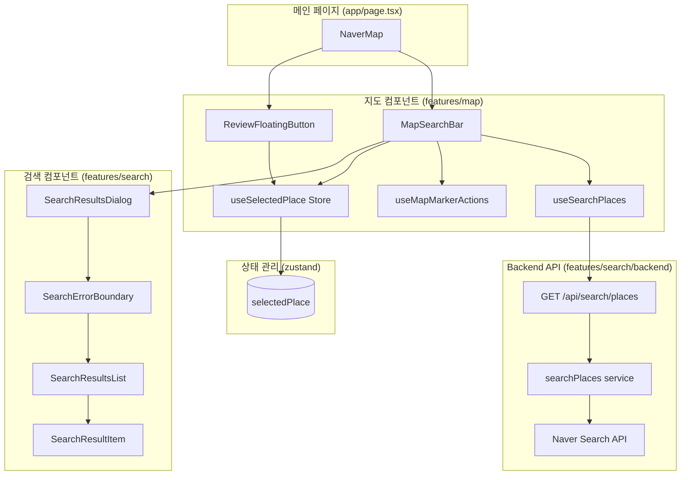
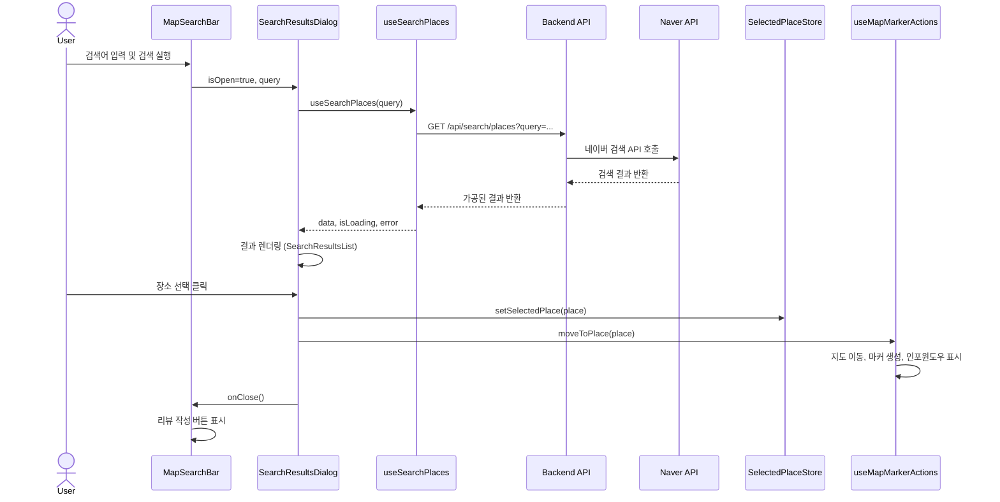

# 검색 결과 팝업 페이지 구현 계획

## 1. 개요

### 1.1 목적
메인 페이지에서 장소 검색 시 표시되는 검색 결과 팝업의 기능을 개선하고, 사용자 경험을 향상시킨다.

### 1.2 현재 상태 분석

**이미 구현된 기능:**
- 네이버 검색 API 연동 (`/api/search/places`)
- 기본 검색 결과 모달 (`SearchResultsModal`)
- 검색 결과 항목 컴포넌트 (`SearchResultItem`)
- 검색창 컴포넌트 (`MapSearchBar`)
- React Query를 사용한 검색 훅 (`useSearchPlaces`)

**개선 필요 사항:**
1. SearchResultsModal을 shadcn-ui Dialog/Sheet로 교체
2. 스켈레톤 UI 추가 (로딩 중 UX 개선)
3. 모바일 대응 (하단 Sheet 사용)
4. 에러 처리 개선 (재시도 버튼)
5. 장소 선택 후 상태 관리 (zustand)
6. 지도 마커 및 인포윈도우 표시
7. 리뷰 작성 버튼 표시

### 1.3 모듈 목록

| 모듈명 | 위치 | 타입 | 설명 |
|--------|------|------|------|
| SearchResultsDialog | `features/search/components/SearchResultsDialog.tsx` | Presentation | shadcn-ui Dialog/Sheet 기반 검색 결과 팝업 |
| SearchResultsList | `features/search/components/SearchResultsList.tsx` | Presentation | 검색 결과 목록 및 스켈레톤 |
| SearchResultItem | `features/search/components/SearchResultItem.tsx` | Presentation | 검색 결과 개별 항목 (개선) |
| useSelectedPlace | `features/map/stores/selected-place-store.ts` | State | 선택된 장소 상태 관리 (zustand) |
| useMapMarkerActions | `features/map/hooks/useMapMarkerActions.ts` | Hook | 지도 마커 및 인포윈도우 관리 |
| useMediaQuery | `hooks/useMediaQuery.ts` | Hook | 반응형 breakpoint 감지 |
| MapSearchBar | `features/map/components/MapSearchBar.tsx` | Presentation | 검색창 (개선) |
| ReviewFloatingButton | `features/map/components/ReviewFloatingButton.tsx` | Presentation | 리뷰 작성 플로팅 버튼 |
| searchPlaces (service) | `features/search/backend/service.ts` | Backend | 네이버 검색 API 호출 (기존 유지) |
| SearchErrorBoundary | `features/search/components/SearchErrorBoundary.tsx` | Shared | 검색 에러 경계 컴포넌트 |

---

## 2. Diagram

### 2.1 컴포넌트 구조



### 2.2 데이터 플로우



---

## 3. Implementation Plan

### 3.1 Phase 1: 공통 모듈 구현

#### 3.1.1 선택된 장소 상태 관리 Store

**파일:** `src/features/map/stores/selected-place-store.ts`

**목적:** 선택된 장소 정보를 전역 상태로 관리

**인터페이스:**
```typescript
interface SelectedPlace {
  naver_place_id: string;
  title: string;
  address: string;
  category: string;
  latitude: number;
  longitude: number;
}

interface SelectedPlaceStore {
  selectedPlace: SelectedPlace | null;
  setSelectedPlace: (place: SelectedPlace) => void;
  clearSelectedPlace: () => void;
}
```

**구현 요구사항:**
- zustand를 사용한 경량 상태 관리
- localStorage persist 선택사항 (페이지 새로고침 시 유지)
- 타입 안전성 보장 (SearchPlaceItem과 호환)

**Unit Test:**
```typescript
describe('useSelectedPlace', () => {
  it('초기 상태는 null이어야 한다', () => {});
  it('setSelectedPlace 호출 시 장소가 저장되어야 한다', () => {});
  it('clearSelectedPlace 호출 시 null로 초기화되어야 한다', () => {});
});
```

---

#### 3.1.2 지도 마커 및 인포윈도우 관리 Hook

**파일:** `src/features/map/hooks/useMapMarkerActions.ts`

**목적:** 선택된 장소로 지도 이동, 마커 생성, 인포윈도우 표시를 통합 관리

**인터페이스:**
```typescript
interface MapMarkerActionsOptions {
  map: NaverMap | null;
}

interface MapMarkerActions {
  moveToPlace: (place: SelectedPlace) => void;
  clearSelectedMarker: () => void;
  selectedMarker: naver.maps.Marker | null;
  infoWindow: naver.maps.InfoWindow | null;
}
```

**구현 요구사항:**
- 지도 중심 이동 (zoom level 16)
- 강조 마커 생성 (기본 마커와 다른 색상/크기)
- 바운스 애니메이션 적용
- 인포윈도우 표시 (장소명, 주소)
- 이전 마커/인포윈도우 정리

**Unit Test:**
```typescript
describe('useMapMarkerActions', () => {
  it('moveToPlace 호출 시 지도가 해당 좌표로 이동해야 한다', () => {});
  it('moveToPlace 호출 시 마커가 생성되어야 한다', () => {});
  it('moveToPlace 호출 시 인포윈도우가 표시되어야 한다', () => {});
  it('clearSelectedMarker 호출 시 마커와 인포윈도우가 제거되어야 한다', () => {});
  it('이전 마커가 있는 경우 새로운 마커 생성 전에 제거되어야 한다', () => {});
});
```

---

### 3.2 Phase 2: Presentation Layer 개선

#### 3.2.1 SearchResultsDialog

**파일:** `src/features/search/components/SearchResultsDialog.tsx`

**목적:** shadcn-ui Dialog/Sheet를 사용한 반응형 검색 결과 팝업

**Props:**
```typescript
interface SearchResultsDialogProps {
  open: boolean;
  query: string;
  onOpenChange: (open: boolean) => void;
  onPlaceSelect: (place: SearchPlaceItem) => void;
}
```

**구현 요구사항:**
- Desktop: Dialog 컴포넌트 사용 (모달 형태)
- Mobile: Sheet 컴포넌트 사용 (하단 시트)
- 반응형 감지: `useMediaQuery` 훅 사용 (breakpoint: 768px)
- SearchResultsList 컴포넌트 사용
- 닫기 버튼 및 ESC 키 지원
- 오버레이 클릭 시 닫기
- SearchErrorBoundary로 SearchResultsList 감싸기
- useSearchPlaces의 refetch 함수를 재시도 버튼에 연결

**구현 예시:**
```typescript
export const SearchResultsDialog = ({
  open,
  query,
  onOpenChange,
  onPlaceSelect,
}: SearchResultsDialogProps) => {
  const isMobile = useMediaQuery('(max-width: 768px)');
  const { data, isLoading, error, refetch } = useSearchPlaces(query, open);

  const content = (
    <>
      <div className="mb-4 flex items-center justify-between">
        <h2 className="text-xl font-bold">검색 결과</h2>
      </div>
      <SearchErrorBoundary>
        <SearchResultsList
          data={data}
          isLoading={isLoading}
          error={error}
          onItemClick={onPlaceSelect}
          onRetry={refetch}
        />
      </SearchErrorBoundary>
    </>
  );

  return isMobile ? (
    <Sheet open={open} onOpenChange={onOpenChange}>
      <SheetContent side="bottom" className="max-h-[80vh]">
        {content}
      </SheetContent>
    </Sheet>
  ) : (
    <Dialog open={open} onOpenChange={onOpenChange}>
      <DialogContent className="max-h-[80vh] overflow-y-auto">
        {content}
      </DialogContent>
    </Dialog>
  );
};
```

**QA Sheet:**
```markdown
## SearchResultsDialog QA

### 기능 테스트
- [ ] Desktop에서 Dialog로 표시되는가?
- [ ] Mobile에서 Sheet로 표시되는가?
- [ ] ESC 키로 닫을 수 있는가?
- [ ] 오버레이 클릭 시 닫히는가?
- [ ] 닫기 버튼 클릭 시 닫히는가?

### UI 테스트
- [ ] 타이틀이 "검색 결과"로 표시되는가?
- [ ] 컨텐츠가 스크롤 가능한가?
- [ ] 최대 높이가 80vh로 제한되는가?

### 접근성 테스트
- [ ] Tab 키로 포커스 이동이 가능한가?
- [ ] aria-label이 적절히 설정되어 있는가?

### 반응형 테스트
- [ ] 768px 이하에서 Sheet로 전환되는가?
- [ ] 768px 이상에서 Dialog로 표시되는가?
```

---

#### 3.2.2 SearchResultsList

**파일:** `src/features/search/components/SearchResultsList.tsx`

**목적:** 검색 결과 목록 및 로딩/에러/빈 상태 표시

**Props:**
```typescript
interface SearchResultsListProps {
  data: SearchPlacesResponse | undefined;
  isLoading: boolean;
  error: Error | null;
  onItemClick: (item: SearchPlaceItem) => void;
  onRetry: () => void;
}
```

**구현 요구사항:**
- 로딩 중: 스켈레톤 UI 표시 (5개 항목)
- 에러: 에러 메시지 및 재시도 버튼
- 빈 결과: "검색 결과가 없습니다" 메시지
- 성공: SearchResultItem 목록 렌더링

**스켈레톤 구조:**
```tsx
<div className="space-y-2">
  {Array.from({ length: 5 }).map((_, i) => (
    <Skeleton key={i} className="h-20 w-full" />
  ))}
</div>
```

**QA Sheet:**
```markdown
## SearchResultsList QA

### 로딩 상태
- [ ] 로딩 중 스켈레톤이 5개 표시되는가?
- [ ] 스켈레톤 애니메이션이 작동하는가?

### 에러 상태
- [ ] 에러 메시지가 표시되는가?
- [ ] 재시도 버튼이 표시되는가?
- [ ] 재시도 버튼 클릭 시 onRetry가 호출되는가?

### 빈 결과 상태
- [ ] "검색 결과가 없습니다" 메시지가 표시되는가?

### 성공 상태
- [ ] 검색 결과 항목들이 표시되는가?
- [ ] 각 항목 클릭 시 onItemClick이 호출되는가?
- [ ] 스크롤이 가능한가?
```

---

#### 3.2.3 SearchResultItem (개선)

**파일:** `src/features/search/components/SearchResultItem.tsx`

**목적:** 검색 결과 개별 항목 UI 개선

**Props:**
```typescript
interface SearchResultItemProps {
  item: SearchPlaceItem;
  onClick: () => void;
}
```

**구현 요구사항:**
- 기존 구현 유지 + 개선
- 호버 효과 강화 (배경색, 그림자)
- 카테고리 뱃지 추가 (색상 구분)
- 주소 아이콘 추가 (lucide-react MapPin)
- 접근성 개선 (role="button", aria-label)
- 키보드 접근성 (Enter, Space)

**스타일:**
```tsx
<button
  onClick={onClick}
  className="w-full rounded-lg border border-gray-200 p-4 text-left transition-all hover:bg-gray-50 hover:shadow-md focus:outline-none focus:ring-2 focus:ring-blue-500"
  role="button"
  aria-label={`${item.title} 선택`}
>
  <div className="flex items-start justify-between">
    <div className="flex-1">
      <h3 className="font-bold text-gray-900">{item.title}</h3>
      <div className="mt-1 flex items-center gap-1 text-sm text-gray-600">
        <MapPin className="h-4 w-4" />
        <span>{item.address}</span>
      </div>
    </div>
    <Badge variant="secondary" className="ml-2">
      {item.category}
    </Badge>
  </div>
</button>
```

**QA Sheet:**
```markdown
## SearchResultItem QA

### UI 테스트
- [ ] 장소명이 볼드체로 표시되는가?
- [ ] 주소 옆에 MapPin 아이콘이 표시되는가?
- [ ] 카테고리가 Badge로 표시되는가?
- [ ] 호버 시 배경색이 변하는가?
- [ ] 호버 시 그림자가 표시되는가?

### 인터랙션 테스트
- [ ] 클릭 시 onClick이 호출되는가?
- [ ] Enter 키로 선택 가능한가?
- [ ] Space 키로 선택 가능한가?

### 접근성 테스트
- [ ] role="button"이 설정되어 있는가?
- [ ] aria-label이 적절한가?
- [ ] 포커스 링이 표시되는가?
```

---

#### 3.2.4 ReviewFloatingButton

**파일:** `src/features/map/components/ReviewFloatingButton.tsx`

**목적:** 장소 선택 후 리뷰 작성 버튼 표시

**Props:**
```typescript
interface ReviewFloatingButtonProps {
  visible: boolean;
  onReviewWrite: () => void;
}
```

**구현 요구사항:**
- 플로팅 액션 버튼 (FAB) 스타일
- 화면 우측 하단 고정
- visible=false일 때 숨김 (애니메이션)
- 클릭 시 리뷰 작성 페이지로 이동 (onReviewWrite)
- 아이콘: Pencil 또는 Star (lucide-react)

**스타일:**
```tsx
<button
  className={cn(
    "fixed bottom-6 right-6 z-40 flex h-14 items-center gap-2 rounded-full bg-blue-600 px-6 py-3 text-white shadow-lg transition-all hover:bg-blue-700 hover:shadow-xl",
    visible ? "opacity-100 scale-100" : "opacity-0 scale-0 pointer-events-none"
  )}
  onClick={onReviewWrite}
>
  <Pencil className="h-5 w-5" />
  <span className="font-medium">리뷰 작성</span>
</button>
```

**QA Sheet:**
```markdown
## ReviewFloatingButton QA

### 표시 테스트
- [ ] visible=true일 때 버튼이 표시되는가?
- [ ] visible=false일 때 버튼이 숨겨지는가?
- [ ] 애니메이션이 부드러운가?

### 위치 테스트
- [ ] 화면 우측 하단에 고정되어 있는가?
- [ ] z-index가 적절한가? (다른 요소보다 위)

### 인터랙션 테스트
- [ ] 클릭 시 onReviewWrite가 호출되는가?
- [ ] 호버 시 배경색이 변하는가?
- [ ] 호버 시 그림자가 강조되는가?

### 반응형 테스트
- [ ] 모바일에서도 적절한 크기로 표시되는가?
```

---

#### 3.2.5 MapSearchBar (개선)

**파일:** `src/features/map/components/MapSearchBar.tsx`

**목적:** 검색창 기능 개선 및 상태 관리 통합

**변경 사항:**
1. `useSelectedPlace` store 사용
2. `useMapMarkerActions` hook 사용
3. 장소 선택 시 상태 저장
4. 빈 검색어 유효성 검사
5. 검색 중 버튼 비활성화

**구현:**
```typescript
export const MapSearchBar = ({ map }: MapSearchBarProps) => {
  const [query, setQuery] = useState('');
  const [isModalOpen, setIsModalOpen] = useState(false);

  const { setSelectedPlace } = useSelectedPlace();
  const { moveToPlace } = useMapMarkerActions({ map });

  const handleSearch = () => {
    const trimmed = query.trim();
    if (!trimmed) {
      // toast 또는 인라인 에러 표시
      return;
    }
    setIsModalOpen(true);
  };

  const handlePlaceSelect = (place: SearchPlaceItem) => {
    setIsModalOpen(false);
    setSelectedPlace(place);
    moveToPlace(place);
  };

  return (
    <>
      <div className="absolute left-1/2 top-4 z-10 w-full max-w-md -translate-x-1/2">
        <div className="rounded-lg bg-white/90 p-4 shadow-lg backdrop-blur">
          <div className="flex gap-2">
            <input
              type="text"
              value={query}
              onChange={(e) => setQuery(e.target.value)}
              onKeyDown={(e) => e.key === 'Enter' && handleSearch()}
              placeholder="맛집을 검색해보세요"
              className="flex-1 rounded border border-gray-300 px-4 py-2 focus:border-blue-500 focus:outline-none focus:ring-1 focus:ring-blue-500"
            />
            <button
              onClick={handleSearch}
              disabled={!query.trim()}
              className="rounded bg-blue-500 px-6 py-2 text-white hover:bg-blue-600 disabled:bg-gray-300 disabled:cursor-not-allowed"
            >
              검색
            </button>
          </div>
        </div>
      </div>

      <SearchResultsDialog
        open={isModalOpen}
        query={query}
        onOpenChange={setIsModalOpen}
        onPlaceSelect={handlePlaceSelect}
      />
    </>
  );
};
```

**QA Sheet:**
```markdown
## MapSearchBar (개선) QA

### 입력 유효성 검사
- [ ] 빈 검색어로 검색 시 모달이 열리지 않는가?
- [ ] 공백만 있는 검색어로 검색 시 모달이 열리지 않는가?

### 상태 관리
- [ ] 장소 선택 시 useSelectedPlace store에 저장되는가?
- [ ] 장소 선택 시 지도가 이동하는가?
- [ ] 장소 선택 시 마커가 생성되는가?

### UI 테스트
- [ ] 검색어가 없을 때 버튼이 비활성화되는가?
- [ ] 포커스 시 입력창 테두리가 파란색으로 변하는가?

### 인터랙션 테스트
- [ ] Enter 키로 검색이 실행되는가?
- [ ] 검색 버튼 클릭 시 모달이 열리는가?
```

---

#### 3.2.6 SearchErrorBoundary

**파일:** `src/features/search/components/SearchErrorBoundary.tsx`

**목적:** 검색 관련 에러를 포착하고 사용자 친화적인 메시지 표시

**Props:**
```typescript
interface SearchErrorBoundaryProps {
  children: React.ReactNode;
  fallback?: (error: Error, reset: () => void) => React.ReactNode;
}
```

**구현 요구사항:**
- React Error Boundary 사용
- 기본 fallback UI 제공
- 재시도 버튼
- 에러 로깅 (console.error)

**기본 Fallback:**
```tsx
<div className="flex flex-col items-center justify-center p-8 text-center">
  <AlertCircle className="h-12 w-12 text-red-500 mb-4" />
  <h3 className="text-lg font-semibold text-gray-900 mb-2">
    검색 중 오류가 발생했습니다
  </h3>
  <p className="text-sm text-gray-600 mb-4">
    잠시 후 다시 시도해주세요.
  </p>
  <button
    onClick={reset}
    className="rounded bg-blue-500 px-4 py-2 text-white hover:bg-blue-600"
  >
    다시 시도
  </button>
</div>
```

**QA Sheet:**
```markdown
## SearchErrorBoundary QA

### 에러 포착
- [ ] 자식 컴포넌트에서 발생한 에러를 포착하는가?
- [ ] 에러 발생 시 fallback UI가 표시되는가?

### 재시도
- [ ] 재시도 버튼 클릭 시 컴포넌트가 재마운트되는가?

### 로깅
- [ ] 에러가 console.error로 로깅되는가?
```

---

### 3.3 Phase 3: NaverMap 컴포넌트 통합

#### 3.3.1 NaverMap 수정

**파일:** `src/features/map/components/NaverMap.tsx`

**변경 사항:**
1. `useSelectedPlace` store 연동
2. `ReviewFloatingButton` 추가
3. 리뷰 작성 버튼 클릭 핸들러

**추가 코드:**
```typescript
export const NaverMap = () => {
  const router = useRouter();
  const { selectedPlace, clearSelectedPlace } = useSelectedPlace();

  // ... 기존 코드 ...

  const handleReviewWrite = useCallback(() => {
    if (selectedPlace) {
      // 장소 정보는 이미 useSelectedPlace store에 저장되어 있으므로
      // 리뷰 작성 페이지에서 해당 store를 읽어서 사용
      router.push('/reviews/new');
    }
  }, [selectedPlace, router]);

  return (
    <div className="relative h-screen w-full">
      {/* 기존 지도 코드 */}
      <div ref={mapRef} className="h-full w-full" />

      {/* ... 기존 오버레이들 ... */}

      {/* 검색창 */}
      {!isMapLoading && !mapError && <MapSearchBar map={map} />}

      {/* 리뷰 작성 버튼 - 장소가 선택된 경우만 표시 */}
      <ReviewFloatingButton
        visible={!!selectedPlace}
        onReviewWrite={handleReviewWrite}
      />

      {/* ... 기존 에러 표시 ... */}
    </div>
  );
};
```

**QA Sheet:**
```markdown
## NaverMap 통합 QA

### 상태 연동
- [ ] 장소 선택 시 ReviewFloatingButton이 표시되는가?
- [ ] 장소가 선택되지 않았을 때 버튼이 숨겨지는가?

### 리뷰 작성 플로우
- [ ] 리뷰 작성 버튼 클릭 시 /reviews/new로 이동하는가?
- [ ] 리뷰 작성 페이지에서 useSelectedPlace store를 통해 장소 정보를 읽을 수 있는가?

### 전체 플로우
- [ ] 검색 → 장소 선택 → 지도 이동 → 마커 생성 → 버튼 표시 플로우가 작동하는가?
```

---

### 3.4 Phase 4: 에러 처리 및 엣지케이스

#### 3.4.1 검색 에러 처리

**위치:** `features/search/backend/service.ts`

**개선 사항:**
- 기존 에러 처리 유지
- 타임아웃 에러 세분화
- 좌표 변환 실패 처리

**추가 에러 코드:**
```typescript
// features/search/backend/error.ts
export const searchErrorCodes = {
  naverApiFailed: 'NAVER_API_FAILED',
  rateLimitExceeded: 'RATE_LIMIT_EXCEEDED',
  validationError: 'SEARCH_VALIDATION_ERROR',
  timeout: 'SEARCH_TIMEOUT', // 추가
  coordinateConversionFailed: 'COORDINATE_CONVERSION_FAILED', // 추가
} as const;
```

---

#### 3.4.2 지도 에러 처리

**위치:** `features/map/hooks/useMapMarkerActions.ts`

**에러 케이스:**
1. 지도 인스턴스가 null
2. 좌표가 유효하지 않음
3. 마커 생성 실패

**에러 처리:**
```typescript
// HTML escape 유틸리티 함수
const escapeHtml = (text: string): string => {
  const div = document.createElement('div');
  div.textContent = text;
  return div.innerHTML;
};

export const useMapMarkerActions = ({ map }: MapMarkerActionsOptions) => {
  const [selectedMarker, setSelectedMarker] = useState<naver.maps.Marker | null>(null);
  const [infoWindow, setInfoWindow] = useState<naver.maps.InfoWindow | null>(null);

  const moveToPlace = useCallback((place: SelectedPlace) => {
    if (!map || !window.naver) {
      console.error('Map is not initialized');
      return;
    }

    if (!place.latitude || !place.longitude) {
      console.error('Invalid coordinates', place);
      return;
    }

    try {
      const position = new window.naver.maps.LatLng(place.latitude, place.longitude);

      // 지도 이동
      map.setCenter(position);
      map.setZoom(16, true);

      // 이전 마커/인포윈도우 제거
      clearSelectedMarker();

      // 마커 생성 (SVG 아이콘 사용)
      const marker = new window.naver.maps.Marker({
        position,
        map,
        icon: {
          content: `
            <svg width="32" height="48" viewBox="0 0 32 48" fill="none" xmlns="http://www.w3.org/2000/svg">
              <path d="M16 0C7.163 0 0 7.163 0 16c0 12 16 32 16 32s16-20 16-32c0-8.837-7.163-16-16-16z" fill="#ef4444"/>
              <circle cx="16" cy="16" r="8" fill="white"/>
            </svg>
          `,
          anchor: new window.naver.maps.Point(16, 48),
        },
        animation: window.naver.maps.Animation.BOUNCE,
      });

      // 인포윈도우 생성 (인라인 스타일 사용, XSS 방지)
      const info = new window.naver.maps.InfoWindow({
        content: `
          <div style="padding: 12px; min-width: 200px; background: white; border-radius: 8px;">
            <h4 style="font-weight: bold; color: #111827; margin: 0; margin-bottom: 4px;">
              ${escapeHtml(place.title)}
            </h4>
            <p style="font-size: 14px; color: #6b7280; margin: 0;">
              ${escapeHtml(place.address)}
            </p>
          </div>
        `,
        borderWidth: 0,
        backgroundColor: 'transparent',
        anchorSize: new window.naver.maps.Size(10, 10),
      });

      info.open(map, marker);

      setSelectedMarker(marker);
      setInfoWindow(info);
    } catch (error) {
      console.error('Failed to move to place', error);
    }
  }, [map]);

  const clearSelectedMarker = useCallback(() => {
    if (selectedMarker) {
      selectedMarker.setMap(null);
      setSelectedMarker(null);
    }
    if (infoWindow) {
      infoWindow.close();
      setInfoWindow(null);
    }
  }, [selectedMarker, infoWindow]);

  return {
    moveToPlace,
    clearSelectedMarker,
    selectedMarker,
    infoWindow,
  };
};
```

---

### 3.5 Phase 5: 반응형 및 접근성

#### 3.5.1 반응형 디자인

**Breakpoints:**
- Mobile: < 768px (Sheet 사용)
- Desktop: >= 768px (Dialog 사용)

**useMediaQuery Hook:**
```typescript
// src/hooks/useMediaQuery.ts
export const useMediaQuery = (query: string): boolean => {
  const [matches, setMatches] = useState(false);

  useEffect(() => {
    const media = window.matchMedia(query);
    setMatches(media.matches);

    const listener = (e: MediaQueryListEvent) => setMatches(e.matches);
    media.addEventListener('change', listener);

    return () => media.removeEventListener('change', listener);
  }, [query]);

  return matches;
};
```

**사용:**
```typescript
// SearchResultsDialog.tsx
const isMobile = useMediaQuery('(max-width: 768px)');

return isMobile ? (
  <Sheet open={open} onOpenChange={onOpenChange}>
    {/* Sheet 내용 */}
  </Sheet>
) : (
  <Dialog open={open} onOpenChange={onOpenChange}>
    {/* Dialog 내용 */}
  </Dialog>
);
```

---

#### 3.5.2 접근성 (a11y)

**요구사항:**
1. 키보드 네비게이션
2. ARIA 속성
3. 포커스 관리
4. 스크린 리더 지원

**구현:**
- `role`, `aria-label`, `aria-labelledby` 속성 추가
- Tab 키로 모든 인터랙티브 요소 접근 가능
- Enter/Space 키로 버튼 활성화
- ESC 키로 모달 닫기
- 포커스 트랩 (모달 내부)

---

### 3.6 Phase 6: 성능 최적화

#### 3.6.1 메모이제이션

**적용 대상:**
- `useMapMarkerActions` 콜백 함수들 (`useCallback`)
- `SearchResultsList` 컴포넌트 (`React.memo`)
- `SearchResultItem` 컴포넌트 (`React.memo`)

**예시:**
```typescript
export const SearchResultItem = React.memo(({ item, onClick }: SearchResultItemProps) => {
  // ... 구현
});
```

---

#### 3.6.2 React Query 설정

**기존 설정 유지:**
```typescript
// useSearchPlaces.ts
export const useSearchPlaces = (query: string, enabled: boolean = true) => {
  return useQuery({
    queryKey: ['search', 'places', query],
    queryFn: async () => { /* ... */ },
    enabled: enabled && query.trim().length > 0,
    retry: 2,
    staleTime: 2 * 60 * 1000, // 2분
  });
};
```

**추가 최적화:**
- `cacheTime`: 5분 (기본값)
- `refetchOnWindowFocus`: false (검색 결과는 창 포커스 시 재조회 불필요)

---

## 4. 구현 순서 및 의존성

### 4.1 구현 순서

1. **Phase 1**: 공통 모듈
   - `useSelectedPlace` store
   - `useMapMarkerActions` hook

2. **Phase 2**: Presentation (순서 중요)
   - `useMediaQuery` (공통 훅)
   - `SearchErrorBoundary` (새로 작성)
   - `SearchResultItem` (개선)
   - `SearchResultsList` (새로 작성)
   - `SearchResultsDialog` (새로 작성, Sheet/Dialog)
   - `MapSearchBar` (개선)
   - `ReviewFloatingButton` (새로 작성)

3. **Phase 3**: 통합
   - `NaverMap` (수정)

4. **Phase 4**: 에러 처리

5. **Phase 5**: 반응형 및 접근성

6. **Phase 6**: 성능 최적화

### 4.2 의존성 그래프

```
useSelectedPlace (store) ─┬─> MapSearchBar (개선)
                          │
useMapMarkerActions ──────┤
                          │
                          └─> NaverMap (통합)

SearchResultItem (개선) ───> SearchResultsList ───> SearchResultsDialog ───> MapSearchBar

ReviewFloatingButton ──────────────────────────────> NaverMap

useMediaQuery ──────────────────────────────────────> SearchResultsDialog
```

---

## 5. shadcn-ui 컴포넌트 설치

다음 shadcn-ui 컴포넌트들을 설치해야 합니다:

```bash
npx shadcn@latest add dialog
npx shadcn@latest add sheet
npx shadcn@latest add badge
npx shadcn@latest add skeleton
npx shadcn@latest add button
```

---

## 6. 테스트 전략

### 6.1 Unit Tests

**테스트 대상:**
- `useSelectedPlace` store
- `useMapMarkerActions` hook
- `useMediaQuery` hook

**도구:** Jest + React Testing Library

---

### 6.2 Component Tests

**테스트 대상:**
- `SearchResultItem`
- `SearchResultsList`
- `SearchResultsDialog`
- `ReviewFloatingButton`

**도구:** Jest + React Testing Library + Mock Service Worker (MSW)

---

### 6.3 Integration Tests (선택사항)

**테스트 시나리오:**
1. 검색 → 결과 표시 → 장소 선택 → 지도 이동
2. 검색 → 에러 발생 → 재시도
3. 검색 → 빈 결과 표시

**도구:** Playwright or Cypress

---

### 6.4 QA Sheets

각 컴포넌트별로 QA Sheet를 작성하여 수동 테스트를 수행합니다.

---

## 7. 예상 작업 시간

| Phase | 모듈 | 예상 시간 |
|-------|------|----------|
| Phase 1 | useSelectedPlace | 30분 |
| Phase 1 | useMapMarkerActions | 1시간 |
| Phase 2 | useMediaQuery | 20분 |
| Phase 2 | SearchErrorBoundary | 30분 |
| Phase 2 | SearchResultItem (개선) | 30분 |
| Phase 2 | SearchResultsList | 1시간 |
| Phase 2 | SearchResultsDialog | 1.5시간 |
| Phase 2 | MapSearchBar (개선) | 1시간 |
| Phase 2 | ReviewFloatingButton | 30분 |
| Phase 3 | NaverMap (통합) | 1시간 |
| Phase 4 | 에러 처리 개선 | 1시간 |
| Phase 5 | 반응형 및 접근성 | 1.5시간 |
| Phase 6 | 성능 최적화 | 30분 |
| **총계** | - | **약 11시간** |

---

## 8. 참고 자료

- `/docs/prd.md`: 프로젝트 요구사항
- `/docs/userflow.md`: 사용자 플로우 (플로우 2, 3)
- `/docs/usecases/002/spec.md`: UC-002 장소 검색 및 선택
- `/docs/searchAPI.md`: 네이버 검색 API 가이드
- [shadcn-ui Dialog](https://ui.shadcn.com/docs/components/dialog)
- [shadcn-ui Sheet](https://ui.shadcn.com/docs/components/sheet)
- [네이버 지도 API - 마커](https://navermaps.github.io/maps.js.ncp/docs/tutorial-2-Marker.html)
- [네이버 지도 API - 인포윈도우](https://navermaps.github.io/maps.js.ncp/docs/tutorial-5-infowindow.html)

---

## 9. 변경 이력

| 버전 | 날짜 | 작성자 | 변경 내용 |
|------|------|--------|-----------|
| 1.0  | 2025-10-22 | Claude | 초기 작성 |
| 1.1  | 2025-10-22 | Claude | 리뷰 라우팅, 마커 스타일, 인포윈도우, ErrorBoundary 위치 수정 |
