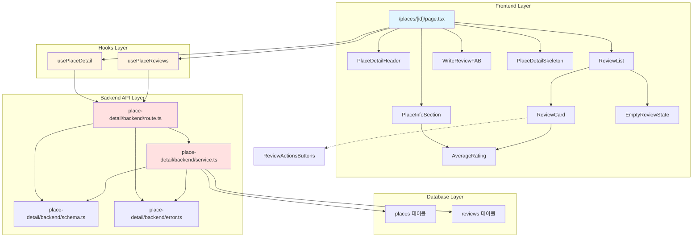

# 구현 계획: 장소 세부정보 페이지

## 프로젝트 ID: PLAN-004

### 제목
장소 세부정보 조회 및 리뷰 목록 표시

---

## 1. 개요

### 1.1 목표
사용자가 특정 장소의 상세 정보를 확인하고, 해당 장소에 작성된 모든 리뷰를 최신순으로 조회하며, 평균 별점을 확인할 수 있는 페이지를 구현한다.

### 1.2 참고 문서
- **유스케이스**: `/docs/usecases/004/spec.md` (UC-004: 장소 세부정보 조회)
- **관련 유스케이스**:
  - `/docs/usecases/005/spec.md` (UC-005: 리뷰 수정)
  - `/docs/usecases/006/spec.md` (UC-006: 리뷰 삭제)
- **PRD**: `/docs/prd.md` (3.4절 장소 세부정보 페이지)
- **데이터베이스 스키마**: `/docs/database.md` (places, reviews 테이블)

### 1.3 범위
- **포함 사항**:
  - 장소 세부정보 페이지 라우팅 및 렌더링 (`/places/[id]`)
  - 장소 기본 정보 조회 및 표시
  - 평균 별점 계산 및 표시
  - 리뷰 목록 조회 및 표시 (최신순 정렬)
  - 각 리뷰에 수정/삭제 버튼 표시
  - 리뷰 작성 버튼 (플로팅 액션 버튼)
  - 스켈레톤 UI (로딩 상태)
  - 빈 상태 UI (리뷰 없음)
  - 에러 처리 및 에러 페이지

- **제외 사항**:
  - 리뷰 수정 다이얼로그 및 수정 페이지 (UC-005에서 구현)
  - 리뷰 삭제 다이얼로그 및 삭제 로직 (UC-006에서 구현)
  - 리뷰 작성 페이지 (이미 구현됨)
  - 무한 스크롤 (향후 확장 고려)

---

## 2. 기술 스택

### 2.1 백엔드
- **프레임워크**: Hono (Next.js App Router 위임)
- **데이터베이스**: Supabase PostgreSQL + Drizzle ORM
- **스키마 검증**: Zod
- **에러 처리**: 공통 HandlerResult 패턴 (`success`/`failure`)
- **런타임**: Node.js (service-role 키 사용)

### 2.2 프론트엔드
- **프레임워크**: Next.js 14 App Router
- **상태 관리**: @tanstack/react-query (서버 상태)
- **UI 라이브러리**: shadcn/ui, Tailwind CSS
- **아이콘**: lucide-react
- **날짜 포맷**: date-fns (상대 시간 표시)
- **클라이언트**: 모든 컴포넌트는 Client Component (`use client`)

### 2.3 외부 서비스
- Supabase Database (places, reviews 테이블)

---

## 3. 데이터베이스 마이그레이션

### 3.1 기존 테이블 활용
이미 존재하는 `places`와 `reviews` 테이블을 활용하며, 새로운 마이그레이션은 필요하지 않음.

**참고 테이블 구조**:
```sql
-- places 테이블
CREATE TABLE places (
  id SERIAL PRIMARY KEY,
  naver_place_id VARCHAR(255) UNIQUE NOT NULL,
  name VARCHAR(255) NOT NULL,
  address TEXT NOT NULL,
  latitude NUMERIC(10, 7) NOT NULL,
  longitude NUMERIC(10, 7) NOT NULL,
  category VARCHAR(100),
  created_at TIMESTAMPTZ NOT NULL DEFAULT NOW(),
  updated_at TIMESTAMPTZ NOT NULL DEFAULT NOW()
);

-- reviews 테이블
CREATE TABLE reviews (
  id SERIAL PRIMARY KEY,
  place_id INTEGER NOT NULL REFERENCES places(id) ON DELETE CASCADE,
  nickname VARCHAR(50) NOT NULL,
  password_hash VARCHAR(255) NOT NULL,
  rating NUMERIC(2, 1) NOT NULL CHECK (rating >= 1.0 AND rating <= 5.0),
  review_text TEXT,
  created_at TIMESTAMPTZ NOT NULL DEFAULT NOW(),
  updated_at TIMESTAMPTZ NOT NULL DEFAULT NOW()
);
```

### 3.2 인덱스 (이미 존재하는 것으로 가정)
- `places.naver_place_id` (UNIQUE)
- `reviews.place_id` (외래 키, 빈번한 조회)
- `reviews.created_at` (최신순 정렬용)

---

## 4. 모듈 구조 및 책임

### 4.1 모듈 개요

```
src/features/place-detail/
├── backend/
│   ├── route.ts          # GET /api/places/:placeId, GET /api/places/:placeId/reviews
│   ├── service.ts        # getPlaceById, getReviewsByPlaceId
│   ├── schema.ts         # Zod 스키마 및 타입 정의
│   └── error.ts          # 에러 코드 정의
├── components/
│   ├── PlaceDetailHeader.tsx      # 헤더 (뒤로가기 + 장소명)
│   ├── PlaceInfoSection.tsx       # 장소 정보 영역
│   ├── AverageRating.tsx          # 평균 별점 컴포넌트
│   ├── ReviewList.tsx             # 리뷰 목록 컨테이너
│   ├── ReviewCard.tsx             # 개별 리뷰 카드
│   ├── ReviewActionsButtons.tsx   # 수정/삭제 버튼
│   ├── WriteReviewFAB.tsx         # 리뷰 작성 플로팅 버튼
│   ├── PlaceDetailSkeleton.tsx    # 로딩 스켈레톤
│   └── EmptyReviewState.tsx       # 빈 리뷰 상태 UI
├── hooks/
│   ├── usePlaceDetail.ts          # 장소 정보 조회 훅
│   └── usePlaceReviews.ts         # 리뷰 목록 조회 훅
├── lib/
│   └── dto.ts                     # schema 재노출 (프론트엔드용)
└── constants/
    └── place-detail.constants.ts  # 상수 (에러 메시지 등)

src/app/places/[id]/
└── page.tsx               # 장소 세부정보 페이지
```

### 4.2 모듈 간 관계 다이어그램



---

## 5. 구현 단계 (Implementation Steps)

### Phase 1: 백엔드 API 구현

**목표**: 장소 정보 및 리뷰 목록 조회 API 엔드포인트 구현

**작업 항목**:

1. **에러 코드 정의**
   - 파일: `src/features/place-detail/backend/error.ts`
   - 설명: 장소 및 리뷰 조회 관련 에러 코드 정의
   - 의존성: 없음
   - 상세:
     ```typescript
     export const placeDetailErrorCodes = {
       placeNotFound: 'PLACE_NOT_FOUND',
       placeFetchFailed: 'PLACE_FETCH_FAILED',
       reviewsFetchFailed: 'REVIEWS_FETCH_FAILED',
       validationError: 'VALIDATION_ERROR',
       invalidPlaceId: 'INVALID_PLACE_ID',
     } as const;

     export type PlaceDetailServiceError = typeof placeDetailErrorCodes[keyof typeof placeDetailErrorCodes];
     ```

2. **Zod 스키마 정의**
   - 파일: `src/features/place-detail/backend/schema.ts`
   - 설명: 요청/응답 스키마 정의
   - 의존성: 작업 1 완료
   - 상세:
     ```typescript
     // 장소 정보 응답 (평균 별점 포함)
     export const PlaceDetailResponseSchema = z.object({
       id: z.number(),
       naver_place_id: z.string(),
       name: z.string(),
       address: z.string(),
       latitude: z.number(),
       longitude: z.number(),
       category: z.string().nullable(),
       avg_rating: z.number().nullable(),
       review_count: z.number(),
     });

     // 리뷰 응답 (비밀번호 제외)
     export const ReviewResponseSchema = z.object({
       id: z.number(),
       place_id: z.number(),
       nickname: z.string(),
       rating: z.number(),
       review_text: z.string().nullable(),
       created_at: z.string(), // ISO 문자열
       updated_at: z.string(),
     });

     export const ReviewListResponseSchema = z.object({
       reviews: z.array(ReviewResponseSchema),
     });

     export type PlaceDetailResponse = z.infer<typeof PlaceDetailResponseSchema>;
     export type ReviewResponse = z.infer<typeof ReviewResponseSchema>;
     export type ReviewListResponse = z.infer<typeof ReviewListResponseSchema>;
     ```

3. **서비스 함수 구현 - 장소 정보 조회**
   - 파일: `src/features/place-detail/backend/service.ts`
   - 설명: `getPlaceById` 함수 구현 (평균 별점 포함)
   - 의존성: 작업 1, 2 완료
   - 상세:
     ```typescript
     export const getPlaceById = async (
       client: SupabaseClient,
       placeId: number
     ): Promise<HandlerResult<PlaceDetailResponse, PlaceDetailServiceError, unknown>> => {
       try {
         const { data, error } = await client
           .from('places')
           .select(`
             id,
             naver_place_id,
             name,
             address,
             latitude,
             longitude,
             category
           `)
           .eq('id', placeId)
           .maybeSingle();

         if (error) {
           return failure(500, placeDetailErrorCodes.placeFetchFailed, error.message);
         }

         if (!data) {
           return failure(404, placeDetailErrorCodes.placeNotFound, 'Place not found');
         }

         // 평균 별점 및 리뷰 개수 조회
         const { data: stats, error: statsError } = await client
           .from('reviews')
           .select('rating')
           .eq('place_id', placeId);

         if (statsError) {
           return failure(500, placeDetailErrorCodes.placeFetchFailed, statsError.message);
         }

         const reviewCount = stats?.length || 0;
         const avgRating = reviewCount > 0
           ? stats.reduce((sum, r) => sum + r.rating, 0) / reviewCount
           : null;

         const result: PlaceDetailResponse = {
           ...data,
           avg_rating: avgRating,
           review_count: reviewCount,
         };

         const validated = PlaceDetailResponseSchema.safeParse(result);
         if (!validated.success) {
           return failure(500, placeDetailErrorCodes.validationError, 'Validation failed', validated.error.format());
         }

         return success(validated.data);
       } catch (error) {
         return failure(
           500,
           placeDetailErrorCodes.placeFetchFailed,
           error instanceof Error ? error.message : 'Unknown error'
         );
       }
     };
     ```

4. **서비스 함수 구현 - 리뷰 목록 조회**
   - 파일: `src/features/place-detail/backend/service.ts`
   - 설명: `getReviewsByPlaceId` 함수 구현 (최신순 정렬)
   - 의존성: 작업 1, 2 완료
   - 상세:
     ```typescript
     export const getReviewsByPlaceId = async (
       client: SupabaseClient,
       placeId: number
     ): Promise<HandlerResult<ReviewListResponse, PlaceDetailServiceError, unknown>> => {
       try {
         const { data, error } = await client
           .from('reviews')
           .select('id, place_id, nickname, rating, review_text, created_at, updated_at')
           .eq('place_id', placeId)
           .order('created_at', { ascending: false });

         if (error) {
           return failure(500, placeDetailErrorCodes.reviewsFetchFailed, error.message);
         }

         const validated = z.array(ReviewResponseSchema).safeParse(data || []);
         if (!validated.success) {
           return failure(500, placeDetailErrorCodes.validationError, 'Validation failed', validated.error.format());
         }

         return success({ reviews: validated.data });
       } catch (error) {
         return failure(
           500,
           placeDetailErrorCodes.reviewsFetchFailed,
           error instanceof Error ? error.message : 'Unknown error'
         );
       }
     };
     ```

5. **Hono 라우터 등록**
   - 파일: `src/features/place-detail/backend/route.ts`
   - 설명: 장소 정보 및 리뷰 목록 엔드포인트 등록
   - 의존성: 작업 3, 4 완료
   - 상세:
     ```typescript
     export const registerPlaceDetailRoutes = (app: Hono<AppEnv>) => {
       app.get('/places/:placeId', async (c) => {
         const logger = getLogger(c);
         const supabase = getSupabase(c);
         const placeIdParam = c.req.param('placeId');
         const placeId = parseInt(placeIdParam, 10);

         if (isNaN(placeId) || placeId <= 0) {
           return c.json(
             {
               error: {
                 code: placeDetailErrorCodes.invalidPlaceId,
                 message: 'Invalid place ID',
               },
             },
             400
           );
         }

         const result = await getPlaceById(supabase, placeId);

         if (!result.ok) {
           logger.error('Failed to fetch place', { placeId });
         }

         return respond(c, result);
       });

       app.get('/places/:placeId/reviews', async (c) => {
         const logger = getLogger(c);
         const supabase = getSupabase(c);
         const placeIdParam = c.req.param('placeId');
         const placeId = parseInt(placeIdParam, 10);

         if (isNaN(placeId) || placeId <= 0) {
           return c.json(
             {
               error: {
                 code: placeDetailErrorCodes.invalidPlaceId,
                 message: 'Invalid place ID',
               },
             },
             400
           );
         }

         const result = await getReviewsByPlaceId(supabase, placeId);

         if (!result.ok) {
           logger.error('Failed to fetch reviews', { placeId });
         }

         return respond(c, result);
       });
     };
     ```

6. **Hono 앱에 라우터 등록**
   - 파일: `src/backend/hono/app.ts`
   - 설명: `registerPlaceDetailRoutes` 호출 추가
   - 의존성: 작업 5 완료
   - 상세:
     ```typescript
     import { registerPlaceDetailRoutes } from '@/features/place-detail/backend/route';

     export const createHonoApp = () => {
       // ... 기존 코드
       registerPlaceDetailRoutes(app);
       // ...
     };
     ```

**Acceptance Tests**:
- [ ] `GET /api/places/:placeId` 호출 시 장소 정보 + 평균 별점 + 리뷰 개수 반환
- [ ] 존재하지 않는 placeId 호출 시 404 에러 반환
- [ ] 잘못된 placeId (문자열, 음수 등) 호출 시 400 에러 반환
- [ ] `GET /api/places/:placeId/reviews` 호출 시 최신순 리뷰 목록 반환
- [ ] 리뷰가 없는 장소 조회 시 빈 배열 반환
- [ ] 비밀번호는 응답에 절대 포함되지 않음

---

### Phase 2: 프론트엔드 Hook 구현

**목표**: React Query를 활용한 데이터 페칭 훅 구현

**작업 항목**:

1. **DTO 재노출**
   - 파일: `src/features/place-detail/lib/dto.ts`
   - 설명: 백엔드 스키마를 프론트엔드에서 재사용
   - 의존성: Phase 1 완료
   - 상세:
     ```typescript
     export {
       PlaceDetailResponseSchema,
       ReviewResponseSchema,
       ReviewListResponseSchema,
       type PlaceDetailResponse,
       type ReviewResponse,
       type ReviewListResponse,
     } from '../backend/schema';
     ```

2. **장소 정보 조회 훅**
   - 파일: `src/features/place-detail/hooks/usePlaceDetail.ts`
   - 설명: 장소 정보를 조회하는 React Query 훅
   - 의존성: 작업 1 완료
   - 상세:
     ```typescript
     import { useQuery } from '@tanstack/react-query';
     import { apiClient } from '@/lib/remote/api-client';
     import { PlaceDetailResponseSchema, type PlaceDetailResponse } from '../lib/dto';

     export const usePlaceDetail = (placeId: number | null) => {
       return useQuery({
         queryKey: ['place', placeId],
         queryFn: async () => {
           if (!placeId) {
             throw new Error('Place ID is required');
           }

           const response = await apiClient.get(`/places/${placeId}`);
           const validated = PlaceDetailResponseSchema.safeParse(response);

           if (!validated.success) {
             throw new Error('Invalid response format');
           }

           return validated.data;
         },
         enabled: !!placeId && placeId > 0,
         staleTime: 1000 * 60 * 5, // 5분
         retry: 2,
       });
     };
     ```

3. **리뷰 목록 조회 훅**
   - 파일: `src/features/place-detail/hooks/usePlaceReviews.ts`
   - 설명: 리뷰 목록을 조회하는 React Query 훅
   - 의존성: 작업 1 완료
   - 상세:
     ```typescript
     import { useQuery } from '@tanstack/react-query';
     import { apiClient } from '@/lib/remote/api-client';
     import { ReviewListResponseSchema, type ReviewListResponse } from '../lib/dto';

     export const usePlaceReviews = (placeId: number | null) => {
       return useQuery({
         queryKey: ['place', placeId, 'reviews'],
         queryFn: async () => {
           if (!placeId) {
             throw new Error('Place ID is required');
           }

           const response = await apiClient.get(`/places/${placeId}/reviews`);
           const validated = ReviewListResponseSchema.safeParse(response);

           if (!validated.success) {
             throw new Error('Invalid response format');
           }

           return validated.data;
         },
         enabled: !!placeId && placeId > 0,
         staleTime: 1000 * 60 * 2, // 2분
         retry: 2,
       });
     };
     ```

**Acceptance Tests**:
- [ ] `usePlaceDetail` 호출 시 장소 정보 반환
- [ ] placeId가 null이면 쿼리 비활성화
- [ ] 네트워크 에러 시 최대 2회 재시도
- [ ] `usePlaceReviews` 호출 시 리뷰 목록 반환
- [ ] 캐싱이 정상적으로 동작하여 중복 요청 방지

---

### Phase 3: UI 컴포넌트 구현 (1) - 공통 컴포넌트

**목표**: 재사용 가능한 공통 UI 컴포넌트 구현

**작업 항목**:

1. **평균 별점 컴포넌트**
   - 파일: `src/features/place-detail/components/AverageRating.tsx`
   - 설명: 별점을 시각적으로 표시하는 컴포넌트 (읽기 전용)
   - 의존성: 없음
   - 상세:
     ```typescript
     interface AverageRatingProps {
       rating: number; // 0.0 ~ 5.0
       showNumber?: boolean; // 숫자 표시 여부
       size?: 'sm' | 'md' | 'lg';
     }

     // 별 5개를 렌더링하며, rating 값에 따라 full/half/empty 상태 표시
     // 기존 RatingInput 컴포넌트를 참고하되, 클릭 불가능한 읽기 전용 버전
     ```

2. **빈 리뷰 상태 UI**
   - 파일: `src/features/place-detail/components/EmptyReviewState.tsx`
   - 설명: 리뷰가 없을 때 표시되는 UI
   - 의존성: 없음
   - 상세:
     ```typescript
     interface EmptyReviewStateProps {
       onWriteReview: () => void;
     }

     // "아직 작성된 리뷰가 없습니다" 메시지
     // "첫 리뷰를 작성해보세요!" 유도 메시지
     // 리뷰 작성 버튼 (강조)
     ```

3. **로딩 스켈레톤**
   - 파일: `src/features/place-detail/components/PlaceDetailSkeleton.tsx`
   - 설명: 데이터 로딩 중 표시되는 스켈레톤 UI
   - 의존성: 없음
   - 상세:
     ```typescript
     // 장소 정보 영역 스켈레톤
     // 평균 별점 스켈레톤
     // 리뷰 카드 3개 스켈레톤
     // Tailwind animate-pulse 활용
     ```

4. **리뷰 작성 플로팅 버튼**
   - 파일: `src/features/place-detail/components/WriteReviewFAB.tsx`
   - 설명: 화면 우측 하단 고정 플로팅 버튼
   - 의존성: 없음
   - 상세:
     ```typescript
     interface WriteReviewFABProps {
       onClick: () => void;
     }

     // 우측 하단 고정 (fixed bottom-6 right-6)
     // 둥근 버튼 (rounded-full)
     // 그림자 효과
     // Pen 아이콘 또는 "리뷰 작성" 텍스트
     ```

**Acceptance Tests**:
- [ ] AverageRating 컴포넌트가 별점을 올바르게 표시
- [ ] 0.5 단위 별점도 정확히 표시 (half star)
- [ ] EmptyReviewState가 빈 상태 메시지 표시
- [ ] 스켈레톤 UI가 로딩 중 표시
- [ ] FAB 버튼이 화면 우측 하단에 고정

---

### Phase 4: UI 컴포넌트 구현 (2) - 페이지 특화 컴포넌트

**목표**: 장소 세부정보 페이지에 특화된 컴포넌트 구현

**작업 항목**:

1. **헤더 컴포넌트**
   - 파일: `src/features/place-detail/components/PlaceDetailHeader.tsx`
   - 설명: 뒤로가기 버튼 및 장소명 표시
   - 의존성: 없음
   - 상세:
     ```typescript
     interface PlaceDetailHeaderProps {
       placeName: string;
       onBack: () => void;
     }

     // 뒤로가기 버튼 (ArrowLeft 아이콘)
     // 장소명 (큰 글씨, 볼드)
     // 헤더 고정 (sticky top-0)
     ```

2. **장소 정보 섹션**
   - 파일: `src/features/place-detail/components/PlaceInfoSection.tsx`
   - 설명: 장소 기본 정보 및 평균 별점 표시
   - 의존성: Phase 3 작업 1 완료
   - 상세:
     ```typescript
     interface PlaceInfoSectionProps {
       place: PlaceDetailResponse;
     }

     // 장소명 (큰 글씨)
     // 주소 (MapPin 아이콘 + 회색 텍스트)
     // 카테고리 뱃지 (있는 경우)
     // 평균 별점 (AverageRating 컴포넌트)
     // 리뷰 개수 ("15개의 리뷰")
     ```

3. **리뷰 액션 버튼**
   - 파일: `src/features/place-detail/components/ReviewActionsButtons.tsx`
   - 설명: 리뷰 카드 내 수정/삭제 버튼
   - 의존성: 없음
   - 상세:
     ```typescript
     interface ReviewActionsButtonsProps {
       reviewId: number;
       onEdit: (reviewId: number) => void;
       onDelete: (reviewId: number) => void;
     }

     // 수정 버튼 (Edit 아이콘)
     // 삭제 버튼 (Trash 아이콘)
     // 호버 효과
     // 작은 아이콘 버튼
     ```

4. **리뷰 카드 컴포넌트**
   - 파일: `src/features/place-detail/components/ReviewCard.tsx`
   - 설명: 개별 리뷰를 카드 형태로 표시
   - 의존성: Phase 3 작업 1, Phase 4 작업 3 완료
   - 상세:
     ```typescript
     interface ReviewCardProps {
       review: ReviewResponse;
       onEdit: (reviewId: number) => void;
       onDelete: (reviewId: number) => void;
     }

     // 닉네임 (볼드)
     // AverageRating 컴포넌트 (별점)
     // 작성일시 (date-fns formatDistanceToNow 사용)
     // 리뷰 텍스트 (있는 경우)
     // ReviewActionsButtons
     // 카드 사이 구분선
     ```

5. **리뷰 목록 컴포넌트**
   - 파일: `src/features/place-detail/components/ReviewList.tsx`
   - 설명: 리뷰 목록 컨테이너
   - 의존성: Phase 3 작업 2, Phase 4 작업 4 완료
   - 상세:
     ```typescript
     interface ReviewListProps {
       reviews: ReviewResponse[];
       onEdit: (reviewId: number) => void;
       onDelete: (reviewId: number) => void;
       onWriteReview: () => void;
     }

     // reviews가 빈 배열이면 EmptyReviewState 표시
     // 아니면 ReviewCard 목록 렌더링
     // 스크롤 가능 영역
     ```

**Acceptance Tests**:
- [ ] PlaceDetailHeader가 뒤로가기 버튼 및 장소명 표시
- [ ] PlaceInfoSection이 장소 정보 및 평균 별점 표시
- [ ] ReviewCard가 개별 리뷰 정보 정확히 표시
- [ ] 작성일시가 상대 시간으로 표시 ("3일 전")
- [ ] ReviewList가 리뷰 목록 렌더링
- [ ] 빈 리뷰 목록 시 EmptyReviewState 표시

---

### Phase 5: 페이지 구현 및 통합

**목표**: `/places/[id]` 페이지 구현 및 전체 통합

**작업 항목**:

1. **상수 정의**
   - 파일: `src/features/place-detail/constants/place-detail.constants.ts`
   - 설명: 에러 메시지 등 상수 정의
   - 의존성: 없음
   - 상세:
     ```typescript
     export const PLACE_DETAIL_MESSAGES = {
       INVALID_ACCESS: '잘못된 접근입니다. 메인 페이지로 이동합니다.',
       PLACE_NOT_FOUND: '존재하지 않는 장소입니다.',
       FETCH_ERROR: '장소 정보를 불러오는 데 실패했습니다. 다시 시도해주세요.',
       REVIEWS_FETCH_ERROR: '리뷰 목록을 불러오는 데 실패했습니다.',
       NETWORK_ERROR: '네트워크 연결을 확인해주세요.',
     } as const;

     export const REDIRECT_DELAY_MS = 3000;
     ```

2. **페이지 구현**
   - 파일: `src/app/places/[id]/page.tsx`
   - 설명: 장소 세부정보 페이지
   - 의존성: Phase 2, 3, 4 모두 완료
   - 상세:
     ```typescript
     'use client';

     import { useParams, useRouter } from 'next/navigation';
     import { usePlaceDetail } from '@/features/place-detail/hooks/usePlaceDetail';
     import { usePlaceReviews } from '@/features/place-detail/hooks/usePlaceReviews';
     import { PlaceDetailHeader } from '@/features/place-detail/components/PlaceDetailHeader';
     import { PlaceInfoSection } from '@/features/place-detail/components/PlaceInfoSection';
     import { ReviewList } from '@/features/place-detail/components/ReviewList';
     import { WriteReviewFAB } from '@/features/place-detail/components/WriteReviewFAB';
     import { PlaceDetailSkeleton } from '@/features/place-detail/components/PlaceDetailSkeleton';
     import { PLACE_DETAIL_MESSAGES } from '@/features/place-detail/constants/place-detail.constants';

     export default function PlaceDetailPage() {
       const params = useParams();
       const router = useRouter();
       const placeId = parseInt(params.id as string, 10);

       // placeId 유효성 검사
       if (isNaN(placeId) || placeId <= 0) {
         // 에러 페이지 또는 리다이렉트
       }

       const { data: place, isLoading: isPlaceLoading, error: placeError } = usePlaceDetail(placeId);
       const { data: reviewsData, isLoading: isReviewsLoading, error: reviewsError } = usePlaceReviews(placeId);

       // 로딩 중
       if (isPlaceLoading || isReviewsLoading) {
         return <PlaceDetailSkeleton />;
       }

       // 장소 에러 (404 등)
       if (placeError || !place) {
         // 에러 페이지 표시
       }

       const handleBack = () => router.push('/');
       const handleEdit = (reviewId: number) => {
         // UC-005: 리뷰 수정 다이얼로그 열기 (향후 구현)
       };
       const handleDelete = (reviewId: number) => {
         // UC-006: 리뷰 삭제 다이얼로그 열기 (향후 구현)
       };
       const handleWriteReview = () => {
         router.push(`/reviews/new?placeId=${placeId}`);
       };

       return (
         <main className="min-h-screen bg-gray-50">
           <PlaceDetailHeader placeName={place.name} onBack={handleBack} />
           <div className="container mx-auto max-w-3xl px-4 py-6 space-y-6">
             <PlaceInfoSection place={place} />
             <ReviewList
               reviews={reviewsData?.reviews || []}
               onEdit={handleEdit}
               onDelete={handleDelete}
               onWriteReview={handleWriteReview}
             />
           </div>
           <WriteReviewFAB onClick={handleWriteReview} />
         </main>
       );
     }
     ```

3. **에러 페이지 처리**
   - 파일: `src/app/places/[id]/error.tsx` (선택사항)
   - 설명: Next.js 에러 바운더리
   - 의존성: 작업 2 완료

4. **통합 테스트**
   - 파일: 없음
   - 설명: 전체 페이지 동작 확인
   - 의존성: 작업 2 완료

**Acceptance Tests**:
- [ ] `/places/123` 접근 시 장소 정보 및 리뷰 목록 표시
- [ ] 뒤로가기 버튼 클릭 시 메인 페이지로 이동
- [ ] 리뷰 작성 버튼 클릭 시 `/reviews/new?placeId=123` 으로 이동
- [ ] 로딩 중 스켈레톤 UI 표시
- [ ] 존재하지 않는 장소 접근 시 404 에러 페이지 표시
- [ ] 잘못된 placeId (문자열 등) 접근 시 에러 처리
- [ ] 리뷰가 없는 장소 접근 시 EmptyReviewState 표시
- [ ] 평균 별점 및 리뷰 개수 정확히 표시
- [ ] 리뷰 목록이 최신순으로 정렬되어 표시

---

## 6. API 엔드포인트 구현

### 6.1 엔드포인트: GET /api/places/:placeId

**요청**:
```http
GET /api/places/123
```

**응답 (성공)**:
```json
{
  "id": 123,
  "naver_place_id": "12345678",
  "name": "맛있는 식당",
  "address": "서울시 강남구 테헤란로 123",
  "latitude": 37.123456,
  "longitude": 127.123456,
  "category": "한식",
  "avg_rating": 4.3,
  "review_count": 15
}
```

**응답 (404 에러)**:
```json
{
  "error": {
    "code": "PLACE_NOT_FOUND",
    "message": "Place not found"
  }
}
```

**응답 (400 에러)**:
```json
{
  "error": {
    "code": "INVALID_PLACE_ID",
    "message": "Invalid place ID"
  }
}
```

**구현 파일**:
- Controller: `src/features/place-detail/backend/route.ts`
- Service: `src/features/place-detail/backend/service.ts` (`getPlaceById`)
- Schema: `src/features/place-detail/backend/schema.ts`

**단위 테스트**:
- [ ] 유효한 placeId로 요청 시 200 응답 및 데이터 반환
- [ ] 존재하지 않는 placeId로 요청 시 404 응답
- [ ] 잘못된 placeId (문자열, 음수) 요청 시 400 응답
- [ ] 리뷰가 없는 장소 요청 시 avg_rating null, review_count 0 반환
- [ ] DB 에러 시 500 응답

---

### 6.2 엔드포인트: GET /api/places/:placeId/reviews

**요청**:
```http
GET /api/places/123/reviews
```

**응답 (성공)**:
```json
{
  "reviews": [
    {
      "id": 456,
      "place_id": 123,
      "nickname": "맛집헌터",
      "rating": 4.5,
      "review_text": "맛있어요",
      "created_at": "2025-10-21T10:30:00Z",
      "updated_at": "2025-10-21T10:30:00Z"
    },
    {
      "id": 457,
      "place_id": 123,
      "nickname": "여행자",
      "rating": 5.0,
      "review_text": null,
      "created_at": "2025-10-20T15:00:00Z",
      "updated_at": "2025-10-20T15:00:00Z"
    }
  ]
}
```

**응답 (빈 리뷰)**:
```json
{
  "reviews": []
}
```

**응답 (400 에러)**:
```json
{
  "error": {
    "code": "INVALID_PLACE_ID",
    "message": "Invalid place ID"
  }
}
```

**구현 파일**:
- Controller: `src/features/place-detail/backend/route.ts`
- Service: `src/features/place-detail/backend/service.ts` (`getReviewsByPlaceId`)
- Schema: `src/features/place-detail/backend/schema.ts`

**단위 테스트**:
- [ ] 유효한 placeId로 요청 시 200 응답 및 리뷰 목록 반환
- [ ] 리뷰 목록이 created_at DESC 순으로 정렬됨
- [ ] 리뷰가 없는 장소 요청 시 빈 배열 반환
- [ ] 비밀번호는 응답에 절대 포함되지 않음
- [ ] 잘못된 placeId 요청 시 400 응답
- [ ] DB 에러 시 500 응답

---

## 7. 프론트엔드 컴포넌트

### 7.1 컴포넌트: PlaceDetailHeader

**경로**: `src/features/place-detail/components/PlaceDetailHeader.tsx`

**Props**:
```typescript
interface PlaceDetailHeaderProps {
  placeName: string;
  onBack: () => void;
}
```

**기능**:
- 뒤로가기 버튼 (ArrowLeft 아이콘)
- 장소명 표시 (큰 글씨, 볼드)
- 헤더 고정 (sticky top-0)

**테스트**:
- [ ] 뒤로가기 버튼 클릭 시 onBack 호출
- [ ] placeName 정확히 표시

---

### 7.2 컴포넌트: PlaceInfoSection

**경로**: `src/features/place-detail/components/PlaceInfoSection.tsx`

**Props**:
```typescript
interface PlaceInfoSectionProps {
  place: PlaceDetailResponse;
}
```

**기능**:
- 장소명, 주소, 카테고리 표시
- 평균 별점 및 리뷰 개수 표시
- AverageRating 컴포넌트 활용

**테스트**:
- [ ] 장소 정보 정확히 렌더링
- [ ] 평균 별점이 null일 때 "아직 별점이 없습니다" 표시
- [ ] 카테고리가 null일 때 표시 안 함

---

### 7.3 컴포넌트: AverageRating

**경로**: `src/features/place-detail/components/AverageRating.tsx`

**Props**:
```typescript
interface AverageRatingProps {
  rating: number; // 0.0 ~ 5.0
  showNumber?: boolean;
  size?: 'sm' | 'md' | 'lg';
}
```

**기능**:
- 별 5개 렌더링
- 0.5 단위 별점 표시 (full, half, empty)
- 읽기 전용 (클릭 불가)

**테스트**:
- [ ] rating 4.5일 때 별 4개 full, 1개 half 표시
- [ ] rating 3.0일 때 별 3개 full, 2개 empty 표시
- [ ] showNumber true일 때 숫자 표시

---

### 7.4 컴포넌트: ReviewCard

**경로**: `src/features/place-detail/components/ReviewCard.tsx`

**Props**:
```typescript
interface ReviewCardProps {
  review: ReviewResponse;
  onEdit: (reviewId: number) => void;
  onDelete: (reviewId: number) => void;
}
```

**기능**:
- 닉네임, 별점, 작성일시, 리뷰 텍스트 표시
- 수정/삭제 버튼
- 상대 시간 표시 (date-fns)

**테스트**:
- [ ] 리뷰 정보 정확히 표시
- [ ] review_text null일 때 텍스트 영역 표시 안 함
- [ ] 수정 버튼 클릭 시 onEdit 호출
- [ ] 삭제 버튼 클릭 시 onDelete 호출
- [ ] 작성일시가 상대 시간으로 표시

---

### 7.5 컴포넌트: ReviewList

**경로**: `src/features/place-detail/components/ReviewList.tsx`

**Props**:
```typescript
interface ReviewListProps {
  reviews: ReviewResponse[];
  onEdit: (reviewId: number) => void;
  onDelete: (reviewId: number) => void;
  onWriteReview: () => void;
}
```

**기능**:
- 리뷰 목록 렌더링
- 빈 리뷰 시 EmptyReviewState 표시

**테스트**:
- [ ] 리뷰 목록 정확히 렌더링
- [ ] 빈 배열일 때 EmptyReviewState 표시
- [ ] ReviewCard들이 최신순으로 표시

---

### 7.6 컴포넌트: WriteReviewFAB

**경로**: `src/features/place-detail/components/WriteReviewFAB.tsx`

**Props**:
```typescript
interface WriteReviewFABProps {
  onClick: () => void;
}
```

**기능**:
- 화면 우측 하단 고정
- 리뷰 작성 버튼
- 클릭 시 onClick 호출

**테스트**:
- [ ] 우측 하단에 고정 표시
- [ ] 클릭 시 onClick 호출
- [ ] 호버 효과

---

## 8. 보안 고려사항

### 8.1 인증/인가
- 장소 및 리뷰 조회는 인증 불필요 (공개 데이터)
- 리뷰 수정/삭제는 비밀번호 확인 필요 (UC-005, UC-006에서 구현)

### 8.2 데이터 보호
- 비밀번호는 절대 API 응답에 포함하지 않음
- `password_hash` 필드는 SELECT 절에서 제외
- bcrypt 해시는 백엔드에서만 비교

### 8.3 CSRF/XSS 방지
- Next.js 기본 CSRF 보호 활용
- 사용자 입력값 (nickname, review_text) sanitization
- Zod 스키마 검증으로 입력 제한

---

## 9. 에러 처리

### 9.1 백엔드 에러

| 에러 코드 | HTTP 상태 | 설명 | 처리 방법 |
|----------|----------|------|----------|
| PLACE_NOT_FOUND | 404 | 장소가 존재하지 않음 | 404 에러 페이지 표시 |
| PLACE_FETCH_FAILED | 500 | 장소 조회 실패 | 에러 메시지 표시, 재시도 버튼 |
| REVIEWS_FETCH_FAILED | 500 | 리뷰 목록 조회 실패 | 리뷰 영역에만 에러 표시 |
| VALIDATION_ERROR | 500 | 응답 데이터 검증 실패 | 서버 로그 기록, 에러 페이지 |
| INVALID_PLACE_ID | 400 | 잘못된 placeId 형식 | 에러 페이지, 메인으로 리다이렉트 |

### 9.2 프론트엔드 에러 핸들링
- React Query의 error 객체 활용
- 네트워크 에러 시 재시도 옵션 (최대 2회)
- 타임아웃 5초
- 에러 토스트 또는 에러 페이지 표시
- "메인으로 돌아가기" 버튼 제공

---

## 10. 테스트 계획

### 10.1 단위 테스트

**파일**: `src/features/place-detail/backend/service.test.ts` (예시)

**커버리지 목표**: 80% 이상

**테스트 케이스**:

| ID | 테스트 내용 | 입력 | 기대 결과 |
|----|-----------|------|----------|
| UT-004-01 | getPlaceById - 정상 조회 | placeId: 123 | success 결과 반환 |
| UT-004-02 | getPlaceById - 존재하지 않음 | placeId: 999 | 404 failure 반환 |
| UT-004-03 | getPlaceById - DB 에러 | placeId: 123 (에러 시뮬) | 500 failure 반환 |
| UT-004-04 | getReviewsByPlaceId - 정상 조회 | placeId: 123 | reviews 배열 반환 |
| UT-004-05 | getReviewsByPlaceId - 빈 리뷰 | placeId: 456 | 빈 배열 반환 |
| UT-004-06 | getReviewsByPlaceId - 최신순 정렬 | placeId: 123 | created_at DESC 확인 |

### 10.2 통합 테스트
- **시나리오**: 메인 페이지 → 마커 클릭 → 장소 세부정보 페이지 → 리뷰 목록 확인
- **검증 항목**:
  - URL 파라미터 정상 전달
  - 장소 정보 및 리뷰 목록 정상 표시
  - 평균 별점 계산 정확성
  - 리뷰 최신순 정렬

### 10.3 E2E 테스트
- **파일**: `e2e/place-detail.spec.ts` (예시)
- **시나리오**:
  1. 메인 페이지 접속
  2. 검색으로 장소 찾기
  3. 마커 클릭
  4. 장소 세부정보 페이지 로딩 확인
  5. 장소 정보 표시 확인
  6. 리뷰 목록 표시 확인
  7. 리뷰 작성 버튼 클릭
  8. 리뷰 작성 페이지 이동 확인

---

## 11. 성능 고려사항

### 11.1 최적화 목표
- 장소 정보 조회 API 응답 시간: 300ms 이내
- 리뷰 목록 조회 API 응답 시간: 500ms 이내
- 페이지 초기 렌더링 시간: 1초 이내
- React Query 캐싱으로 중복 요청 방지

### 11.2 캐싱 전략
- React Query staleTime:
  - 장소 정보: 5분
  - 리뷰 목록: 2분
- 브라우저 캐싱 활용 (HTTP Cache-Control)

### 11.3 인덱스 전략
- `reviews.place_id` 외래 키 인덱스 (자동 생성)
- `reviews.created_at` 인덱스 (최신순 정렬용)
- `places.id` 프라이머리 키 인덱스

---

## 12. 배포 계획

### 12.1 환경 변수
기존 환경 변수 유지, 추가 없음.

### 12.2 배포 순서
1. 백엔드 API 배포 (Phase 1)
2. 프론트엔드 빌드 및 배포 (Phase 2-5)
3. 통합 테스트 실행
4. 프로덕션 배포

### 12.3 롤백 계획
- Git 리버트로 이전 커밋 복구
- Vercel/Netlify 등에서 이전 배포 버전으로 롤백

---

## 13. 모니터링 및 로깅

### 13.1 로그 항목
- **장소 조회 실패**: `logger.error('Failed to fetch place', { placeId })`
- **리뷰 조회 실패**: `logger.error('Failed to fetch reviews', { placeId })`
- **DB 에러**: Supabase 에러 메시지 로깅

### 13.2 메트릭
- API 응답 시간 (평균, p95, p99)
- 에러 발생률 (4xx, 5xx)
- 페이지 로딩 시간 (Core Web Vitals)

---

## 14. 문서화

### 14.1 API 문서
- [ ] OpenAPI/Swagger 스펙 작성 (선택사항)
- [ ] API 엔드포인트 README 업데이트

### 14.2 사용자 가이드
- [ ] 장소 세부정보 페이지 사용 가이드 (선택사항)
- [ ] 개발자 문서 업데이트

---

## 15. 체크리스트

### 15.1 구현 전
- [ ] UC-004 유스케이스 검토 완료
- [ ] 기존 코드베이스 탐색 완료 (places, reviews 관련)
- [ ] API 엔드포인트 설계 확정
- [ ] 컴포넌트 구조 설계 확정

### 15.2 구현 중
- [ ] TDD 방식으로 백엔드 서비스 구현
- [ ] Zod 스키마 검증 추가
- [ ] 에러 처리 철저히 구현
- [ ] 코드 리뷰 완료
- [ ] 단위 테스트 작성 및 통과

### 15.3 구현 후
- [ ] E2E 테스트 통과
- [ ] 성능 테스트 (API 응답 시간, 페이지 로딩)
- [ ] 보안 검토 (비밀번호 노출 여부 확인)
- [ ] 접근성 검토 (키보드 내비게이션, ARIA)
- [ ] 문서 작성 완료
- [ ] 배포 준비 완료

---

## 16. 변경 이력

| 버전 | 날짜 | 작성자 | 변경 내용 |
|------|------|--------|-----------|
| 1.0 | 2025-10-22 | Claude | 초기 작성 |

---

## 부록

### A. 참고 코드 예시

**평균 별점 계산 로직**:
```typescript
const reviewCount = stats?.length || 0;
const avgRating = reviewCount > 0
  ? stats.reduce((sum, r) => sum + r.rating, 0) / reviewCount
  : null;
```

**상대 시간 표시**:
```typescript
import { formatDistanceToNow } from 'date-fns';
import { ko } from 'date-fns/locale';

const relativeTime = formatDistanceToNow(new Date(review.created_at), {
  addSuffix: true,
  locale: ko,
}); // "3일 전"
```

### B. 의사결정 기록

**결정 1**: 장소 정보와 리뷰 목록을 별도 API로 분리
- **이유**:
  - 리뷰 목록은 데이터 크기가 가변적이며, 향후 페이지네이션 추가 시 분리가 유리
  - 장소 정보만 필요한 경우 효율적
  - React Query로 병렬 요청 가능
- **대안**: 단일 API로 통합 (`GET /api/places/:placeId?include=reviews`)
  - 장점: 요청 수 감소
  - 단점: 유연성 부족, 캐싱 전략 복잡

**결정 2**: 평균 별점을 서버에서 계산
- **이유**:
  - 클라이언트에서 모든 리뷰를 받아 계산하는 것보다 효율적
  - 향후 페이지네이션 추가 시에도 평균 별점은 전체 리뷰 기준이어야 함
- **대안**: 클라이언트에서 계산
  - 장점: 서버 부하 감소
  - 단점: 모든 리뷰를 받아야 하므로 비효율적

**결정 3**: AverageRating 컴포넌트를 별도로 분리
- **이유**:
  - PlaceInfoSection과 ReviewCard 모두에서 재사용
  - 읽기 전용 별점 표시 로직을 독립적으로 관리
- **대안**: RatingInput을 읽기 전용으로 사용
  - 장점: 컴포넌트 수 감소
  - 단점: 책임 혼재 (입력 vs 표시)

### C. 리스크 및 대응 방안

| 리스크 | 가능성 | 영향도 | 대응 방안 |
|--------|--------|--------|-----------|
| 리뷰 개수가 많아져 성능 저하 | 중 | 높음 | 향후 페이지네이션 구현, 초기 렌더링 개수 제한 |
| 평균 별점 계산 오류 | 낮 | 중 | 단위 테스트로 검증, 엣지 케이스 처리 |
| 비밀번호 노출 | 낮 | 높음 | SELECT 절에서 password_hash 제외, 코드 리뷰 철저 |
| 네트워크 에러로 페이지 표시 안 됨 | 중 | 중 | React Query 재시도 메커니즘, 에러 페이지 구현 |
| UC-005, UC-006 미구현으로 수정/삭제 버튼 동작 안 함 | 높 | 낮 | 버튼만 표시, 클릭 시 "준비 중" 메시지 또는 빈 핸들러 |

---

## QA Sheet (품질 보증 시트)

### QA-004-01: 장소 정보 정상 표시
- **전제 조건**: 리뷰가 있는 장소 존재 (placeId: 123)
- **테스트 단계**:
  1. `/places/123` 접속
  2. 장소명, 주소, 카테고리 확인
  3. 평균 별점 확인
  4. 리뷰 개수 확인
- **기대 결과**: 모든 정보가 정확히 표시됨

### QA-004-02: 리뷰 목록 최신순 정렬
- **전제 조건**: 리뷰가 3개 이상 있는 장소
- **테스트 단계**:
  1. `/places/123` 접속
  2. 리뷰 목록의 작성일시 순서 확인
- **기대 결과**: 최신 리뷰가 맨 위에 표시됨

### QA-004-03: 빈 리뷰 상태 UI
- **전제 조건**: 리뷰가 없는 장소 존재 (placeId: 456)
- **테스트 단계**:
  1. `/places/456` 접속
  2. "아직 작성된 리뷰가 없습니다" 메시지 확인
  3. 리뷰 작성 버튼 확인
- **기대 결과**: EmptyReviewState 표시, 평균 별점 미표시

### QA-004-04: 로딩 스켈레톤 UI
- **전제 조건**: 네트워크 속도 느림 시뮬레이션 (브라우저 DevTools)
- **테스트 단계**:
  1. 네트워크 Slow 3G 설정
  2. `/places/123` 접속
  3. 로딩 중 화면 확인
- **기대 결과**: 스켈레톤 UI 표시

### QA-004-05: 404 에러 처리
- **전제 조건**: 존재하지 않는 placeId
- **테스트 단계**:
  1. `/places/99999` 접속
  2. 에러 페이지 확인
- **기대 결과**: "존재하지 않는 장소입니다" 메시지, 메인으로 돌아가기 버튼

### QA-004-06: 잘못된 placeId 처리
- **전제 조건**: 없음
- **테스트 단계**:
  1. `/places/abc` 접속
  2. 에러 페이지 확인
- **기대 결과**: "잘못된 접근입니다" 메시지, 메인으로 리다이렉트

### QA-004-07: 리뷰 작성 버튼 동작
- **전제 조건**: 장소 존재 (placeId: 123)
- **테스트 단계**:
  1. `/places/123` 접속
  2. 플로팅 리뷰 작성 버튼 클릭
  3. URL 확인
- **기대 결과**: `/reviews/new?placeId=123` 으로 이동

### QA-004-08: 뒤로가기 버튼 동작
- **전제 조건**: 장소 존재 (placeId: 123)
- **테스트 단계**:
  1. `/places/123` 접속
  2. 헤더의 뒤로가기 버튼 클릭
  3. URL 확인
- **기대 결과**: `/` (메인 페이지)로 이동

### QA-004-09: 상대 시간 표시
- **전제 조건**: 리뷰가 있는 장소
- **테스트 단계**:
  1. `/places/123` 접속
  2. 각 리뷰의 작성일시 확인
- **기대 결과**: "방금 전", "3일 전", "2주 전" 등 상대 시간 표시

### QA-004-10: 리뷰 텍스트 없는 리뷰
- **전제 조건**: review_text가 null인 리뷰 존재
- **테스트 단계**:
  1. `/places/123` 접속
  2. 리뷰 카드 확인
- **기대 결과**: 닉네임과 별점만 표시, 텍스트 영역 없음

---

## 최종 요약

본 구현 계획은 **장소 세부정보 페이지**를 5개의 Phase로 나누어 체계적으로 구현하도록 설계되었습니다.

**핵심 포인트**:
1. **백엔드 우선 구현** (Phase 1): API를 먼저 완성하고 단위 테스트로 검증
2. **Hook 계층 분리** (Phase 2): 비즈니스 로직과 UI를 분리하여 재사용성 향상
3. **컴포넌트 세분화** (Phase 3-4): 공통 컴포넌트와 페이지 특화 컴포넌트를 명확히 분리
4. **통합 및 에러 처리** (Phase 5): 전체 페이지 통합 및 엣지 케이스 처리

**기존 코드베이스와의 통합**:
- `places`, `reviews` 테이블 재사용
- `success`/`failure` 응답 패턴 준수
- Hono 라우터 등록 방식 일치
- React Query + shadcn/ui 컴포넌트 활용
- 기존 RatingInput 컴포넌트 참고하여 AverageRating 구현

**확장 가능성**:
- 향후 무한 스크롤/페이지네이션 추가 가능
- UC-005 (리뷰 수정), UC-006 (리뷰 삭제) 통합 준비 완료
- 평균 별점 캐싱 전략 적용 가능
