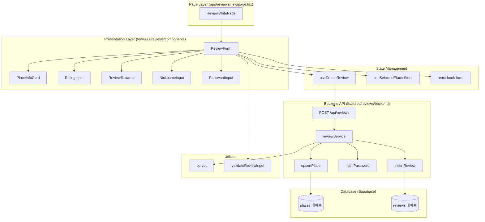
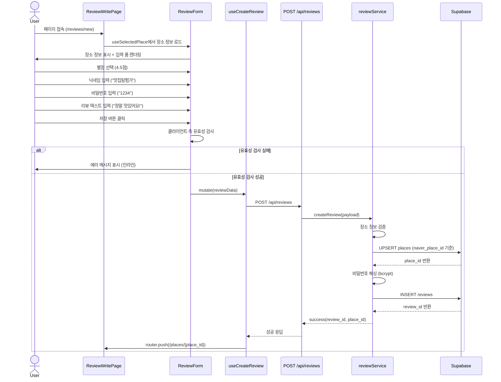

# 리뷰 작성 페이지 구현 계획

## 프로젝트 ID: PLAN-003

### 제목
리뷰 작성 페이지 (UC-003) - 장소 리뷰 작성 및 저장

---

## 1. 개요

### 1.1 목적
사용자가 선택한 장소에 대한 리뷰를 작성하고 저장할 수 있는 페이지를 구현합니다. 별점, 닉네임, 비밀번호, 리뷰 텍스트를 입력받아 검증하고, 장소 정보와 함께 데이터베이스에 저장합니다.

### 1.2 참고 문서
- **유스케이스**: `/docs/pages/review_write/UC-003.md` (요구사항 명세)
- **데이터베이스 스키마**: `/supabase/migrations/20250101000000_create_places_and_reviews_tables.sql`
- **기존 구현**:
  - `/docs/pages/mainpage/plan.md` (메인 페이지 구현 계획)
  - `/docs/pages/popup/plan.md` (검색 결과 팝업 구현 계획)

### 1.3 범위
- **포함 사항**:
  - 리뷰 작성 페이지 UI 및 폼 관리
  - 입력값 유효성 검사 (클라이언트/서버)
  - 별점 입력 컴포넌트 (0.5점 단위)
  - 장소 정보 표시 (읽기 전용)
  - 비밀번호 해싱 (bcrypt)
  - 장소 UPSERT 로직 (네이버 place ID 기반)
  - 리뷰 저장 API (POST /api/reviews)
  - 성공 시 장소 세부정보 페이지로 리다이렉트

- **제외 사항**:
  - 이미지 업로드 기능 (향후 확장 가능)
  - 사용자 인증/회원가입 (익명 리뷰)
  - 리뷰 수정/삭제 기능 (별도 UC)

### 1.4 모듈 목록

| 모듈명 | 위치 | 타입 | 설명 |
|--------|------|------|------|
| ReviewWritePage | `app/reviews/new/page.tsx` | Page | 리뷰 작성 메인 페이지 |
| PlaceInfoCard | `features/reviews/components/PlaceInfoCard.tsx` | Presentation | 장소 정보 표시 카드 |
| RatingInput | `features/reviews/components/RatingInput.tsx` | Presentation | 별점 입력 (0.5점 단위) |
| ReviewTextarea | `features/reviews/components/ReviewTextarea.tsx` | Presentation | 리뷰 텍스트 입력 (문자 수 카운터) |
| NicknameInput | `features/reviews/components/NicknameInput.tsx` | Presentation | 닉네임 입력 |
| PasswordInput | `features/reviews/components/PasswordInput.tsx` | Presentation | 4자리 숫자 비밀번호 입력 |
| ReviewForm | `features/reviews/components/ReviewForm.tsx` | Presentation | 폼 컨테이너 (통합) |
| useCreateReview | `features/reviews/hooks/useCreateReview.ts` | Hook | React Query mutation 훅 |
| reviewSchema | `features/reviews/backend/schema.ts` | Backend | Zod 스키마 (요청/응답/DB) |
| reviewService | `features/reviews/backend/service.ts` | Backend | 비즈니스 로직 (장소 UPSERT, 비밀번호 해싱, 리뷰 저장) |
| reviewRoute | `features/reviews/backend/route.ts` | Backend | Hono 라우터 (POST /reviews) |
| reviewError | `features/reviews/backend/error.ts` | Backend | 에러 코드 정의 |
| hashPassword | `lib/auth/password.ts` | Util | bcrypt 비밀번호 해싱 유틸 |
| validateReviewInput | `features/reviews/lib/validation.ts` | Util | 클라이언트 측 유효성 검사 |

---

## 2. Diagram

### 2.1 컴포넌트 구조



### 2.2 데이터 플로우



---

## 3. 기술 스택

### 3.1 백엔드
- **프레임워크**: Hono (Next.js Route Handler 통합)
- **데이터베이스**: Supabase (PostgreSQL)
- **ORM**: Supabase JS SDK
- **비밀번호 해싱**: bcrypt
- **검증**: Zod

### 3.2 프론트엔드
- **프레임워크**: Next.js 14 (App Router)
- **상태 관리**:
  - React Query (서버 상태)
  - Zustand (selectedPlace)
  - react-hook-form (폼 상태)
- **UI 라이브러리**: shadcn-ui, Tailwind CSS
- **검증**: Zod + react-hook-form resolver
- **아이콘**: lucide-react

### 3.3 외부 라이브러리
- `bcrypt` (비밀번호 해싱)
- `@hookform/resolvers` (Zod + react-hook-form 통합)
- `react-use` (유틸 훅)

---

## 4. 데이터베이스 스키마

### 4.1 places 테이블 (기존)

```sql
CREATE TABLE IF NOT EXISTS places (
  id SERIAL PRIMARY KEY,
  naver_place_id VARCHAR(255) NOT NULL UNIQUE,
  name VARCHAR(255) NOT NULL,
  address TEXT NOT NULL,
  latitude NUMERIC(10, 7) NOT NULL,
  longitude NUMERIC(10, 7) NOT NULL,
  category VARCHAR(100),
  created_at TIMESTAMPTZ NOT NULL DEFAULT NOW(),
  updated_at TIMESTAMPTZ NOT NULL DEFAULT NOW()
);
```

### 4.2 reviews 테이블 (기존)

```sql
CREATE TABLE IF NOT EXISTS reviews (
  id SERIAL PRIMARY KEY,
  place_id INTEGER NOT NULL,
  nickname VARCHAR(50) NOT NULL,
  password_hash VARCHAR(255) NOT NULL,
  rating NUMERIC(2, 1) NOT NULL,
  review_text TEXT,
  created_at TIMESTAMPTZ NOT NULL DEFAULT NOW(),
  updated_at TIMESTAMPTZ NOT NULL DEFAULT NOW(),

  CONSTRAINT reviews_place_id_fkey
    FOREIGN KEY (place_id)
    REFERENCES places(id)
    ON DELETE CASCADE,
  CONSTRAINT reviews_rating_check
    CHECK (rating >= 1.0 AND rating <= 5.0)
);
```

### 4.3 마이그레이션

기존 마이그레이션이 이미 적용되어 있으므로 추가 마이그레이션 불필요.

---

## 5. 구현 단계 (Implementation Steps)

### Phase 1: 백엔드 API 구현

#### 5.1 Zod 스키마 정의

**파일**: `src/features/reviews/backend/schema.ts`

```typescript
import { z } from 'zod';

// ===== 요청 스키마 =====

// 장소 정보 스키마 (요청 본문에 포함)
export const CreateReviewPlaceSchema = z.object({
  naver_place_id: z.string().min(1, 'Naver place ID is required'),
  name: z.string().min(1, 'Place name is required'),
  address: z.string().min(1, 'Address is required'),
  latitude: z.number().min(-90).max(90),
  longitude: z.number().min(-180).max(180),
  category: z.string().optional(),
});

// 리뷰 정보 스키마 (요청 본문에 포함)
export const CreateReviewDataSchema = z.object({
  nickname: z
    .string()
    .min(1, 'Nickname is required')
    .max(20, 'Nickname must be 20 characters or less')
    .trim(),
  password: z
    .string()
    .regex(/^\d{4}$/, 'Password must be exactly 4 digits'),
  rating: z
    .number()
    .min(1.0, 'Rating must be at least 1.0')
    .max(5.0, 'Rating must be at most 5.0')
    .refine((val) => val % 0.5 === 0, 'Rating must be in 0.5 increments'),
  review_text: z
    .string()
    .max(500, 'Review text must be 500 characters or less')
    .optional(),
});

// 전체 요청 스키마
export const CreateReviewRequestSchema = z.object({
  place: CreateReviewPlaceSchema,
  review: CreateReviewDataSchema,
});

// ===== 데이터베이스 스키마 =====

// places 테이블 행 스키마
export const PlaceTableRowSchema = z.object({
  id: z.number(),
  naver_place_id: z.string(),
  name: z.string(),
  address: z.string(),
  latitude: z.number(),
  longitude: z.number(),
  category: z.string().nullable(),
  created_at: z.string(), // Supabase는 ISO 문자열로 반환
  updated_at: z.string(),
});

// reviews 테이블 행 스키마
export const ReviewTableRowSchema = z.object({
  id: z.number(),
  place_id: z.number(),
  nickname: z.string(),
  password_hash: z.string(),
  rating: z.number(),
  review_text: z.string().nullable(),
  created_at: z.string(),
  updated_at: z.string(),
});

// ===== 응답 스키마 =====

export const CreateReviewResponseSchema = z.object({
  reviewId: z.number(),
  placeId: z.number(),
  redirectUrl: z.string(),
});

// ===== 타입 추론 =====

export type CreateReviewPlace = z.infer<typeof CreateReviewPlaceSchema>;
export type CreateReviewData = z.infer<typeof CreateReviewDataSchema>;
export type CreateReviewRequest = z.infer<typeof CreateReviewRequestSchema>;
export type PlaceTableRow = z.infer<typeof PlaceTableRowSchema>;
export type ReviewTableRow = z.infer<typeof ReviewTableRowSchema>;
export type CreateReviewResponse = z.infer<typeof CreateReviewResponseSchema>;
```

**작업 항목**:
- [x] 요청 스키마 정의 (장소 + 리뷰)
- [x] 유효성 검사 규칙 (별점 0.5 단위, 비밀번호 4자리 숫자 등)
- [x] 데이터베이스 스키마 정의
- [x] 응답 스키마 정의
- [x] 타입 추론 export

**Acceptance Tests**:
- [ ] 유효한 데이터는 검증 통과
- [ ] 별점이 0.5 단위가 아니면 검증 실패
- [ ] 비밀번호가 4자리 숫자가 아니면 검증 실패
- [ ] 닉네임이 20자를 초과하면 검증 실패
- [ ] 리뷰 텍스트가 500자를 초과하면 검증 실패

---

#### 5.2 에러 코드 정의

**파일**: `src/features/reviews/backend/error.ts`

```typescript
export const reviewErrorCodes = {
  validationError: 'REVIEW_VALIDATION_ERROR',
  placeUpsertFailed: 'PLACE_UPSERT_FAILED',
  passwordHashFailed: 'PASSWORD_HASH_FAILED',
  reviewInsertFailed: 'REVIEW_INSERT_FAILED',
  placeNotFound: 'PLACE_NOT_FOUND',
} as const;

export type ReviewServiceError = typeof reviewErrorCodes[keyof typeof reviewErrorCodes];
```

**작업 항목**:
- [x] 에러 코드 정의 (5개 타입)
- [x] 타입 추론 export

**Acceptance Tests**:
- [ ] 모든 에러 코드가 고유한 문자열
- [ ] ReviewServiceError 타입이 올바르게 추론됨

---

#### 5.3 비즈니스 로직 (Service Layer)

**파일**: `src/features/reviews/backend/service.ts`

```typescript
import type { SupabaseClient } from '@supabase/supabase-js';
import bcrypt from 'bcrypt';
import { failure, success, type HandlerResult } from '@/backend/http/response';
import {
  CreateReviewRequestSchema,
  PlaceTableRowSchema,
  ReviewTableRowSchema,
  type CreateReviewRequest,
  type CreateReviewResponse,
} from './schema';
import { reviewErrorCodes, type ReviewServiceError } from './error';

/**
 * 장소 UPSERT
 * naver_place_id를 기준으로 장소가 있으면 업데이트, 없으면 생성
 */
const upsertPlace = async (
  client: SupabaseClient,
  place: CreateReviewRequest['place']
): Promise<HandlerResult<number, ReviewServiceError, unknown>> => {
  try {
    // naver_place_id로 기존 장소 조회
    const { data: existingPlace, error: selectError } = await client
      .from('places')
      .select('id')
      .eq('naver_place_id', place.naver_place_id)
      .maybeSingle();

    if (selectError) {
      return failure(500, reviewErrorCodes.placeUpsertFailed, selectError.message);
    }

    // 기존 장소가 있으면 ID 반환
    if (existingPlace) {
      return success(existingPlace.id);
    }

    // 없으면 새로 생성
    const { data: newPlace, error: insertError } = await client
      .from('places')
      .insert({
        naver_place_id: place.naver_place_id,
        name: place.name,
        address: place.address,
        latitude: place.latitude,
        longitude: place.longitude,
        category: place.category || null,
      })
      .select('id')
      .single();

    if (insertError || !newPlace) {
      return failure(
        500,
        reviewErrorCodes.placeUpsertFailed,
        insertError?.message || 'Failed to insert place'
      );
    }

    return success(newPlace.id);
  } catch (error) {
    return failure(
      500,
      reviewErrorCodes.placeUpsertFailed,
      error instanceof Error ? error.message : 'Unknown error'
    );
  }
};

/**
 * 비밀번호 해싱 (bcrypt)
 */
const hashPassword = async (
  password: string
): Promise<HandlerResult<string, ReviewServiceError, unknown>> => {
  try {
    const saltRounds = 10;
    const hash = await bcrypt.hash(password, saltRounds);
    return success(hash);
  } catch (error) {
    return failure(
      500,
      reviewErrorCodes.passwordHashFailed,
      error instanceof Error ? error.message : 'Failed to hash password'
    );
  }
};

/**
 * 리뷰 생성 (메인 함수)
 */
export const createReview = async (
  client: SupabaseClient,
  payload: CreateReviewRequest
): Promise<HandlerResult<CreateReviewResponse, ReviewServiceError, unknown>> => {
  // 1. 요청 데이터 검증
  const parsed = CreateReviewRequestSchema.safeParse(payload);
  if (!parsed.success) {
    return failure(
      400,
      reviewErrorCodes.validationError,
      'Invalid request data',
      parsed.error.format()
    );
  }

  const { place, review } = parsed.data;

  // 2. 장소 UPSERT
  const placeResult = await upsertPlace(client, place);
  if (!placeResult.ok) {
    return placeResult;
  }
  const placeId = placeResult.data;

  // 3. 비밀번호 해싱
  const hashResult = await hashPassword(review.password);
  if (!hashResult.ok) {
    return hashResult;
  }
  const passwordHash = hashResult.data;

  // 4. 리뷰 삽입
  try {
    const { data: newReview, error: insertError } = await client
      .from('reviews')
      .insert({
        place_id: placeId,
        nickname: review.nickname,
        password_hash: passwordHash,
        rating: review.rating,
        review_text: review.review_text || null,
      })
      .select('id')
      .single();

    if (insertError || !newReview) {
      return failure(
        500,
        reviewErrorCodes.reviewInsertFailed,
        insertError?.message || 'Failed to insert review'
      );
    }

    return success({
      reviewId: newReview.id,
      placeId,
      redirectUrl: `/places/${placeId}`,
    });
  } catch (error) {
    return failure(
      500,
      reviewErrorCodes.reviewInsertFailed,
      error instanceof Error ? error.message : 'Unknown error'
    );
  }
};
```

**작업 항목**:
- [x] `upsertPlace` 함수 (naver_place_id 기준 중복 체크)
- [x] `hashPassword` 함수 (bcrypt, saltRounds=10)
- [x] `createReview` 함수 (메인 로직)
- [x] 에러 핸들링 (각 단계별)
- [x] 트랜잭션 불필요 (Supabase 외래키 제약 조건으로 충분)

**Acceptance Tests**:
- [ ] 새로운 장소가 생성되고 리뷰가 저장됨
- [ ] 기존 장소에 리뷰가 추가됨 (UPSERT 동작)
- [ ] 비밀번호가 bcrypt로 해싱됨
- [ ] 유효하지 않은 데이터는 400 에러 반환
- [ ] 데이터베이스 에러 시 500 에러 반환

---

#### 5.4 라우터 (Route Handler)

**파일**: `src/features/reviews/backend/route.ts`

```typescript
import type { Hono } from 'hono';
import { respond } from '@/backend/http/response';
import { getSupabase, getLogger, type AppEnv } from '@/backend/hono/context';
import { createReview } from './service';

export const registerReviewRoutes = (app: Hono<AppEnv>) => {
  app.post('/reviews', async (c) => {
    const logger = getLogger(c);
    const supabase = getSupabase(c);

    let payload;
    try {
      payload = await c.req.json();
    } catch (error) {
      logger.error('Failed to parse request body', error);
      return c.json(
        {
          error: {
            code: 'INVALID_JSON',
            message: 'Request body must be valid JSON',
          },
        },
        400
      );
    }

    const result = await createReview(supabase, payload);

    if (!result.ok) {
      logger.error('Failed to create review', result.error);
    } else {
      logger.info('Review created successfully', {
        reviewId: result.data.reviewId,
        placeId: result.data.placeId,
      });
    }

    return respond(c, result);
  });
};
```

**작업 항목**:
- [x] POST /reviews 엔드포인트
- [x] JSON 파싱 에러 처리
- [x] 로깅 (성공/실패)
- [x] respond 헬퍼 사용

**Acceptance Tests**:
- [ ] POST /api/reviews가 200 성공 응답 반환
- [ ] 잘못된 JSON은 400 에러 반환
- [ ] 유효하지 않은 데이터는 400 에러 반환
- [ ] 서버 에러는 500 에러 반환

---

#### 5.5 Hono 앱에 라우터 등록

**파일**: `src/backend/hono/app.ts` (수정)

```typescript
import { Hono } from 'hono';
import { errorBoundary } from '@/backend/middleware/error';
import { withAppContext } from '@/backend/middleware/context';
import { withSupabase } from '@/backend/middleware/supabase';
import { registerExampleRoutes } from '@/features/example/backend/route';
import { registerPlacesRoutes } from '@/features/places/backend/route';
import { registerSearchRoutes } from '@/features/search/backend/route';
import { registerReviewRoutes } from '@/features/reviews/backend/route'; // 추가
import type { AppEnv } from '@/backend/hono/context';

let singletonApp: Hono<AppEnv> | null = null;

export const createHonoApp = () => {
  if (singletonApp) {
    return singletonApp;
  }

  const app = new Hono<AppEnv>();

  app.use('*', errorBoundary());
  app.use('*', withAppContext());
  app.use('*', withSupabase());

  registerExampleRoutes(app);
  registerPlacesRoutes(app);
  registerSearchRoutes(app);
  registerReviewRoutes(app); // 추가

  singletonApp = app;

  return app;
};
```

**작업 항목**:
- [x] `registerReviewRoutes` import
- [x] 라우터 등록

**Acceptance Tests**:
- [ ] /api/reviews 엔드포인트가 정상 작동

---

#### 5.6 프론트엔드용 DTO 재노출

**파일**: `src/features/reviews/lib/dto.ts`

```typescript
export {
  CreateReviewRequestSchema,
  CreateReviewResponseSchema,
  type CreateReviewPlace,
  type CreateReviewData,
  type CreateReviewRequest,
  type CreateReviewResponse,
} from '../backend/schema';
```

**작업 항목**:
- [x] 스키마 및 타입 재노출

**Acceptance Tests**:
- [ ] 프론트엔드에서 import 가능

---

### Phase 2: 프론트엔드 Presentation Layer 구현

#### 5.7 별점 입력 컴포넌트

**파일**: `src/features/reviews/components/RatingInput.tsx`

```typescript
'use client';

import { Star } from 'lucide-react';
import { cn } from '@/lib/utils';

interface RatingInputProps {
  value: number;
  onChange: (value: number) => void;
  error?: string;
  disabled?: boolean;
}

export const RatingInput = ({ value, onChange, error, disabled }: RatingInputProps) => {
  const handleStarClick = (rating: number) => {
    if (disabled) return;
    onChange(rating);
  };

  const renderStar = (index: number) => {
    const rating = (index + 1) * 0.5; // 0.5, 1.0, 1.5, ..., 5.0
    const isFilled = value >= rating;
    const isHalf = value >= rating - 0.5 && value < rating;

    return (
      <button
        key={index}
        type="button"
        onClick={() => handleStarClick(rating)}
        disabled={disabled}
        className={cn(
          'p-1 transition-transform hover:scale-110 focus:outline-none focus:ring-2 focus:ring-blue-500 focus:ring-offset-2 rounded',
          disabled && 'cursor-not-allowed opacity-50'
        )}
        aria-label={`${rating}점`}
      >
        <Star
          className={cn(
            'h-8 w-8 transition-colors',
            isFilled && 'fill-yellow-400 stroke-yellow-400',
            !isFilled && 'fill-gray-200 stroke-gray-300'
          )}
        />
      </button>
    );
  };

  return (
    <div className="space-y-2">
      <label className="block text-sm font-medium text-gray-700">
        별점 <span className="text-red-500">*</span>
      </label>
      <div className="flex items-center gap-1">
        {Array.from({ length: 10 }).map((_, index) => renderStar(index))}
        <span className="ml-2 text-lg font-semibold text-gray-900">
          {value.toFixed(1)}
        </span>
      </div>
      {error && <p className="text-sm text-red-600">{error}</p>}
    </div>
  );
};
```

**작업 항목**:
- [x] 0.5점 단위 별점 입력 (10개 버튼)
- [x] 별 아이콘 색상 (채워짐/비어있음)
- [x] 현재 값 숫자 표시
- [x] 에러 메시지 표시
- [x] 접근성 (aria-label, 키보드 포커스)
- [x] 비활성화 상태

**QA Sheet**:
```markdown
## RatingInput QA

### 기능 테스트
- [ ] 별 클릭 시 value가 0.5점 단위로 변경되는가?
- [ ] 5.0점까지 입력 가능한가?
- [ ] 현재 값이 숫자로 표시되는가?
- [ ] onChange가 올바른 값으로 호출되는가?

### UI 테스트
- [ ] 채워진 별이 노란색으로 표시되는가?
- [ ] 비어있는 별이 회색으로 표시되는가?
- [ ] 호버 시 별이 확대되는가?
- [ ] 에러 메시지가 빨간색으로 표시되는가?

### 접근성 테스트
- [ ] 각 별에 aria-label이 있는가?
- [ ] Tab 키로 별 간 이동이 가능한가?
- [ ] 포커스 링이 표시되는가?
- [ ] disabled 상태에서 클릭이 불가능한가?
```

---

#### 5.8 리뷰 텍스트 입력 컴포넌트

**파일**: `src/features/reviews/components/ReviewTextarea.tsx`

```typescript
'use client';

import { Textarea } from '@/components/ui/textarea';
import { cn } from '@/lib/utils';

interface ReviewTextareaProps {
  value: string;
  onChange: (value: string) => void;
  error?: string;
  disabled?: boolean;
  maxLength?: number;
}

export const ReviewTextarea = ({
  value,
  onChange,
  error,
  disabled,
  maxLength = 500,
}: ReviewTextareaProps) => {
  const currentLength = value.length;
  const isOverLimit = currentLength > maxLength;

  return (
    <div className="space-y-2">
      <label className="block text-sm font-medium text-gray-700">
        리뷰 (선택사항)
      </label>
      <Textarea
        value={value}
        onChange={(e) => onChange(e.target.value)}
        placeholder="이 장소에 대한 솔직한 리뷰를 작성해주세요"
        disabled={disabled}
        rows={5}
        className={cn(
          'resize-none',
          error && 'border-red-500 focus:ring-red-500'
        )}
      />
      <div className="flex items-center justify-between">
        <span
          className={cn(
            'text-sm',
            isOverLimit ? 'text-red-600 font-semibold' : 'text-gray-500'
          )}
        >
          {currentLength} / {maxLength}
        </span>
        {error && <p className="text-sm text-red-600">{error}</p>}
      </div>
    </div>
  );
};
```

**작업 항목**:
- [x] Textarea 컴포넌트 사용 (shadcn-ui)
- [x] 문자 수 카운터 (현재/최대)
- [x] 최대 길이 초과 시 빨간색 표시
- [x] 에러 메시지 표시
- [x] 선택사항 표시

**QA Sheet**:
```markdown
## ReviewTextarea QA

### 기능 테스트
- [ ] 텍스트 입력 시 문자 수가 업데이트되는가?
- [ ] 500자까지 입력 가능한가?
- [ ] onChange가 올바르게 호출되는가?

### UI 테스트
- [ ] 문자 수 카운터가 표시되는가?
- [ ] 500자 초과 시 카운터가 빨간색으로 변하는가?
- [ ] 플레이스홀더가 표시되는가?
- [ ] 에러 메시지가 표시되는가?

### UX 테스트
- [ ] 리사이즈가 불가능한가? (resize-none)
- [ ] 5줄 높이로 표시되는가?
```

---

#### 5.9 닉네임 입력 컴포넌트

**파일**: `src/features/reviews/components/NicknameInput.tsx`

```typescript
'use client';

import { Input } from '@/components/ui/input';
import { cn } from '@/lib/utils';

interface NicknameInputProps {
  value: string;
  onChange: (value: string) => void;
  error?: string;
  disabled?: boolean;
}

export const NicknameInput = ({
  value,
  onChange,
  error,
  disabled,
}: NicknameInputProps) => {
  return (
    <div className="space-y-2">
      <label className="block text-sm font-medium text-gray-700">
        닉네임 <span className="text-red-500">*</span>
      </label>
      <Input
        type="text"
        value={value}
        onChange={(e) => onChange(e.target.value)}
        placeholder="닉네임을 입력하세요 (최대 20자)"
        disabled={disabled}
        maxLength={20}
        className={cn(error && 'border-red-500 focus:ring-red-500')}
      />
      {error && <p className="text-sm text-red-600">{error}</p>}
    </div>
  );
};
```

**작업 항목**:
- [x] Input 컴포넌트 사용 (shadcn-ui)
- [x] 최대 20자 제한
- [x] 에러 메시지 표시
- [x] 필수 항목 표시

**QA Sheet**:
```markdown
## NicknameInput QA

### 기능 테스트
- [ ] 텍스트 입력이 가능한가?
- [ ] 20자까지 입력 가능한가?
- [ ] 20자 초과 시 더 이상 입력되지 않는가?

### UI 테스트
- [ ] 플레이스홀더가 표시되는가?
- [ ] 에러 메시지가 빨간색으로 표시되는가?
- [ ] 필수 항목 별표(*)가 표시되는가?
```

---

#### 5.10 비밀번호 입력 컴포넌트

**파일**: `src/features/reviews/components/PasswordInput.tsx`

```typescript
'use client';

import { Input } from '@/components/ui/input';
import { cn } from '@/lib/utils';

interface PasswordInputProps {
  value: string;
  onChange: (value: string) => void;
  error?: string;
  disabled?: boolean;
}

export const PasswordInput = ({
  value,
  onChange,
  error,
  disabled,
}: PasswordInputProps) => {
  const handleChange = (e: React.ChangeEvent<HTMLInputElement>) => {
    const input = e.target.value;
    // 숫자만 허용, 최대 4자리
    if (/^\d{0,4}$/.test(input)) {
      onChange(input);
    }
  };

  return (
    <div className="space-y-2">
      <label className="block text-sm font-medium text-gray-700">
        비밀번호 <span className="text-red-500">*</span>
      </label>
      <Input
        type="password"
        inputMode="numeric"
        pattern="\d{4}"
        value={value}
        onChange={handleChange}
        placeholder="4자리 숫자"
        disabled={disabled}
        maxLength={4}
        className={cn(error && 'border-red-500 focus:ring-red-500')}
      />
      <p className="text-xs text-gray-500">
        리뷰 수정/삭제 시 사용됩니다. 4자리 숫자만 입력 가능합니다.
      </p>
      {error && <p className="text-sm text-red-600">{error}</p>}
    </div>
  );
};
```

**작업 항목**:
- [x] Input 컴포넌트 사용 (type="password")
- [x] 숫자만 입력 가능 (정규식 검증)
- [x] 4자리 제한
- [x] inputMode="numeric" (모바일 숫자 키패드)
- [x] 안내 문구
- [x] 에러 메시지 표시

**QA Sheet**:
```markdown
## PasswordInput QA

### 기능 테스트
- [ ] 숫자만 입력 가능한가?
- [ ] 4자리까지만 입력되는가?
- [ ] 문자 입력 시 무시되는가?
- [ ] 비밀번호가 마스킹되는가? (type="password")

### UI 테스트
- [ ] 플레이스홀더가 "4자리 숫자"로 표시되는가?
- [ ] 안내 문구가 표시되는가?
- [ ] 에러 메시지가 표시되는가?

### 모바일 테스트
- [ ] 모바일에서 숫자 키패드가 표시되는가? (inputMode="numeric")
```

---

#### 5.11 장소 정보 카드 컴포넌트

**파일**: `src/features/reviews/components/PlaceInfoCard.tsx`

```typescript
'use client';

import { MapPin, Tag } from 'lucide-react';
import { Card, CardContent, CardHeader, CardTitle } from '@/components/ui/card';
import type { SelectedPlace } from '@/features/map/stores/selected-place-store';

interface PlaceInfoCardProps {
  place: SelectedPlace;
}

export const PlaceInfoCard = ({ place }: PlaceInfoCardProps) => {
  return (
    <Card className="border-blue-200 bg-blue-50">
      <CardHeader>
        <CardTitle className="text-lg font-bold text-gray-900">
          리뷰를 작성할 장소
        </CardTitle>
      </CardHeader>
      <CardContent className="space-y-2">
        <div>
          <h3 className="text-xl font-bold text-gray-900">{place.title}</h3>
        </div>
        <div className="flex items-start gap-2 text-sm text-gray-600">
          <MapPin className="h-4 w-4 mt-0.5 flex-shrink-0" />
          <span>{place.address}</span>
        </div>
        {place.category && (
          <div className="flex items-center gap-2 text-sm text-gray-600">
            <Tag className="h-4 w-4 flex-shrink-0" />
            <span>{place.category}</span>
          </div>
        )}
      </CardContent>
    </Card>
  );
};
```

**작업 항목**:
- [x] Card 컴포넌트 사용 (shadcn-ui)
- [x] 장소명, 주소, 카테고리 표시
- [x] 아이콘 사용 (MapPin, Tag)
- [x] 읽기 전용 (입력 불가)
- [x] 강조 스타일 (파란색 배경)

**QA Sheet**:
```markdown
## PlaceInfoCard QA

### UI 테스트
- [ ] 장소명이 볼드체로 표시되는가?
- [ ] 주소 옆에 MapPin 아이콘이 표시되는가?
- [ ] 카테고리 옆에 Tag 아이콘이 표시되는가?
- [ ] 카드 배경이 파란색인가?
- [ ] 카드 테두리가 파란색인가?

### 데이터 테스트
- [ ] place prop이 올바르게 표시되는가?
- [ ] category가 없으면 표시되지 않는가?
```

---

#### 5.12 리뷰 폼 컨테이너

**파일**: `src/features/reviews/components/ReviewForm.tsx`

```typescript
'use client';

import { useState } from 'react';
import { useRouter } from 'next/navigation';
import { useForm } from 'react-hook-form';
import { zodResolver } from '@hookform/resolvers/zod';
import { z } from 'zod';
import { Button } from '@/components/ui/button';
import { useToast } from '@/hooks/use-toast';
import { useSelectedPlace } from '@/features/map/stores/selected-place-store';
import { PlaceInfoCard } from './PlaceInfoCard';
import { RatingInput } from './RatingInput';
import { NicknameInput } from './NicknameInput';
import { PasswordInput } from './PasswordInput';
import { ReviewTextarea } from './ReviewTextarea';
import { useCreateReview } from '../hooks/useCreateReview';
import { CreateReviewDataSchema } from '../backend/schema';

type FormData = z.infer<typeof CreateReviewDataSchema>;

export const ReviewForm = () => {
  const router = useRouter();
  const { toast } = useToast();
  const { selectedPlace, clearSelectedPlace } = useSelectedPlace();
  const { mutate: createReview, isPending } = useCreateReview();

  const {
    watch,
    setValue,
    handleSubmit,
    formState: { errors },
  } = useForm<FormData>({
    resolver: zodResolver(CreateReviewDataSchema),
    defaultValues: {
      nickname: '',
      password: '',
      rating: 5.0,
      review_text: '',
    },
  });

  const formValues = watch();

  // 장소 정보가 없으면 에러
  if (!selectedPlace) {
    return (
      <div className="flex flex-col items-center justify-center min-h-screen p-4">
        <div className="text-center space-y-4">
          <h2 className="text-2xl font-bold text-gray-900">
            장소 정보가 없습니다
          </h2>
          <p className="text-gray-600">
            메인 페이지에서 장소를 선택한 후 리뷰를 작성해주세요.
          </p>
          <Button onClick={() => router.push('/')}>
            메인 페이지로 이동
          </Button>
        </div>
      </div>
    );
  }

  const onSubmit = (data: FormData) => {
    createReview(
      {
        place: {
          naver_place_id: selectedPlace.naver_place_id,
          name: selectedPlace.title,
          address: selectedPlace.address,
          latitude: selectedPlace.latitude,
          longitude: selectedPlace.longitude,
          category: selectedPlace.category,
        },
        review: data,
      },
      {
        onSuccess: (response) => {
          toast({
            title: '리뷰가 저장되었습니다',
            description: '장소 페이지로 이동합니다.',
          });
          clearSelectedPlace();
          router.push(response.redirectUrl);
        },
        onError: (error: any) => {
          toast({
            title: '리뷰 저장 실패',
            description: error.message || '알 수 없는 오류가 발생했습니다.',
            variant: 'destructive',
          });
        },
      }
    );
  };

  return (
    <form onSubmit={handleSubmit(onSubmit)} className="space-y-6">
      {/* 장소 정보 */}
      <PlaceInfoCard place={selectedPlace} />

      {/* 별점 */}
      <RatingInput
        value={formValues.rating}
        onChange={(value) => setValue('rating', value)}
        error={errors.rating?.message}
        disabled={isPending}
      />

      {/* 닉네임 */}
      <NicknameInput
        value={formValues.nickname}
        onChange={(value) => setValue('nickname', value)}
        error={errors.nickname?.message}
        disabled={isPending}
      />

      {/* 비밀번호 */}
      <PasswordInput
        value={formValues.password}
        onChange={(value) => setValue('password', value)}
        error={errors.password?.message}
        disabled={isPending}
      />

      {/* 리뷰 텍스트 */}
      <ReviewTextarea
        value={formValues.review_text || ''}
        onChange={(value) => setValue('review_text', value)}
        error={errors.review_text?.message}
        disabled={isPending}
      />

      {/* 저장 버튼 */}
      <div className="flex gap-4">
        <Button
          type="button"
          variant="outline"
          onClick={() => router.back()}
          disabled={isPending}
          className="flex-1"
        >
          취소
        </Button>
        <Button
          type="submit"
          disabled={isPending}
          className="flex-1"
        >
          {isPending ? '저장 중...' : '리뷰 저장'}
        </Button>
      </div>
    </form>
  );
};
```

**작업 항목**:
- [x] react-hook-form 사용
- [x] Zod resolver 통합
- [x] useSelectedPlace에서 장소 정보 로드
- [x] 장소 정보 없으면 에러 화면
- [x] 모든 입력 컴포넌트 통합
- [x] 폼 제출 처리
- [x] useCreateReview mutation 호출
- [x] 성공 시 toast + 리다이렉트
- [x] 실패 시 toast 에러

**QA Sheet**:
```markdown
## ReviewForm QA

### 기능 테스트
- [ ] 모든 필드가 올바르게 렌더링되는가?
- [ ] 유효성 검사가 작동하는가?
- [ ] 폼 제출 시 mutation이 호출되는가?
- [ ] 성공 시 리다이렉트되는가?
- [ ] 실패 시 에러 토스트가 표시되는가?

### 상태 관리 테스트
- [ ] selectedPlace가 null이면 에러 화면이 표시되는가?
- [ ] 폼 값이 watch로 실시간 업데이트되는가?
- [ ] 제출 중 모든 입력이 비활성화되는가?

### UX 테스트
- [ ] 취소 버튼 클릭 시 이전 페이지로 이동하는가?
- [ ] 저장 중 버튼 텍스트가 "저장 중..."으로 변하는가?
```

---

#### 5.13 React Query Mutation Hook

**파일**: `src/features/reviews/hooks/useCreateReview.ts`

```typescript
'use client';

import { useMutation } from '@tanstack/react-query';
import { apiClient } from '@/lib/remote/api-client';
import {
  CreateReviewRequestSchema,
  CreateReviewResponseSchema,
  type CreateReviewRequest,
  type CreateReviewResponse,
} from '../lib/dto';

export const useCreateReview = () => {
  return useMutation<CreateReviewResponse, Error, CreateReviewRequest>({
    mutationFn: async (payload: CreateReviewRequest) => {
      // 요청 검증
      const parsedPayload = CreateReviewRequestSchema.parse(payload);

      // API 호출
      const response = await apiClient.post('/api/reviews', parsedPayload);

      // 응답 검증
      const parsedResponse = CreateReviewResponseSchema.parse(response.data);

      return parsedResponse;
    },
  });
};
```

**작업 항목**:
- [x] useMutation 훅 사용
- [x] apiClient.post 호출
- [x] 요청/응답 Zod 검증
- [x] 타입 안전성 보장

**Unit Test**:
```typescript
describe('useCreateReview', () => {
  it('should create review successfully', async () => {
    // Mock apiClient
    const mockPost = jest.spyOn(apiClient, 'post').mockResolvedValue({
      data: {
        reviewId: 123,
        placeId: 456,
        redirectUrl: '/places/456',
      },
    });

    const { result } = renderHook(() => useCreateReview());

    act(() => {
      result.current.mutate({
        place: {
          naver_place_id: '123',
          name: '맛집',
          address: '서울시',
          latitude: 37.5,
          longitude: 127.0,
        },
        review: {
          nickname: '테스터',
          password: '1234',
          rating: 4.5,
          review_text: '맛있어요',
        },
      });
    });

    await waitFor(() => {
      expect(result.current.isSuccess).toBe(true);
    });

    expect(mockPost).toHaveBeenCalledWith('/api/reviews', expect.any(Object));
  });
});
```

---

#### 5.14 리뷰 작성 페이지

**파일**: `src/app/reviews/new/page.tsx`

```typescript
'use client';

import { ReviewForm } from '@/features/reviews/components/ReviewForm';

export default function ReviewWritePage() {
  return (
    <main className="min-h-screen bg-gray-50 py-8">
      <div className="container mx-auto max-w-2xl px-4">
        <div className="mb-6">
          <h1 className="text-3xl font-bold text-gray-900">리뷰 작성</h1>
          <p className="mt-2 text-gray-600">
            방문하신 장소에 대한 솔직한 리뷰를 작성해주세요.
          </p>
        </div>
        <ReviewForm />
      </div>
    </main>
  );
}
```

**작업 항목**:
- [x] 페이지 레이아웃
- [x] ReviewForm 컴포넌트 사용
- [x] 반응형 디자인 (max-w-2xl)

**QA Sheet**:
```markdown
## ReviewWritePage QA

### 레이아웃 테스트
- [ ] 페이지가 중앙 정렬되는가?
- [ ] 최대 너비가 2xl로 제한되는가?
- [ ] 배경색이 회색인가?

### 반응형 테스트
- [ ] 모바일에서 패딩이 적절한가?
- [ ] 태블릿에서 정상적으로 표시되는가?
```

---

### Phase 3: 유틸리티 및 공통 모듈

#### 5.15 비밀번호 해싱 유틸

**파일**: `src/lib/auth/password.ts`

```typescript
import bcrypt from 'bcrypt';

const SALT_ROUNDS = 10;

/**
 * 비밀번호 해싱 (bcrypt)
 */
export const hashPassword = async (password: string): Promise<string> => {
  return bcrypt.hash(password, SALT_ROUNDS);
};

/**
 * 비밀번호 검증
 */
export const verifyPassword = async (
  password: string,
  hash: string
): Promise<boolean> => {
  return bcrypt.compare(password, hash);
};
```

**작업 항목**:
- [x] hashPassword 함수
- [x] verifyPassword 함수 (향후 사용)
- [x] saltRounds 상수

**Unit Test**:
```typescript
describe('password utilities', () => {
  it('should hash password', async () => {
    const password = '1234';
    const hash = await hashPassword(password);
    expect(hash).not.toBe(password);
    expect(hash.length).toBeGreaterThan(0);
  });

  it('should verify correct password', async () => {
    const password = '1234';
    const hash = await hashPassword(password);
    const isValid = await verifyPassword(password, hash);
    expect(isValid).toBe(true);
  });

  it('should reject incorrect password', async () => {
    const password = '1234';
    const hash = await hashPassword(password);
    const isValid = await verifyPassword('9999', hash);
    expect(isValid).toBe(false);
  });
});
```

---

#### 5.16 클라이언트 측 유효성 검사

**파일**: `src/features/reviews/lib/validation.ts`

```typescript
import { z } from 'zod';
import { CreateReviewDataSchema } from '../backend/schema';

/**
 * 클라이언트 측 리뷰 데이터 유효성 검사
 */
export const validateReviewInput = (data: unknown) => {
  const result = CreateReviewDataSchema.safeParse(data);

  if (!result.success) {
    const errors: Record<string, string> = {};
    result.error.issues.forEach((issue) => {
      const path = issue.path.join('.');
      errors[path] = issue.message;
    });
    return { valid: false, errors };
  }

  return { valid: true, data: result.data };
};
```

**작업 항목**:
- [x] Zod 스키마 재사용
- [x] 에러 메시지 포맷팅

**Unit Test**:
```typescript
describe('validateReviewInput', () => {
  it('should validate correct data', () => {
    const result = validateReviewInput({
      nickname: '테스터',
      password: '1234',
      rating: 4.5,
      review_text: '맛있어요',
    });
    expect(result.valid).toBe(true);
  });

  it('should reject invalid rating', () => {
    const result = validateReviewInput({
      nickname: '테스터',
      password: '1234',
      rating: 4.3, // 0.5 단위 아님
      review_text: '맛있어요',
    });
    expect(result.valid).toBe(false);
    expect(result.errors?.rating).toBeDefined();
  });
});
```

---

### Phase 4: 통합 및 테스트

#### 5.17 E2E 테스트 시나리오 (선택사항)

**파일**: `e2e/review-write.spec.ts` (Playwright)

```typescript
import { test, expect } from '@playwright/test';

test.describe('리뷰 작성 페이지', () => {
  test('리뷰 작성 성공 플로우', async ({ page }) => {
    // 1. 메인 페이지 접속
    await page.goto('/');

    // 2. 장소 검색
    await page.fill('input[placeholder*="맛집"]', '강남역 맛집');
    await page.click('button:has-text("검색")');

    // 3. 첫 번째 검색 결과 선택
    await page.click('[role="button"]:has-text("강남")').first();

    // 4. 리뷰 작성 버튼 클릭
    await page.click('button:has-text("리뷰 작성")');

    // 5. 리뷰 작성 페이지 확인
    await expect(page).toHaveURL(/\/reviews\/new/);

    // 6. 별점 선택
    await page.click('button[aria-label="4.5점"]');

    // 7. 닉네임 입력
    await page.fill('input[placeholder*="닉네임"]', '테스터');

    // 8. 비밀번호 입력
    await page.fill('input[type="password"]', '1234');

    // 9. 리뷰 텍스트 입력
    await page.fill('textarea', '정말 맛있어요!');

    // 10. 저장 버튼 클릭
    await page.click('button:has-text("리뷰 저장")');

    // 11. 장소 세부정보 페이지로 리다이렉트 확인
    await expect(page).toHaveURL(/\/places\/\d+/);

    // 12. 성공 토스트 확인
    await expect(page.locator('text=리뷰가 저장되었습니다')).toBeVisible();
  });

  test('필수 항목 누락 시 에러 표시', async ({ page }) => {
    // ... (장소 선택까지 동일)

    // 리뷰 작성 페이지
    await page.goto('/reviews/new');

    // 닉네임만 입력
    await page.fill('input[placeholder*="닉네임"]', '테스터');

    // 저장 버튼 클릭 (비밀번호 누락)
    await page.click('button:has-text("리뷰 저장")');

    // 에러 메시지 확인
    await expect(page.locator('text=Password must be exactly 4 digits')).toBeVisible();
  });
});
```

---

## 6. 에러 처리

### 6.1 백엔드 에러

| 에러 코드 | HTTP 상태 | 설명 | 처리 방법 |
|----------|----------|------|----------|
| REVIEW_VALIDATION_ERROR | 400 | 요청 데이터 유효성 검사 실패 | 클라이언트에 에러 메시지 반환 |
| PLACE_UPSERT_FAILED | 500 | 장소 UPSERT 실패 | 로깅 + 재시도 안내 |
| PASSWORD_HASH_FAILED | 500 | 비밀번호 해싱 실패 | 로깅 + 재시도 안내 |
| REVIEW_INSERT_FAILED | 500 | 리뷰 삽입 실패 | 로깅 + 재시도 안내 |
| INVALID_JSON | 400 | JSON 파싱 실패 | 클라이언트에 에러 메시지 반환 |

### 6.2 프론트엔드 에러 핸들링

- **유효성 검사 에러**: 각 입력 컴포넌트 아래에 빨간색 메시지 표시
- **네트워크 에러**: Toast 알림으로 "네트워크 오류가 발생했습니다" 표시
- **서버 에러**: Toast 알림으로 에러 메시지 표시
- **장소 정보 없음**: 에러 화면 + 메인 페이지 이동 버튼

---

## 7. 보안 고려사항

### 7.1 비밀번호 보호
- bcrypt를 사용한 단방향 해싱 (saltRounds=10)
- 평문 비밀번호는 절대 데이터베이스에 저장하지 않음
- 비밀번호는 4자리 숫자로 제한 (간단한 인증)

### 7.2 입력 검증
- 클라이언트와 서버 양쪽에서 검증
- Zod 스키마를 통한 타입 안전성
- SQL Injection 방지 (Supabase 파라미터화된 쿼리)

### 7.3 XSS 방지
- React의 기본 XSS 방어 메커니즘 활용
- 사용자 입력은 자동으로 이스케이프됨

---

## 8. 성능 고려사항

### 8.1 최적화 목표
- 리뷰 저장 API 응답 시간 < 500ms
- 페이지 초기 로딩 시간 < 2초

### 8.2 데이터베이스 인덱스
기존 인덱스 활용:
- `idx_reviews_place_id`: 장소별 리뷰 조회
- `idx_reviews_created_at`: 최신 리뷰 조회

### 8.3 React Query 설정
```typescript
{
  retry: 1, // 실패 시 1회만 재시도
  // mutation은 캐싱 불필요
}
```

---

## 9. shadcn-ui 컴포넌트 설치

다음 shadcn-ui 컴포넌트들을 설치해야 합니다:

```bash
npx shadcn@latest add card
npx shadcn@latest add input
npx shadcn@latest add textarea
npx shadcn@latest add button
npx shadcn@latest add toast
```

---

## 10. 환경 변수

추가 환경 변수 불필요 (기존 Supabase 설정 사용).

---

## 11. 배포 계획

### 11.1 배포 순서
1. 백엔드 API 배포 (라우터 등록)
2. 프론트엔드 페이지 배포
3. 데이터베이스 확인 (기존 테이블 사용)
4. E2E 테스트 실행

### 11.2 롤백 계획
- 라우터 등록 제거 (`registerReviewRoutes` 주석 처리)
- 페이지 접근 불가 설정

---

## 12. 테스트 계획

### 12.1 단위 테스트

**Backend Service:**
- `upsertPlace`: 새 장소 생성, 기존 장소 재사용
- `hashPassword`: 비밀번호 해싱
- `createReview`: 전체 플로우

**Frontend Hooks:**
- `useCreateReview`: mutation 성공/실패

**Utilities:**
- `validateReviewInput`: 유효성 검사

### 12.2 컴포넌트 테스트

- `RatingInput`: 별점 선택
- `ReviewTextarea`: 문자 수 카운터
- `NicknameInput`: 최대 길이 제한
- `PasswordInput`: 숫자만 입력
- `PlaceInfoCard`: 장소 정보 표시
- `ReviewForm`: 폼 제출

### 12.3 통합 테스트

- 리뷰 작성 API 엔드포인트 (POST /api/reviews)
- 장소 UPSERT 동작
- 리다이렉트 동작

### 12.4 E2E 테스트 (선택사항)

- 전체 리뷰 작성 플로우
- 유효성 검사 에러 처리

---

## 13. 문서화

### 13.1 API 문서

**POST /api/reviews**

```
요청:
{
  "place": {
    "naver_place_id": "string",
    "name": "string",
    "address": "string",
    "latitude": number,
    "longitude": number,
    "category": "string?" (optional)
  },
  "review": {
    "nickname": "string (1-20자)",
    "password": "string (4자리 숫자)",
    "rating": number (1.0-5.0, 0.5 단위),
    "review_text": "string? (최대 500자, optional)"
  }
}

응답 (성공):
{
  "reviewId": number,
  "placeId": number,
  "redirectUrl": "/places/{placeId}"
}

응답 (실패):
{
  "error": {
    "code": "string",
    "message": "string",
    "details": object?
  }
}
```

### 13.2 사용자 가이드
- 리뷰 작성 방법
- 별점 선택 방법
- 비밀번호 설정 안내

---

## 14. 체크리스트

### 14.1 구현 전
- [x] 유스케이스 검토 완료
- [x] 데이터베이스 스키마 확인
- [x] API 엔드포인트 설계 완료
- [x] 보안 요구사항 확인

### 14.2 구현 중
- [ ] Backend schema 작성
- [ ] Backend service 작성
- [ ] Backend route 작성
- [ ] Frontend 컴포넌트 작성
- [ ] React Query hook 작성
- [ ] 페이지 작성
- [ ] 단위 테스트 작성 및 통과

### 14.3 구현 후
- [ ] API 테스트 통과
- [ ] 컴포넌트 QA 통과
- [ ] E2E 테스트 통과 (선택사항)
- [ ] 보안 검토 완료
- [ ] 문서 작성 완료
- [ ] 배포 준비 완료

---

## 15. 변경 이력

| 버전 | 날짜 | 작성자 | 변경 내용 |
|------|------|--------|-----------|
| 1.0  | 2025-10-22 | Claude | 초기 작성 |

---

## 16. 참고 자료

- `/docs/pages/review_write/UC-003.md`: UC-003 유스케이스 명세
- `/docs/prd.md`: 프로젝트 요구사항 정의서
- `/docs/userflow.md`: 사용자 플로우 (플로우 3)
- `/docs/database.md`: 데이터베이스 스키마
- `/supabase/migrations/20250101000000_create_places_and_reviews_tables.sql`: 테이블 마이그레이션
- [bcrypt 문서](https://github.com/kelektiv/node.bcrypt.js)
- [react-hook-form 문서](https://react-hook-form.com/)
- [shadcn-ui 문서](https://ui.shadcn.com/)

---

## 부록 A: 의사결정 기록

### A.1 비밀번호를 4자리 숫자로 제한한 이유
- 회원가입이 없는 익명 리뷰 시스템
- 간단한 인증만 필요 (수정/삭제 시)
- 사용자 편의성 우선 (복잡한 비밀번호 불필요)
- 대안: 없음 (현재 설계가 요구사항에 적합)

### A.2 장소 UPSERT를 선택한 이유
- 동일한 장소에 여러 리뷰 가능
- naver_place_id를 기준으로 중복 방지
- 트랜잭션 불필요 (외래키 제약 조건으로 충분)
- 대안: 장소를 매번 새로 생성 (비효율적)

### A.3 react-hook-form을 선택한 이유
- 선언적 폼 관리
- Zod 통합 용이
- 성능 최적화 (불필요한 리렌더링 방지)
- 대안: useState로 수동 관리 (복잡도 증가)

---

## 부록 B: 리스크 및 대응 방안

| 리스크 | 가능성 | 영향도 | 대응 방안 |
|--------|--------|--------|-----------|
| 비밀번호 해싱 실패 | 낮음 | 높음 | 에러 핸들링 + 재시도 안내 |
| 장소 UPSERT 실패 | 중간 | 중간 | 로깅 + 관리자 알림 |
| 네트워크 타임아웃 | 중간 | 낮음 | React Query 재시도 + 로딩 인디케이터 |
| 유효성 검사 우회 | 낮음 | 중간 | 서버 측 검증 필수 |

---

## 부록 C: 구현 순서 요약

1. **Backend Schema** (`schema.ts`)
2. **Backend Error** (`error.ts`)
3. **Backend Service** (`service.ts`)
4. **Backend Route** (`route.ts`)
5. **Hono App 라우터 등록** (`app.ts`)
6. **Frontend DTO** (`lib/dto.ts`)
7. **RatingInput** 컴포넌트
8. **ReviewTextarea** 컴포넌트
9. **NicknameInput** 컴포넌트
10. **PasswordInput** 컴포넌트
11. **PlaceInfoCard** 컴포넌트
12. **useCreateReview** 훅
13. **ReviewForm** 컴포넌트
14. **ReviewWritePage** 페이지
15. **테스트 작성**
16. **QA 수행**

---

## 부록 D: 주요 의존성

### Backend
- `bcrypt`: ^5.1.1
- `zod`: ^3.22.4
- `hono`: ^3.11.7
- `@supabase/supabase-js`: ^2.38.4

### Frontend
- `react-hook-form`: ^7.48.2
- `@hookform/resolvers`: ^3.3.2
- `@tanstack/react-query`: ^5.8.4
- `zustand`: ^4.4.7
- `lucide-react`: ^0.292.0
- `shadcn-ui`: (컴포넌트별 설치)

---

**구현 시작 전 확인사항:**
1. [ ] 기존 마이그레이션이 Supabase에 적용되어 있는지 확인
2. [ ] `places`, `reviews` 테이블이 존재하는지 확인
3. [ ] `useSelectedPlace` store가 정상 작동하는지 확인
4. [ ] bcrypt 패키지가 설치되어 있는지 확인
5. [ ] shadcn-ui 컴포넌트 설치 (card, input, textarea, button, toast)

이 계획서를 바탕으로 구현을 시작할 수 있습니다. 각 단계별로 QA Sheet와 Acceptance Tests를 참고하여 철저한 검증을 수행하세요.
