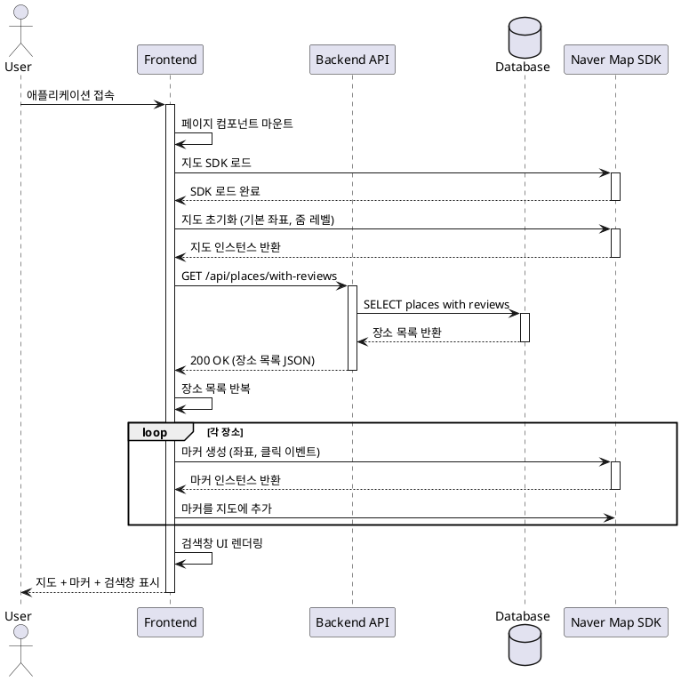

# 유스케이스 ID: UC-001

## 제목
메인 페이지 로딩 및 지도 표시

---

## 1. 개요

### 1.1 목적
사용자가 맛집 리뷰 플랫폼에 접속했을 때, 네이버 지도를 기반으로 리뷰가 작성된 장소들을 시각적으로 표시하여 즉시 탐색할 수 있도록 한다.

### 1.2 범위
- 네이버 지도 SDK 초기화 및 렌더링
- 리뷰가 존재하는 장소들의 마커 표시
- 기본 지도 조작 기능 제공 (확대/축소, 이동)
- 검색창 UI 표시

**제외 사항**:
- 장소 검색 기능 (UC-002에서 처리)
- 마커 클릭 후 페이지 이동 (UC-004에서 처리)

### 1.3 액터
- **주요 액터**: 일반 사용자 (방문자)
- **부 액터**: 네이버 지도 SDK, Supabase Database

---

## 2. 선행 조건

- 사용자의 브라우저가 JavaScript를 지원해야 함
- 네이버 지도 SDK가 로드 가능한 네트워크 환경이어야 함
- 데이터베이스 연결이 가능해야 함

---

## 3. 참여 컴포넌트

- **Frontend (메인 페이지)**: 지도 컨테이너 렌더링, 네이버 지도 SDK 초기화
- **Backend API**: 리뷰가 존재하는 장소 목록 조회 엔드포인트
- **Supabase Database**: `places` 및 `reviews` 테이블 조회
- **네이버 지도 SDK**: 지도 렌더링 및 마커 표시

---

## 4. 기본 플로우 (Basic Flow)

### 4.1 단계별 흐름

1. **사용자**: 애플리케이션 URL 접속
   - 입력: 브라우저에 URL 입력
   - 처리: 메인 페이지 요청
   - 출력: HTML 페이지 로딩 시작

2. **Frontend**: 페이지 초기화
   - 입력: 페이지 컴포넌트 마운트
   - 처리: 네이버 지도 SDK 스크립트 로드
   - 출력: 지도 컨테이너 DOM 생성

3. **Frontend**: 네이버 지도 SDK 초기화
   - 입력: 지도 컨테이너 DOM 참조
   - 처리:
     - 기본 좌표 설정 (서울 중심: 37.5665, 126.9780)
     - 기본 줌 레벨 설정 (레벨 13)
     - 지도 인스턴스 생성
   - 출력: 지도 렌더링 완료

4. **Frontend**: 리뷰가 있는 장소 목록 요청
   - 입력: 없음
   - 처리: `GET /api/places/with-reviews` API 호출
   - 출력: API 요청 전송

5. **Backend**: 장소 목록 조회
   - 입력: API 요청
   - 처리:
     ```sql
     SELECT DISTINCT
       p.id,
       p.naver_place_id,
       p.name,
       p.address,
       p.latitude,
       p.longitude,
       COUNT(r.id) as review_count
     FROM places p
     INNER JOIN reviews r ON p.id = r.place_id
     GROUP BY p.id, p.naver_place_id, p.name, p.address, p.latitude, p.longitude
     ORDER BY review_count DESC;
     ```
   - 출력: JSON 형태의 장소 목록

6. **Frontend**: 마커 생성 및 표시
   - 입력: 장소 목록 데이터
   - 처리:
     - 각 장소의 좌표로 마커 생성
     - 마커 클릭 이벤트 리스너 등록
     - 지도에 마커 추가
   - 출력: 지도에 마커 표시 완료

7. **Frontend**: 검색창 UI 렌더링
   - 입력: 없음
   - 처리: 검색창 컴포넌트 렌더링
   - 출력: 지도 상단에 검색창 표시

### 4.2 시퀀스 다이어그램



---

## 5. 대안 플로우 (Alternative Flows)

### 5.1 대안 플로우 1: 리뷰가 없는 경우

**시작 조건**: 단계 5에서 데이터베이스에 리뷰가 하나도 없는 경우

**단계**:
1. Backend가 빈 배열 반환
2. Frontend는 마커를 생성하지 않음
3. 사용자에게 "아직 작성된 리뷰가 없습니다" 메시지 표시
4. 검색창은 정상적으로 표시되어 사용자가 새로운 장소를 검색할 수 있도록 함

**결과**: 빈 지도와 검색창만 표시된 메인 페이지

---

## 6. 예외 플로우 (Exception Flows)

### 6.1 예외 상황 1: 네이버 지도 SDK 로딩 실패

**발생 조건**:
- 네트워크 오류로 SDK 스크립트 로드 실패
- API 키가 유효하지 않음
- 네이버 지도 서비스 장애

**처리 방법**:
1. 지도 컨테이너에 에러 메시지 표시
2. "지도를 불러올 수 없습니다. 페이지를 새로고침해주세요" 메시지
3. 재시도 버튼 제공
4. 콘솔에 에러 로깅

**에러 코드**: `MAP_SDK_LOAD_FAILED`

**사용자 메시지**: "지도를 불러오는 데 실패했습니다. 잠시 후 다시 시도해주세요."

### 6.2 예외 상황 2: 장소 목록 조회 API 실패

**발생 조건**:
- 데이터베이스 연결 오류
- 네트워크 타임아웃
- 서버 내부 오류

**처리 방법**:
1. 지도는 정상적으로 표시
2. 마커는 표시되지 않음
3. 화면 하단에 토스트 메시지 표시
4. 백그라운드에서 자동 재시도 (최대 3회)
5. 실패 시 에러 로깅

**에러 코드**: `PLACES_FETCH_FAILED` (HTTP 500)

**사용자 메시지**: "리뷰 정보를 불러오는 데 실패했습니다. 검색 기능은 정상적으로 사용할 수 있습니다."

### 6.3 예외 상황 3: 브라우저 미지원

**발생 조건**:
- 브라우저가 JavaScript를 지원하지 않음
- 필수 웹 API가 지원되지 않음 (Fetch API, Promise 등)

**처리 방법**:
1. noscript 태그로 경고 메시지 표시
2. 최신 브라우저 사용 권장 메시지

**사용자 메시지**: "이 브라우저는 지원되지 않습니다. Chrome, Firefox, Safari 최신 버전을 사용해주세요."

### 6.4 예외 상황 4: 좌표 정보가 없는 장소

**발생 조건**:
- 데이터베이스에 장소는 있으나 latitude 또는 longitude가 NULL

**처리 방법**:
1. 해당 장소는 마커 생성에서 제외
2. 에러 로깅 (데이터 정합성 문제)
3. 다른 정상적인 장소들의 마커는 정상 표시

---

## 7. 후행 조건 (Post-conditions)

### 7.1 성공 시

- **프론트엔드 상태**:
  - 지도가 화면에 렌더링되어 있음
  - 리뷰가 있는 장소들에 마커가 표시되어 있음
  - 검색창이 상단에 표시되어 있음
  - 지도 조작 가능 (확대/축소, 드래그)

- **데이터베이스 변경**: 없음 (읽기 전용 작업)

- **외부 시스템**: 네이버 지도 SDK가 메모리에 로드되어 있음

### 7.2 실패 시

- **프론트엔드 상태**:
  - 에러 메시지 표시
  - 재시도 옵션 제공

- **데이터 롤백**: 없음 (데이터 변경 없음)

---

## 8. 비기능 요구사항

### 8.1 성능
- 지도 초기 로딩 시간: 3초 이내
- 마커 100개 표시 시간: 1초 이내
- API 응답 시간: 500ms 이내

### 8.2 보안
- API 요청에 적절한 CORS 헤더 설정
- 네이버 지도 API 키는 환경변수로 관리
- SQL Injection 방어를 위한 파라미터화된 쿼리 사용

### 8.3 가용성
- 네이버 지도 SDK 로드 실패 시 재시도 메커니즘
- API 요청 실패 시 자동 재시도 (최대 3회)

---

## 9. UI/UX 요구사항

### 9.1 화면 구성
- **지도 영역**: 화면 전체를 차지하는 지도 컨테이너
- **검색창**: 지도 상단 중앙에 고정, 반투명 배경
- **마커**: 리뷰가 있는 장소에 표시, 클릭 가능한 인터랙션 제공
- **로딩 인디케이터**: 데이터 로딩 중 스피너 표시

### 9.2 사용자 경험
- 지도는 부드럽게 로딩되어야 함
- 마커 클릭 시 시각적 피드백 (호버 효과)
- 검색창은 항상 접근 가능한 위치에 고정
- 모바일 환경에서도 정상 작동 (반응형 디자인)

---

## 10. 테스트 시나리오

### 10.1 성공 케이스

| 테스트 케이스 ID | 입력값 | 기대 결과 |
|----------------|--------|----------|
| TC-001-01 | 정상적인 브라우저 접속 | 지도가 정상적으로 표시됨 |
| TC-001-02 | 리뷰가 있는 장소 5개 | 5개의 마커가 지도에 표시됨 |
| TC-001-03 | 빈 데이터베이스 | 빈 지도와 안내 메시지 표시 |

### 10.2 실패 케이스

| 테스트 케이스 ID | 입력값 | 기대 결과 |
|----------------|--------|----------|
| TC-001-04 | 네이버 SDK 로드 실패 | 에러 메시지 및 재시도 버튼 표시 |
| TC-001-05 | API 서버 응답 없음 | 타임아웃 후 에러 메시지, 지도는 정상 표시 |
| TC-001-06 | 좌표 정보 없는 장소 | 해당 장소 제외하고 다른 마커는 정상 표시 |

---

## 11. 관련 유스케이스

- **후행 유스케이스**:
  - UC-002: 장소 검색 (검색창 사용)
  - UC-004: 장소 세부정보 조회 (마커 클릭)

---

## 12. 변경 이력

| 버전 | 날짜 | 작성자 | 변경 내용 |
|------|------|--------|-----------|
| 1.0  | 2025-10-22 | Claude | 초기 작성 |

---

## 부록

### A. 용어 정의
- **마커**: 지도 위에 특정 위치를 나타내는 시각적 표시
- **네이버 지도 SDK**: 네이버가 제공하는 웹 지도 JavaScript API (v3)
- **줌 레벨**: 지도의 확대/축소 정도 (숫자가 클수록 더 확대됨)

### B. 참고 자료
- `/docs/prd.md`: 프로젝트 요구사항 정의서
- `/docs/userflow.md`: 사용자 플로우 상세 문서 (플로우 1)
- `/docs/database.md`: 데이터베이스 스키마 정의
- `/docs/map_sdk.md`: 네이버 지도 SDK 사용 가이드
- [네이버 지도 API 공식 문서](https://navermaps.github.io/maps.js.ncp/)
