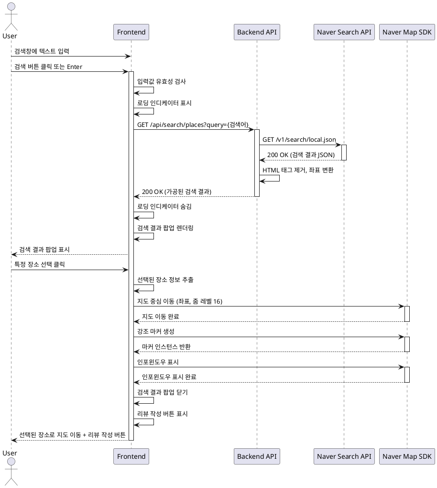

# 유스케이스 ID: UC-002

## 제목
장소 검색 및 선택

---

## 1. 개요

### 1.1 목적
사용자가 메인 페이지 상단 검색창을 통해 네이버 검색 API를 활용하여 맛집을 검색하고, 검색 결과에서 원하는 장소를 선택하여 해당 위치로 지도를 이동시킨다.

### 1.2 범위
- 검색창에 장소명 입력
- 네이버 검색 API를 통한 장소 검색
- 검색 결과 팝업 표시
- 검색 결과에서 장소 선택
- 선택한 장소로 지도 이동 및 강조 표시
- 리뷰 작성 버튼 표시

**제외 사항**:
- 리뷰 작성 페이지 이동 (UC-003에서 처리)
- 기존 마커 클릭 (UC-004에서 처리)

### 1.3 액터
- **주요 액터**: 일반 사용자 (방문자)
- **부 액터**: 네이버 검색 API, Backend API, 네이버 지도 SDK

---

## 2. 선행 조건

- 메인 페이지가 로딩되어 있어야 함 (UC-001 완료)
- 네이버 지도가 정상적으로 표시되어 있어야 함
- 네이버 검색 API가 사용 가능해야 함

---

## 3. 참여 컴포넌트

- **Frontend (검색 UI)**: 검색창 입력 처리, 결과 팝업 렌더링
- **Backend API**: 네이버 검색 API 프록시 엔드포인트
- **네이버 검색 API**: 지역 검색 서비스 (`/search/local.json`)
- **네이버 지도 SDK**: 지도 이동 및 마커 표시

---

## 4. 기본 플로우 (Basic Flow)

### 4.1 단계별 흐름

1. **사용자**: 검색창에 장소명 입력
   - 입력: 텍스트 입력 (예: "강남역 맛집")
   - 처리: 실시간 입력 감지
   - 출력: 입력 필드에 텍스트 표시

2. **사용자**: 검색 실행
   - 입력: Enter 키 입력 또는 검색 버튼 클릭
   - 처리: 입력값 유효성 검사 (빈 문자열 여부)
   - 출력: 검색 요청 트리거

3. **Frontend**: 검색 요청 전송
   - 입력: 검색어
   - 처리:
     - 로딩 인디케이터 표시
     - `GET /api/search/places?query={검색어}` API 호출
   - 출력: API 요청 전송

4. **Backend**: 네이버 검색 API 호출
   - 입력: 검색어
   - 처리:
     ```typescript
     // 네이버 검색 API 요청
     GET https://openapi.naver.com/v1/search/local.json
     Headers:
       - X-Naver-Client-Id: {CLIENT_ID}
       - X-Naver-Client-Secret: {CLIENT_SECRET}
     Params:
       - query: {검색어}
       - display: 5 (최대 5개 결과)
     ```
   - 출력: 검색 결과 JSON

5. **Backend**: 검색 결과 가공
   - 입력: 네이버 API 응답
   - 처리:
     - HTML 태그 제거 (장소명, 주소)
     - 좌표 정보 추출 (mapx, mapy를 경위도로 변환)
     - 필요한 필드만 추출
   - 출력: 가공된 JSON 응답
     ```json
     {
       "items": [
         {
           "title": "장소명",
           "address": "주소",
           "category": "카테고리",
           "latitude": 37.1234,
           "longitude": 127.1234,
           "naver_place_id": "네이버 place ID"
         }
       ]
     }
     ```

6. **Frontend**: 검색 결과 팝업 표시
   - 입력: 가공된 검색 결과
   - 처리:
     - 로딩 인디케이터 숨김
     - 결과 목록 렌더링
     - 팝업 오버레이 표시
   - 출력: 검색 결과 팝업 화면 표시

7. **사용자**: 검색 결과에서 장소 선택
   - 입력: 특정 장소 항목 클릭
   - 처리: 선택 이벤트 발생
   - 출력: 선택된 장소 정보

8. **Frontend**: 선택된 장소로 지도 이동
   - 입력: 선택된 장소의 좌표
   - 처리:
     - 지도 중심을 선택된 좌표로 이동
     - 줌 레벨을 16으로 조정 (상세 확대)
     - 선택된 장소에 강조 마커 생성
     - 인포윈도우 표시 (장소명, 주소)
     - 검색 결과 팝업 닫기
   - 출력: 지도가 해당 위치로 이동, 강조 마커 표시

9. **Frontend**: 리뷰 작성 버튼 표시
   - 입력: 선택된 장소 정보
   - 처리:
     - 선택된 장소 정보를 전역 상태에 저장
     - 지도 하단에 플로팅 액션 버튼 표시
   - 출력: "리뷰 작성" 버튼 표시

### 4.2 시퀀스 다이어그램



---

## 5. 대안 플로우 (Alternative Flows)

### 5.1 대안 플로우 1: 검색 결과 없음

**시작 조건**: 단계 4에서 네이버 검색 API가 빈 결과 반환

**단계**:
1. Backend가 빈 배열 반환
2. Frontend는 검색 결과 팝업에 "검색 결과가 없습니다" 메시지 표시
3. 다른 검색어 입력 권장 메시지 표시
4. 팝업 닫기 버튼만 활성화

**결과**: 사용자는 다시 검색창에 다른 검색어를 입력할 수 있음

### 5.2 대안 플로우 2: 빈 검색어 입력

**시작 조건**: 단계 2에서 입력값이 빈 문자열 또는 공백만 있는 경우

**단계**:
1. Frontend에서 유효성 검사 실패
2. API 요청 전송하지 않음
3. 검색창 하단에 인라인 에러 메시지 표시
4. "검색어를 입력해주세요" 안내

**결과**: 사용자가 유효한 검색어를 입력할 때까지 대기

### 5.3 대안 플로우 3: 검색 결과 팝업 닫기

**시작 조건**: 사용자가 장소를 선택하지 않고 팝업 닫기 버튼 클릭

**단계**:
1. 검색 결과 팝업 닫기
2. 지도는 현재 위치 유지
3. 선택된 장소 정보 초기화

**결과**: 메인 페이지 상태로 복귀, 다시 검색 가능

---

## 6. 예외 플로우 (Exception Flows)

### 6.1 예외 상황 1: 네이버 검색 API 호출 실패

**발생 조건**:
- 네이버 API 서버 장애
- API 키 인증 실패
- Rate Limit 초과
- 네트워크 타임아웃

**처리 방법**:
1. Backend에서 에러 응답 반환
2. Frontend는 로딩 인디케이터 숨김
3. 검색 결과 팝업에 에러 메시지 표시
4. "검색 서비스가 일시적으로 불가합니다" 안내
5. 재시도 버튼 제공
6. 에러 로깅 (서버 로그)

**에러 코드**: `SEARCH_API_FAILED` (HTTP 502)

**사용자 메시지**: "검색 서비스에 일시적인 문제가 발생했습니다. 잠시 후 다시 시도해주세요."

### 6.2 예외 상황 2: 좌표 정보 없는 검색 결과

**발생 조건**:
- 네이버 API 응답에 mapx 또는 mapy가 0 또는 null

**처리 방법**:
1. Backend에서 좌표가 없는 항목 필터링
2. 좌표가 있는 항목만 반환
3. 모든 항목에 좌표가 없으면 "검색 결과 없음" 처리

**에러 코드**: 없음 (정상 처리)

### 6.3 예외 상황 3: 지도 이동 실패

**발생 조건**:
- 지도 SDK에서 좌표 범위 오류
- 지도 인스턴스가 초기화되지 않음

**처리 방법**:
1. try-catch로 에러 감지
2. 콘솔에 에러 로깅
3. 사용자에게 토스트 메시지 표시
4. 검색 결과 팝업은 유지하여 다른 장소 선택 가능

**에러 코드**: `MAP_MOVE_FAILED`

**사용자 메시지**: "지도를 이동할 수 없습니다. 다른 장소를 선택해보세요."

### 6.4 예외 상황 4: API Rate Limit 초과

**발생 조건**:
- 네이버 검색 API 일일 호출 한도 초과
- 짧은 시간에 과도한 요청

**처리 방법**:
1. Backend에서 429 에러 반환
2. Frontend는 에러 메시지 표시
3. "일시적으로 검색이 제한되었습니다" 안내
4. 재시도 가능 시간 표시 (있는 경우)

**에러 코드**: `RATE_LIMIT_EXCEEDED` (HTTP 429)

**사용자 메시지**: "검색 요청이 너무 많습니다. 잠시 후 다시 시도해주세요."

---

## 7. 후행 조건 (Post-conditions)

### 7.1 성공 시

- **프론트엔드 상태**:
  - 지도가 선택된 장소 위치로 이동되어 있음
  - 선택된 장소에 강조 마커가 표시되어 있음
  - 인포윈도우에 장소 정보가 표시되어 있음
  - 리뷰 작성 버튼이 활성화되어 있음
  - 선택된 장소 정보가 전역 상태에 저장되어 있음

- **데이터베이스 변경**: 없음 (읽기 전용 작업)

- **외부 시스템**: 네이버 검색 API 호출 1회 소비

### 7.2 실패 시

- **프론트엔드 상태**:
  - 지도는 이전 상태 유지
  - 에러 메시지 표시
  - 재시도 옵션 제공

- **데이터 롤백**: 없음 (데이터 변경 없음)

---

## 8. 비기능 요구사항

### 8.1 성능
- 검색 API 응답 시간: 1초 이내
- 검색 결과 팝업 렌더링 시간: 300ms 이내
- 지도 이동 애니메이션: 부드러운 전환 (500ms)

### 8.2 보안
- 네이버 API 키는 Backend에서만 사용 (Frontend 노출 금지)
- 검색어 입력값 sanitization (XSS 방어)
- Rate Limiting 구현 (동일 IP에서 초당 최대 3회 요청)

### 8.3 가용성
- 네이버 API 실패 시 재시도 메커니즘 (최대 2회)
- 타임아웃 설정 (5초)

---

## 9. UI/UX 요구사항

### 9.1 화면 구성
- **검색창**:
  - 지도 상단 중앙에 고정
  - 반투명 배경 (backdrop-blur)
  - placeholder: "맛집을 검색해보세요"
  - 검색 아이콘 버튼

- **검색 결과 팝업**:
  - 모달 형태의 오버레이
  - 중앙 정렬
  - 최대 5개 결과 표시
  - 각 항목: 장소명, 주소, 카테고리
  - 스크롤 가능

- **강조 마커**:
  - 기본 마커와 다른 색상 (빨간색)
  - 크기가 약간 더 큼
  - 바운스 애니메이션

- **인포윈도우**:
  - 마커 위에 표시
  - 장소명 (볼드체)
  - 주소 (작은 글씨)
  - 닫기 버튼

- **리뷰 작성 버튼**:
  - 플로팅 액션 버튼 (FAB)
  - 화면 우측 하단 고정
  - 텍스트: "리뷰 작성"
  - 아이콘: 펜 또는 별

### 9.2 사용자 경험
- 검색창에 입력 시 자동완성 제안 (선택사항, 향후 확장)
- 검색 결과 로딩 중 스켈레톤 UI 표시
- 지도 이동 시 부드러운 애니메이션
- 모바일에서는 검색 결과 팝업이 하단 시트 형태
- 키보드 접근성 지원 (Tab, Enter 키)

---

## 10. 테스트 시나리오

### 10.1 성공 케이스

| 테스트 케이스 ID | 입력값 | 기대 결과 |
|----------------|--------|----------|
| TC-002-01 | "강남역 맛집" 입력 후 검색 | 검색 결과 팝업에 5개 이하의 장소 표시 |
| TC-002-02 | 검색 결과에서 첫 번째 장소 선택 | 지도가 해당 위치로 이동, 마커 및 인포윈도우 표시 |
| TC-002-03 | 장소 선택 후 리뷰 작성 버튼 확인 | 화면 우측 하단에 FAB 버튼 표시 |

### 10.2 실패 케이스

| 테스트 케이스 ID | 입력값 | 기대 결과 |
|----------------|--------|----------|
| TC-002-04 | 빈 문자열 입력 후 검색 | 인라인 에러 메시지 표시, API 호출 없음 |
| TC-002-05 | "asjkdfhlasjdhf" (존재하지 않는 장소) | "검색 결과가 없습니다" 메시지 표시 |
| TC-002-06 | 네이버 API 타임아웃 시뮬레이션 | 에러 메시지 및 재시도 버튼 표시 |
| TC-002-07 | 좌표 정보 없는 결과만 반환 | 필터링 후 "검색 결과 없음" 처리 |

---

## 11. 관련 유스케이스

- **선행 유스케이스**:
  - UC-001: 메인 페이지 로딩 및 지도 표시

- **후행 유스케이스**:
  - UC-003: 리뷰 작성 (리뷰 작성 버튼 클릭)

---

## 12. 변경 이력

| 버전 | 날짜 | 작성자 | 변경 내용 |
|------|------|--------|-----------|
| 1.0  | 2025-10-22 | Claude | 초기 작성 |

---

## 부록

### A. 용어 정의
- **네이버 검색 API**: 네이버가 제공하는 지역 검색 REST API
- **인포윈도우**: 지도 마커 위에 표시되는 정보 팝업
- **플로팅 액션 버튼 (FAB)**: 화면에 떠있는 둥근 액션 버튼
- **Rate Limit**: API 호출 횟수 제한
- **Sanitization**: 사용자 입력값에서 위험한 문자를 제거하는 과정

### B. 참고 자료
- `/docs/prd.md`: 프로젝트 요구사항 정의서
- `/docs/userflow.md`: 사용자 플로우 상세 문서 (플로우 2, 3)
- `/docs/searchAPI.md`: 네이버 검색 API 사용 가이드
- [네이버 검색 API 공식 문서](https://developers.naver.com/docs/serviceapi/search/local/local.md)
- [네이버 지도 API - 마커](https://navermaps.github.io/maps.js.ncp/docs/tutorial-2-Marker.html)

### C. 네이버 검색 API Place ID 처리

네이버 Local Search API는 직접적인 place ID 필드를 제공하지 않습니다. 다음 방법으로 고유 ID를 생성합니다:

**우선 방법: `link` 필드에서 ID 추출**
```typescript
// link 예시: "https://map.naver.com/v5/entry/place/1234567890"
const extractPlaceId = (link: string): string | null => {
  const match = link.match(/place\/(\d+)/);
  return match ? match[1] : null;
};
```

**폴백 방법: 좌표 기반 고유 ID 생성**
```typescript
// mapx, mapy를 조합한 고유 ID
const generateFallbackId = (mapx: string, mapy: string): string => {
  return `${mapx}_${mapy}`;
};
```

**구현 로직:**
1. 네이버 API 응답에서 `link` 필드 확인
2. `link`에서 place ID 추출 시도
3. 추출 성공 시 해당 ID를 `naver_place_id`로 사용
4. 추출 실패 시 좌표 기반 ID를 `naver_place_id`로 사용
5. 데이터베이스의 `naver_place_id` UNIQUE 제약조건으로 중복 방지
