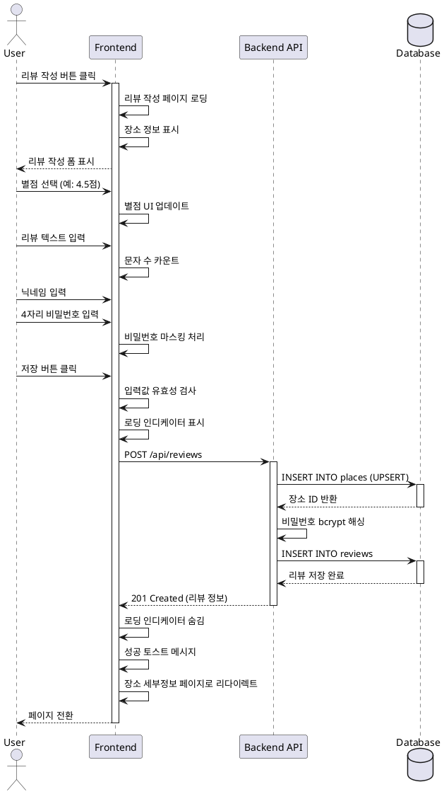

# 유스케이스 ID: UC-003

## 제목
리뷰 작성

---

## 1. 개요

### 1.1 목적
사용자가 선택한 장소에 대해 별점과 텍스트 리뷰를 작성하고, 닉네임과 4자리 숫자 비밀번호로 간단한 인증을 설정하여 리뷰를 저장한다.

### 1.2 범위
- 리뷰 작성 페이지 접근
- 장소 정보 표시
- 별점 선택 (1-5점, 0.5점 단위)
- 리뷰 텍스트 입력 (선택사항)
- 닉네임 입력
- 4자리 숫자 비밀번호 입력
- 입력값 유효성 검사
- 장소 정보 저장 (없는 경우)
- 리뷰 저장
- 장소 세부정보 페이지로 리다이렉트

**제외 사항**:
- 리뷰 수정/삭제 (UC-005, UC-006에서 처리)
- 사진 첨부 (미지원)

### 1.3 액터
- **주요 액터**: 일반 사용자 (방문자)
- **부 액터**: Backend API, Supabase Database

---

## 2. 선행 조건

- 장소가 선택되어 있어야 함 (UC-002 완료 또는 UC-004에서 접근)
- 선택된 장소 정보가 전역 상태에 저장되어 있어야 함
  - 장소명
  - 주소
  - 좌표 (latitude, longitude)
  - 네이버 place ID
  - 카테고리 (선택사항)

---

## 3. 참여 컴포넌트

- **Frontend (리뷰 작성 폼)**: 입력 폼 렌더링, 유효성 검사, 제출 처리
- **Backend API**:
  - 장소 저장 엔드포인트: `POST /api/places`
  - 리뷰 저장 엔드포인트: `POST /api/reviews`
- **Supabase Database**:
  - `places` 테이블: 장소 정보 UPSERT
  - `reviews` 테이블: 리뷰 INSERT

---

## 4. 기본 플로우 (Basic Flow)

### 4.1 단계별 흐름

1. **사용자**: 리뷰 작성 버튼 클릭
   - 입력: 플로팅 액션 버튼 또는 장소 세부정보 페이지의 버튼 클릭
   - 처리: 리뷰 작성 페이지로 라우팅
   - 출력: 페이지 전환

2. **Frontend**: 리뷰 작성 페이지 로딩
   - 입력: 선택된 장소 정보 (전역 상태 또는 URL 파라미터)
   - 처리:
     - 장소 정보 표시 영역 렌더링
     - 빈 입력 폼 렌더링
   - 출력: 리뷰 작성 페이지 표시

3. **Frontend**: 장소 정보 표시
   - 입력: 장소 데이터
   - 처리: 읽기 전용 정보 렌더링
   - 출력:
     - 장소명 (헤더)
     - 주소
     - 카테고리 (있는 경우)

4. **사용자**: 별점 선택
   - 입력: 별 아이콘 클릭 또는 드래그
   - 처리: 1.0 ~ 5.0 점, 0.5점 단위로 선택
   - 출력: 선택된 별점 시각적으로 표시 (채워진 별)

5. **사용자**: 리뷰 텍스트 입력 (선택사항)
   - 입력: 텍스트 에리어에 리뷰 내용 입력
   - 처리: 실시간 문자 수 카운트 (최대 500자)
   - 출력: 입력된 텍스트 및 문자 수 표시

6. **사용자**: 닉네임 입력
   - 입력: 닉네임 필드에 텍스트 입력
   - 처리: 실시간 문자 수 카운트 (최대 20자)
   - 출력: 입력된 닉네임 표시

7. **사용자**: 비밀번호 입력
   - 입력: 4자리 숫자 입력
   - 처리:
     - 숫자만 입력 가능하도록 제한
     - 마스킹 처리 (•••• 형태)
     - 4자리로 제한
   - 출력: 마스킹된 비밀번호 표시

8. **사용자**: 저장 버튼 클릭
   - 입력: 저장 버튼 클릭
   - 처리: 폼 제출 이벤트 발생
   - 출력: 제출 요청

9. **Frontend**: 입력값 유효성 검사
   - 입력: 폼 데이터
   - 처리:
     - 별점 선택 여부 확인 (필수)
     - 닉네임 입력 여부 확인 (필수, 빈 문자열 X)
     - 비밀번호 4자리 숫자 형식 확인 (필수)
     - 리뷰 텍스트는 선택사항 (빈 값 허용)
   - 출력: 유효성 검사 결과

10. **Frontend**: 리뷰 저장 요청
    - 입력: 유효한 폼 데이터
    - 처리:
      - 로딩 인디케이터 표시
      - `POST /api/reviews` API 호출
      ```json
      {
        "place": {
          "naver_place_id": "네이버 place ID",
          "name": "장소명",
          "address": "주소",
          "latitude": 37.1234,
          "longitude": 127.1234,
          "category": "카테고리"
        },
        "review": {
          "nickname": "닉네임",
          "password": "1234",
          "rating": 4.5,
          "review_text": "리뷰 텍스트"
        }
      }
      ```
    - 출력: API 요청 전송

11. **Backend**: 장소 저장 (UPSERT)
    - 입력: 장소 정보
    - 처리:
      ```sql
      INSERT INTO places (naver_place_id, name, address, latitude, longitude, category)
      VALUES ($1, $2, $3, $4, $5, $6)
      ON CONFLICT (naver_place_id)
      DO UPDATE SET
        name = EXCLUDED.name,
        address = EXCLUDED.address,
        latitude = EXCLUDED.latitude,
        longitude = EXCLUDED.longitude,
        category = EXCLUDED.category,
        updated_at = NOW()
      RETURNING id;
      ```
    - 출력: 장소 ID

12. **Backend**: 비밀번호 해싱
    - 입력: 4자리 숫자 비밀번호
    - 처리: bcrypt 해싱 (cost factor: 10)
    - 출력: 해싱된 비밀번호 문자열

13. **Backend**: 리뷰 저장
    - 입력: 리뷰 데이터 + 해싱된 비밀번호 + 장소 ID
    - 처리:
      ```sql
      INSERT INTO reviews (place_id, nickname, password_hash, rating, review_text)
      VALUES ($1, $2, $3, $4, $5)
      RETURNING id, place_id, nickname, rating, review_text, created_at;
      ```
    - 출력: 저장된 리뷰 정보

14. **Backend**: 성공 응답
    - 입력: 저장된 리뷰 정보
    - 처리: 응답 JSON 생성
    - 출력: `201 Created`
      ```json
      {
        "success": true,
        "data": {
          "review_id": 123,
          "place_id": 456,
          "redirect_url": "/places/456"
        }
      }
      ```

15. **Frontend**: 리다이렉트
    - 입력: 성공 응답
    - 처리:
      - 로딩 인디케이터 숨김
      - 성공 토스트 메시지 표시
      - 장소 세부정보 페이지로 리다이렉트
    - 출력: 페이지 전환

### 4.2 시퀀스 다이어그램



---

## 5. 대안 플로우 (Alternative Flows)

### 5.1 대안 플로우 1: 장소 정보 없이 접근

**시작 조건**: 단계 2에서 선택된 장소 정보가 없는 경우

**단계**:
1. Frontend에서 장소 정보 확인 실패
2. 에러 메시지 표시: "잘못된 접근입니다"
3. 3초 후 메인 페이지로 자동 리다이렉트
4. 또는 즉시 뒤로가기 버튼 제공

**결과**: 사용자가 메인 페이지로 돌아가 장소를 다시 선택

### 5.2 대안 플로우 2: 리뷰 텍스트 없이 저장

**시작 조건**: 사용자가 별점과 닉네임, 비밀번호만 입력하고 텍스트는 비움

**단계**:
1. 유효성 검사 통과 (리뷰 텍스트는 선택사항)
2. 리뷰 저장 API 호출
3. review_text는 NULL 또는 빈 문자열로 저장
4. 정상적으로 저장 완료

**결과**: 별점만 있는 리뷰가 저장됨

---

## 6. 예외 플로우 (Exception Flows)

### 6.1 예외 상황 1: 필수 필드 누락

**발생 조건**:
- 별점을 선택하지 않음
- 닉네임을 입력하지 않음
- 비밀번호를 입력하지 않음

**처리 방법**:
1. 유효성 검사 실패
2. 해당 필드에 빨간색 테두리 표시
3. 필드 하단에 인라인 에러 메시지 표시
   - 별점: "별점을 선택해주세요"
   - 닉네임: "닉네임을 입력해주세요"
   - 비밀번호: "4자리 비밀번호를 입력해주세요"
4. API 요청 전송하지 않음
5. 해당 필드로 포커스 이동

**에러 코드**: 없음 (클라이언트 측 유효성 검사)

**사용자 메시지**: 각 필드별 인라인 메시지

### 6.2 예외 상황 2: 비밀번호 형식 오류

**발생 조건**:
- 비밀번호가 4자리가 아님 (3자리 이하 또는 5자리 이상)
- 숫자가 아닌 문자 포함

**처리 방법**:
1. 유효성 검사 실패
2. 비밀번호 필드에 빨간색 테두리
3. "4자리 숫자를 입력해주세요" 메시지
4. API 요청 전송하지 않음

**에러 코드**: 없음 (클라이언트 측 유효성 검사)

**사용자 메시지**: "4자리 숫자를 입력해주세요"

### 6.3 예외 상황 3: 닉네임 길이 초과

**발생 조건**:
- 닉네임이 20자를 초과

**처리 방법**:
1. 입력 시 20자까지만 입력 가능하도록 제한 (maxLength)
2. 문자 수 카운터 표시 (예: 18/20)
3. 20자 초과 입력 불가

**에러 코드**: 없음 (입력 제한)

### 6.4 예외 상황 4: 리뷰 텍스트 길이 초과

**발생 조건**:
- 리뷰 텍스트가 500자를 초과

**처리 방법**:
1. 입력 시 500자까지만 입력 가능하도록 제한 (maxLength)
2. 문자 수 카운터 표시 (예: 487/500)
3. 500자 초과 입력 불가

**에러 코드**: 없음 (입력 제한)

### 6.5 예외 상황 5: 데이터베이스 저장 실패

**발생 조건**:
- 데이터베이스 연결 오류
- 제약조건 위반 (외래키, NOT NULL 등)
- 트랜잭션 롤백

**처리 방법**:
1. Backend에서 에러 응답 반환
2. Frontend는 로딩 인디케이터 숨김
3. 에러 토스트 메시지 표시
4. 폼 데이터는 유지 (사용자가 다시 입력할 필요 없음)
5. 재시도 버튼 제공
6. 서버 로그에 에러 상세 기록

**에러 코드**: `REVIEW_SAVE_FAILED` (HTTP 500)

**사용자 메시지**: "리뷰 저장에 실패했습니다. 다시 시도해주세요."

### 6.6 예외 상황 6: 네트워크 오류

**발생 조건**:
- API 요청 타임아웃
- 네트워크 연결 끊김

**처리 방법**:
1. Frontend에서 네트워크 에러 감지
2. 로딩 인디케이터 숨김
3. 에러 토스트 메시지 표시
4. 폼 데이터 유지
5. 재시도 버튼 제공

**에러 코드**: `NETWORK_ERROR`

**사용자 메시지**: "네트워크 연결을 확인해주세요."

---

## 7. 후행 조건 (Post-conditions)

### 7.1 성공 시

- **데이터베이스 변경**:
  - `places` 테이블: 장소가 없으면 INSERT, 있으면 UPDATE (UPSERT)
  - `reviews` 테이블: 새로운 리뷰 레코드 INSERT
  - `reviews.password_hash`: bcrypt 해싱된 비밀번호 저장

- **프론트엔드 상태**:
  - 장소 세부정보 페이지로 리다이렉트됨
  - 성공 토스트 메시지 표시됨
  - 폼 데이터 초기화

- **비즈니스 로직**:
  - 해당 장소의 평균 별점 재계산 필요 (조회 시)
  - 해당 장소가 지도에 마커로 표시됨 (다음 메인 페이지 로딩 시)

### 7.2 실패 시

- **데이터베이스 변경**: 없음 (트랜잭션 롤백)

- **프론트엔드 상태**:
  - 리뷰 작성 페이지에 유지
  - 폼 데이터 유지
  - 에러 메시지 표시

---

## 8. 비기능 요구사항

### 8.1 성능
- 리뷰 저장 API 응답 시간: 1초 이내
- 페이지 로딩 시간: 500ms 이내
- 비밀번호 해싱 시간: 300ms 이내

### 8.2 보안
- 비밀번호는 bcrypt로 해싱하여 저장 (cost factor: 10)
- 평문 비밀번호는 저장하지 않음
- 비밀번호는 마스킹 처리 (••••)
- 사용자 입력값 sanitization (XSS 방어)
- SQL Injection 방어 (파라미터화된 쿼리)

### 8.3 가용성
- API 요청 실패 시 재시도 메커니즘
- 폼 데이터 임시 저장 (localStorage, 선택사항)

---

## 9. UI/UX 요구사항

### 9.1 화면 구성
- **헤더**: 장소명 (볼드, 큰 글씨)
- **장소 정보 영역**:
  - 주소
  - 카테고리 (있는 경우)
  - 읽기 전용 (배경색 구분)

- **별점 선택 UI**:
  - 5개의 별 아이콘
  - 클릭 또는 드래그로 선택
  - 0.5점 단위 (반 별 지원)
  - 시각적 피드백 (호버, 선택 상태)

- **리뷰 텍스트 입력**:
  - 다중 라인 텍스트 에리어
  - placeholder: "맛집에 대한 솔직한 리뷰를 남겨주세요"
  - 문자 수 카운터 (우측 하단)
  - 최대 500자

- **닉네임 입력**:
  - 단일 라인 텍스트 필드
  - placeholder: "닉네임 (최대 20자)"
  - 최대 20자
  - 필수 필드 표시 (*)

- **비밀번호 입력**:
  - 단일 라인 숫자 필드
  - type="password" (마스킹)
  - placeholder: "4자리 숫자"
  - 최대 4자리
  - 숫자만 입력 가능
  - 필수 필드 표시 (*)

- **저장 버튼**:
  - 큰 버튼 (화면 하단 고정 또는 폼 하단)
  - 텍스트: "리뷰 저장"
  - 로딩 중 스피너 표시
  - 비활성화 상태 (유효성 검사 실패 시)

### 9.2 사용자 경험
- 필드별 실시간 유효성 검사
- 유효성 검사 실패 시 즉시 피드백
- 저장 중 버튼 비활성화 (중복 제출 방지)
- 키보드 접근성 (Tab, Enter 키)
- 모바일 환경에서도 입력 편의성 고려
  - 비밀번호 필드: 숫자 키패드 자동 표시
  - 리뷰 텍스트: 충분한 높이

---

## 10. 테스트 시나리오

### 10.1 성공 케이스

| 테스트 케이스 ID | 입력값 | 기대 결과 |
|----------------|--------|----------|
| TC-003-01 | 별점 4.5, 닉네임 "맛집헌터", 비밀번호 "1234", 텍스트 "맛있어요" | 리뷰 저장 성공, 장소 세부정보 페이지로 리다이렉트 |
| TC-003-02 | 별점 5.0, 닉네임 "홍길동", 비밀번호 "9999", 텍스트 없음 | 리뷰 저장 성공 (텍스트 NULL) |
| TC-003-03 | 새로운 장소 (DB에 없음) | places 테이블에 INSERT, reviews 테이블에 INSERT |

### 10.2 실패 케이스

| 테스트 케이스 ID | 입력값 | 기대 결과 |
|----------------|--------|----------|
| TC-003-04 | 별점 선택 안 함 | "별점을 선택해주세요" 에러 메시지, 제출 불가 |
| TC-003-05 | 닉네임 비움 | "닉네임을 입력해주세요" 에러 메시지, 제출 불가 |
| TC-003-06 | 비밀번호 "12" (2자리) | "4자리 숫자를 입력해주세요" 에러 메시지 |
| TC-003-07 | 비밀번호 "abcd" (문자) | 입력 불가 (숫자만 허용) |
| TC-003-08 | 닉네임 21자 입력 | 20자까지만 입력 가능 (제한) |
| TC-003-09 | 리뷰 텍스트 501자 입력 | 500자까지만 입력 가능 (제한) |
| TC-003-10 | DB 연결 실패 시뮬레이션 | 에러 메시지 표시, 폼 데이터 유지, 재시도 버튼 |

---

## 11. 관련 유스케이스

- **선행 유스케이스**:
  - UC-002: 장소 검색 및 선택 (리뷰 작성 버튼 활성화)
  - UC-004: 장소 세부정보 조회 (리뷰 작성 버튼)

- **후행 유스케이스**:
  - UC-004: 장소 세부정보 조회 (리다이렉트 후 표시)

---

## 12. 변경 이력

| 버전 | 날짜 | 작성자 | 변경 내용 |
|------|------|--------|-----------|
| 1.0  | 2025-10-22 | Claude | 초기 작성 |

---

## 부록

### A. 용어 정의
- **UPSERT**: INSERT + UPDATE 동작 (존재하면 업데이트, 없으면 삽입)
- **bcrypt**: 비밀번호 해싱 알고리즘 (단방향 암호화)
- **cost factor**: bcrypt 해싱의 반복 횟수 (10 = 2^10 = 1024회)
- **Sanitization**: 사용자 입력값에서 위험한 문자를 제거하는 과정

### B. 참고 자료
- `/docs/prd.md`: 프로젝트 요구사항 정의서
- `/docs/userflow.md`: 사용자 플로우 상세 문서 (플로우 4, 5)
- `/docs/database.md`: 데이터베이스 스키마 정의 (places, reviews 테이블)
- [bcrypt 라이브러리](https://www.npmjs.com/package/bcrypt)

### C. 네이버 검색 API Place ID 처리

네이버 Local Search API는 직접적인 place ID 필드를 제공하지 않습니다. 검색 결과에서 받은 장소 정보를 저장할 때 다음 방법으로 고유 ID를 생성합니다:

**우선 방법: `link` 필드에서 ID 추출**
```typescript
// link 예시: "https://map.naver.com/v5/entry/place/1234567890"
const extractPlaceId = (link: string): string | null => {
  const match = link.match(/place\/(\d+)/);
  return match ? match[1] : null;
};
```

**폴백 방법: 좌표 기반 고유 ID 생성**
```typescript
// mapx, mapy를 조합한 고유 ID
const generateFallbackId = (mapx: string, mapy: string): string => {
  return `${mapx}_${mapy}`;
};
```

**UPSERT 처리:**
```sql
INSERT INTO places (naver_place_id, name, address, latitude, longitude, category)
VALUES ($1, $2, $3, $4, $5, $6)
ON CONFLICT (naver_place_id)
DO UPDATE SET
  name = EXCLUDED.name,
  address = EXCLUDED.address,
  latitude = EXCLUDED.latitude,
  longitude = EXCLUDED.longitude,
  category = EXCLUDED.category,
  updated_at = NOW()
RETURNING id;
```

이 방식으로 동일 장소에 대한 중복 저장을 방지하고, 장소 정보가 변경되었을 때 자동으로 업데이트됩니다.
