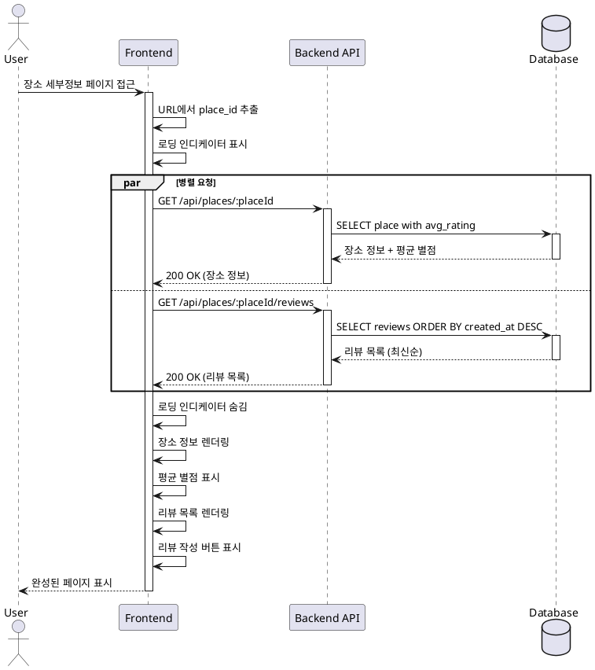

# 유스케이스 ID: UC-004

## 제목
장소 세부정보 조회 및 리뷰 목록 표시

---

## 1. 개요

### 1.1 목적
사용자가 특정 장소의 상세 정보를 확인하고, 해당 장소에 작성된 모든 리뷰를 최신순으로 조회하며, 평균 별점을 확인한다.

### 1.2 범위
- 장소 세부정보 페이지 접근
- 장소 기본 정보 표시 (장소명, 주소, 카테고리)
- 평균 별점 계산 및 표시
- 리뷰 목록 조회 및 표시 (최신순)
- 각 리뷰에 수정/삭제 버튼 표시
- 리뷰 작성 버튼 표시

**제외 사항**:
- 리뷰 수정/삭제 처리 (UC-005, UC-006에서 처리)
- 리뷰 작성 페이지 이동 (UC-003에서 처리)

### 1.3 액터
- **주요 액터**: 일반 사용자 (방문자)
- **부 액터**: Backend API, Supabase Database

---

## 2. 선행 조건

- 장소 ID가 URL 파라미터로 전달되어야 함
- 해당 장소가 데이터베이스에 존재해야 함

---

## 3. 참여 컴포넌트

- **Frontend (장소 세부정보 페이지)**: 페이지 렌더링, 데이터 조회 요청
- **Backend API**:
  - 장소 정보 조회 엔드포인트: `GET /api/places/:placeId`
  - 리뷰 목록 조회 엔드포인트: `GET /api/places/:placeId/reviews`
- **Supabase Database**:
  - `places` 테이블: 장소 정보 조회
  - `reviews` 테이블: 리뷰 목록 조회 및 평균 별점 계산

---

## 4. 기본 플로우 (Basic Flow)

### 4.1 단계별 흐름

1. **사용자**: 장소 세부정보 페이지 접근
   - 입력:
     - 메인 페이지에서 마커 클릭 (UC-001)
     - 리뷰 작성 완료 후 리다이렉트 (UC-003)
     - 직접 URL 접근
   - 처리: 페이지 요청
   - 출력: 페이지 로딩 시작

2. **Frontend**: 페이지 초기화
   - 입력: URL 파라미터에서 place_id 추출
   - 처리:
     - place_id 유효성 검사
     - 로딩 인디케이터 표시
   - 출력: 빈 페이지 스켈레톤 UI

3. **Frontend**: 장소 정보 및 리뷰 데이터 요청
   - 입력: place_id
   - 처리:
     - `GET /api/places/:placeId` API 호출
     - `GET /api/places/:placeId/reviews` API 호출
     - 두 요청을 병렬로 실행 (Promise.all)
   - 출력: API 요청 전송

4. **Backend**: 장소 정보 조회
   - 입력: place_id
   - 처리:
     ```sql
     SELECT
       p.id,
       p.naver_place_id,
       p.name,
       p.address,
       p.latitude,
       p.longitude,
       p.category,
       COALESCE(AVG(r.rating), 0) as avg_rating,
       COUNT(r.id) as review_count
     FROM places p
     LEFT JOIN reviews r ON p.id = r.place_id
     WHERE p.id = $1
     GROUP BY p.id, p.naver_place_id, p.name, p.address, p.latitude, p.longitude, p.category;
     ```
   - 출력: 장소 정보 + 평균 별점 + 리뷰 개수

5. **Backend**: 리뷰 목록 조회
   - 입력: place_id
   - 처리:
     ```sql
     SELECT
       id,
       place_id,
       nickname,
       rating,
       review_text,
       created_at,
       updated_at
     FROM reviews
     WHERE place_id = $1
     ORDER BY created_at DESC;
     ```
   - 출력: 리뷰 목록 (최신순)

6. **Backend**: 성공 응답
   - 입력: 장소 정보, 리뷰 목록
   - 처리: 응답 JSON 생성
   - 출력: `200 OK`
     ```json
     // 장소 정보 응답
     {
       "success": true,
       "data": {
         "id": 456,
         "naver_place_id": "12345678",
         "name": "맛있는 식당",
         "address": "서울시 강남구 ...",
         "latitude": 37.1234,
         "longitude": 127.1234,
         "category": "한식",
         "avg_rating": 4.3,
         "review_count": 15
       }
     }

     // 리뷰 목록 응답
     {
       "success": true,
       "data": [
         {
           "id": 123,
           "place_id": 456,
           "nickname": "맛집헌터",
           "rating": 4.5,
           "review_text": "맛있어요",
           "created_at": "2025-10-21T10:30:00Z",
           "updated_at": "2025-10-21T10:30:00Z"
         },
         ...
       ]
     }
     ```

7. **Frontend**: 데이터 렌더링
   - 입력: 장소 정보, 리뷰 목록
   - 처리:
     - 로딩 인디케이터 숨김
     - 장소 정보 렌더링
     - 평균 별점 표시 (별 아이콘 + 숫자)
     - 리뷰 개수 표시
     - 리뷰 목록 렌더링
   - 출력: 완성된 페이지 표시

8. **Frontend**: 장소 정보 영역 렌더링
   - 입력: 장소 데이터
   - 처리:
     - 헤더: 장소명 (큰 글씨, 볼드)
     - 주소 (회색 텍스트)
     - 카테고리 뱃지 (있는 경우)
     - 평균 별점 (별 아이콘 + 숫자 + 리뷰 개수)
   - 출력: 장소 정보 영역 표시

9. **Frontend**: 리뷰 목록 렌더링
   - 입력: 리뷰 배열
   - 처리: 각 리뷰를 카드 형태로 렌더링
     - 닉네임 (볼드)
     - 별점 (별 아이콘)
     - 작성일시 (상대 시간, 예: "3일 전")
     - 리뷰 텍스트 (있는 경우)
     - 수정 버튼
     - 삭제 버튼
   - 출력: 리뷰 목록 카드

10. **Frontend**: 리뷰 작성 버튼 표시
    - 입력: 없음
    - 처리: 페이지 하단에 플로팅 액션 버튼 렌더링
    - 출력: "리뷰 작성" 버튼 표시

### 4.2 시퀀스 다이어그램



---

## 5. 대안 플로우 (Alternative Flows)

### 5.1 대안 플로우 1: 리뷰가 없는 장소

**시작 조건**: 단계 5에서 리뷰 목록이 빈 배열

**단계**:
1. Backend가 빈 배열 반환
2. Frontend는 장소 정보는 정상 표시
3. 평균 별점은 표시하지 않음 (또는 "아직 별점이 없습니다")
4. 리뷰 목록 영역에 "아직 작성된 리뷰가 없습니다" 메시지 표시
5. 리뷰 작성 버튼 강조 (첫 리뷰 작성 유도)

**결과**: 리뷰가 없는 상태로 페이지 표시, 사용자가 첫 리뷰 작성 가능

### 5.2 대안 플로우 2: 리뷰 텍스트가 없는 리뷰

**시작 조건**: 리뷰 목록에 review_text가 NULL 또는 빈 문자열인 항목 포함

**단계**:
1. 해당 리뷰 카드에 리뷰 텍스트 영역을 렌더링하지 않음
2. 닉네임과 별점만 표시
3. 수정/삭제 버튼은 정상적으로 표시

**결과**: 별점만 있는 리뷰도 정상적으로 표시

---

## 6. 예외 플로우 (Exception Flows)

### 6.1 예외 상황 1: 장소 ID 누락 또는 잘못된 형식

**발생 조건**:
- URL에 place_id 파라미터가 없음
- place_id가 숫자가 아님

**처리 방법**:
1. Frontend에서 URL 파라미터 유효성 검사 실패
2. 에러 페이지 표시: "잘못된 접근입니다"
3. 3초 후 메인 페이지로 자동 리다이렉트
4. 또는 "메인으로 돌아가기" 버튼 제공

**에러 코드**: 없음 (클라이언트 측 검사)

**사용자 메시지**: "잘못된 접근입니다. 메인 페이지로 이동합니다."

### 6.2 예외 상황 2: 존재하지 않는 장소

**발생 조건**:
- 데이터베이스에 해당 place_id가 없음

**처리 방법**:
1. Backend에서 빈 결과 반환 또는 404 에러
2. Frontend는 404 페이지 표시
3. "존재하지 않는 장소입니다" 메시지
4. "메인으로 돌아가기" 버튼 제공

**에러 코드**: `PLACE_NOT_FOUND` (HTTP 404)

**사용자 메시지**: "존재하지 않는 장소입니다."

### 6.3 예외 상황 3: 데이터베이스 조회 실패

**발생 조건**:
- 데이터베이스 연결 오류
- 쿼리 실행 오류
- 타임아웃

**처리 방법**:
1. Backend에서 에러 응답 반환
2. Frontend는 로딩 인디케이터 숨김
3. 에러 페이지 또는 토스트 메시지 표시
4. 재시도 버튼 제공
5. 서버 로그에 에러 기록

**에러 코드**: `PLACE_FETCH_FAILED` (HTTP 500)

**사용자 메시지**: "장소 정보를 불러오는 데 실패했습니다. 다시 시도해주세요."

### 6.4 예외 상황 4: 리뷰 목록 조회 실패

**발생 조건**:
- 장소 정보는 정상 조회되었으나, 리뷰 목록 조회 실패

**처리 방법**:
1. 장소 정보는 정상 표시
2. 리뷰 목록 영역에 에러 메시지 표시
3. "리뷰를 불러올 수 없습니다" 안내
4. 재시도 버튼 제공

**에러 코드**: `REVIEWS_FETCH_FAILED` (HTTP 500)

**사용자 메시지**: "리뷰 목록을 불러오는 데 실패했습니다."

### 6.5 예외 상황 5: 네트워크 오류

**발생 조건**:
- API 요청 타임아웃
- 네트워크 연결 끊김

**처리 방법**:
1. Frontend에서 네트워크 에러 감지
2. 로딩 인디케이터 숨김
3. 에러 페이지 표시
4. "네트워크 연결을 확인해주세요" 메시지
5. 재시도 버튼 제공

**에러 코드**: `NETWORK_ERROR`

**사용자 메시지**: "네트워크 연결을 확인해주세요."

---

## 7. 후행 조건 (Post-conditions)

### 7.1 성공 시

- **프론트엔드 상태**:
  - 장소 정보가 화면에 표시되어 있음
  - 평균 별점이 표시되어 있음 (리뷰가 있는 경우)
  - 리뷰 목록이 최신순으로 표시되어 있음
  - 각 리뷰에 수정/삭제 버튼이 있음
  - 리뷰 작성 버튼이 활성화되어 있음

- **데이터베이스 변경**: 없음 (읽기 전용 작업)

- **외부 시스템**: 없음

### 7.2 실패 시

- **프론트엔드 상태**:
  - 에러 페이지 또는 메시지 표시
  - 재시도 옵션 제공

- **데이터 롤백**: 없음 (데이터 변경 없음)

---

## 8. 비기능 요구사항

### 8.1 성능
- 장소 정보 조회 API 응답 시간: 300ms 이내
- 리뷰 목록 조회 API 응답 시간: 500ms 이내
- 페이지 초기 렌더링 시간: 1초 이내
- 리뷰 100개 렌더링 시간: 500ms 이내

### 8.2 보안
- SQL Injection 방어 (파라미터화된 쿼리)
- 비밀번호는 절대 응답에 포함하지 않음
- 사용자 입력값 sanitization (XSS 방어)

### 8.3 가용성
- API 요청 실패 시 재시도 메커니즘 (최대 2회)
- 타임아웃 설정 (5초)

---

## 9. UI/UX 요구사항

### 9.1 화면 구성
- **헤더 영역**:
  - 뒤로가기 버튼 (메인 페이지로)
  - 장소명 (큰 글씨, 볼드)

- **장소 정보 영역**:
  - 주소 (작은 글씨, 회색)
  - 카테고리 뱃지 (있는 경우)
  - 평균 별점 (별 아이콘 + 숫자)
  - 리뷰 개수 (예: "15개의 리뷰")

- **리뷰 목록 영역**:
  - 각 리뷰 카드:
    - 닉네임 (볼드)
    - 별점 (별 아이콘)
    - 작성일시 (상대 시간)
    - 리뷰 텍스트 (있는 경우)
    - 수정 버튼 (아이콘)
    - 삭제 버튼 (아이콘)
  - 카드 사이 구분선
  - 스크롤 가능

- **리뷰 작성 버튼**:
  - 플로팅 액션 버튼 (FAB)
  - 화면 우측 하단 고정
  - 텍스트: "리뷰 작성"

- **로딩 상태**:
  - 스켈레톤 UI (장소 정보, 리뷰 카드)

- **빈 상태**:
  - 리뷰 없음 메시지
  - 리뷰 작성 유도 메시지
  - 리뷰 작성 버튼 강조

### 9.2 사용자 경험
- 페이지 로딩 중 스켈레톤 UI 표시
- 리뷰 목록 무한 스크롤 (선택사항, 향후 확장)
- 상대 시간 표시 (예: "방금 전", "3일 전", "2주 전")
- 수정/삭제 버튼 호버 효과
- 모바일 환경에서도 터치 친화적
- 뒤로가기 버튼으로 메인 페이지 복귀

---

## 10. 테스트 시나리오

### 10.1 성공 케이스

| 테스트 케이스 ID | 입력값 | 기대 결과 |
|----------------|--------|----------|
| TC-004-01 | 리뷰가 있는 장소 ID | 장소 정보 + 평균 별점 + 리뷰 목록 표시 |
| TC-004-02 | 리뷰가 없는 장소 ID | 장소 정보 표시, 빈 리뷰 메시지 |
| TC-004-03 | 리뷰 15개 있는 장소 | 15개 리뷰 최신순 정렬 표시 |
| TC-004-04 | 리뷰 텍스트 없는 리뷰 포함 | 별점만 있는 리뷰도 정상 표시 |

### 10.2 실패 케이스

| 테스트 케이스 ID | 입력값 | 기대 결과 |
|----------------|--------|----------|
| TC-004-05 | place_id 파라미터 없음 | 에러 메시지 및 메인 페이지 리다이렉트 |
| TC-004-06 | 존재하지 않는 place_id | 404 에러 페이지 표시 |
| TC-004-07 | DB 연결 실패 시뮬레이션 | 에러 메시지 및 재시도 버튼 표시 |
| TC-004-08 | 네트워크 타임아웃 | 네트워크 에러 메시지 및 재시도 버튼 |

---

## 11. 관련 유스케이스

- **선행 유스케이스**:
  - UC-001: 메인 페이지 로딩 및 지도 표시 (마커 클릭)
  - UC-003: 리뷰 작성 (작성 완료 후 리다이렉트)

- **후행 유스케이스**:
  - UC-003: 리뷰 작성 (리뷰 작성 버튼 클릭)
  - UC-005: 리뷰 수정 (수정 버튼 클릭)
  - UC-006: 리뷰 삭제 (삭제 버튼 클릭)

---

## 12. 변경 이력

| 버전 | 날짜 | 작성자 | 변경 내용 |
|------|------|--------|-----------|
| 1.0  | 2025-10-22 | Claude | 초기 작성 |

---

## 부록

### A. 용어 정의
- **스켈레톤 UI**: 로딩 중 표시되는 콘텐츠의 뼈대 형태 플레이스홀더
- **플로팅 액션 버튼 (FAB)**: 화면에 떠있는 둥근 액션 버튼
- **상대 시간**: 현재 시각 기준 상대적인 시간 표현 (예: "3일 전")
- **무한 스크롤**: 스크롤 시 자동으로 다음 데이터를 로드하는 UI 패턴

### B. 참고 자료
- `/docs/prd.md`: 프로젝트 요구사항 정의서
- `/docs/userflow.md`: 사용자 플로우 상세 문서 (플로우 6, 7, 13)
- `/docs/database.md`: 데이터베이스 스키마 정의 (places, reviews 테이블)
- [date-fns 라이브러리](https://date-fns.org/): 상대 시간 표시용
