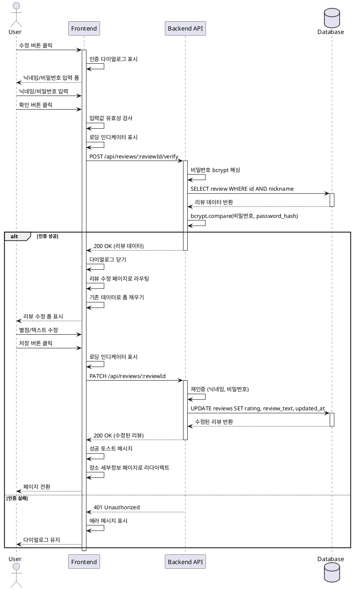

# 유스케이스 ID: UC-005

## 제목
리뷰 수정

---

## 1. 개요

### 1.1 목적
사용자가 자신이 작성한 리뷰를 닉네임과 비밀번호로 인증한 후, 별점과 리뷰 텍스트를 수정한다.

### 1.2 범위
- 장소 세부정보 페이지에서 수정 버튼 클릭
- 인증 다이얼로그 표시
- 닉네임 및 비밀번호 입력
- 인증 확인
- 리뷰 수정 페이지 표시
- 기존 리뷰 데이터 로딩
- 수정된 내용 저장
- 장소 세부정보 페이지로 리다이렉트

**제외 사항**:
- 리뷰 삭제 (UC-006에서 처리)
- 다른 사용자의 리뷰 수정 (인증 실패)

### 1.3 액터
- **주요 액터**: 일반 사용자 (리뷰 작성자)
- **부 액터**: Backend API, Supabase Database

---

## 2. 선행 조건

- 장소 세부정보 페이지가 로딩되어 있어야 함 (UC-004 완료)
- 수정할 리뷰가 존재해야 함
- 사용자가 해당 리뷰를 작성했어야 함 (닉네임과 비밀번호 일치)

---

## 3. 참여 컴포넌트

- **Frontend**:
  - 장소 세부정보 페이지: 수정 버튼 렌더링
  - 인증 다이얼로그: 닉네임/비밀번호 입력
  - 리뷰 수정 페이지: 수정 폼 렌더링
- **Backend API**:
  - 리뷰 인증 엔드포인트: `POST /api/reviews/:reviewId/verify`
  - 리뷰 조회 엔드포인트: `GET /api/reviews/:reviewId`
  - 리뷰 수정 엔드포인트: `PATCH /api/reviews/:reviewId`
- **Supabase Database**: `reviews` 테이블

---

## 4. 기본 플로우 (Basic Flow)

### 4.1 단계별 흐름

1. **사용자**: 수정 버튼 클릭
   - 입력: 장소 세부정보 페이지의 특정 리뷰 카드에서 수정 버튼 클릭
   - 처리: 수정 이벤트 발생
   - 출력: 클릭된 리뷰 ID

2. **Frontend**: 인증 다이얼로그 표시
   - 입력: 리뷰 ID
   - 처리:
     - 모달 오버레이 생성
     - 인증 폼 렌더링
   - 출력: 인증 다이얼로그 표시
     - 닉네임 입력 필드
     - 비밀번호 입력 필드 (4자리 숫자)
     - 확인 버튼
     - 취소 버튼

3. **사용자**: 닉네임 및 비밀번호 입력
   - 입력: 닉네임과 4자리 숫자 비밀번호 입력
   - 처리: 입력값 실시간 검증
   - 출력: 입력된 값 표시 (비밀번호는 마스킹)

4. **사용자**: 확인 버튼 클릭
   - 입력: 확인 버튼 클릭
   - 처리: 폼 제출 이벤트 발생
   - 출력: 제출 요청

5. **Frontend**: 입력값 유효성 검사
   - 입력: 닉네임, 비밀번호
   - 처리:
     - 닉네임 빈 문자열 확인
     - 비밀번호 4자리 숫자 형식 확인
   - 출력: 유효성 검사 결과

6. **Frontend**: 인증 요청
   - 입력: 유효한 닉네임, 비밀번호, 리뷰 ID
   - 처리:
     - 로딩 인디케이터 표시
     - `POST /api/reviews/:reviewId/verify` API 호출
     ```json
     {
       "nickname": "닉네임",
       "password": "1234"
     }
     ```
   - 출력: API 요청 전송

7. **Backend**: 비밀번호 해싱 및 인증 확인
   - 입력: 리뷰 ID, 닉네임, 비밀번호
   - 처리:
     - 입력된 비밀번호를 bcrypt로 해싱
     - 데이터베이스에서 리뷰 조회 및 비교
     ```sql
     SELECT id, place_id, nickname, rating, review_text, created_at, updated_at
     FROM reviews
     WHERE id = $1 AND nickname = $2;
     ```
     - bcrypt.compare로 비밀번호 일치 확인
   - 출력: 인증 성공/실패

8. **Backend**: 인증 성공 응답
   - 입력: 인증 성공
   - 처리: 리뷰 데이터 반환
   - 출력: `200 OK`
     ```json
     {
       "success": true,
       "data": {
         "id": 123,
         "place_id": 456,
         "nickname": "맛집헌터",
         "rating": 4.5,
         "review_text": "맛있어요",
         "created_at": "2025-10-21T10:30:00Z",
         "updated_at": "2025-10-21T10:30:00Z"
       }
     }
     ```

9. **Frontend**: 리뷰 수정 페이지로 이동
   - 입력: 인증 성공 응답
   - 처리:
     - 인증 다이얼로그 닫기
     - 리뷰 수정 페이지로 라우팅
     - 리뷰 ID를 URL 파라미터로 전달
   - 출력: 페이지 전환

10. **Frontend**: 리뷰 수정 페이지 로딩
    - 입력: 리뷰 데이터 (인증 응답에서 받음)
    - 처리:
      - 장소 정보 표시 (place_id로 조회 또는 캐시 사용)
      - 수정 폼 렌더링
      - 기존 데이터를 폼에 채우기
    - 출력: 수정 폼 표시
      - 별점 (기존 값 선택됨)
      - 리뷰 텍스트 (기존 값 표시됨)

11. **사용자**: 리뷰 내용 수정
    - 입력: 별점 변경, 텍스트 수정
    - 처리: 실시간 문자 수 카운트
    - 출력: 수정된 내용 표시

12. **사용자**: 저장 버튼 클릭
    - 입력: 저장 버튼 클릭
    - 처리: 폼 제출 이벤트 발생
    - 출력: 제출 요청

13. **Frontend**: 수정 요청
    - 입력: 수정된 별점, 텍스트, 리뷰 ID
    - 처리:
      - 로딩 인디케이터 표시
      - `PATCH /api/reviews/:reviewId` API 호출
      ```json
      {
        "nickname": "맛집헌터",
        "password": "1234",
        "rating": 5.0,
        "review_text": "정말 맛있어요!"
      }
      ```
    - 출력: API 요청 전송

14. **Backend**: 리뷰 수정
    - 입력: 리뷰 ID, 닉네임, 비밀번호, 수정된 데이터
    - 처리:
      - 재인증 (닉네임과 비밀번호 확인)
      - 인증 성공 시 리뷰 업데이트
      ```sql
      UPDATE reviews
      SET
        rating = $1,
        review_text = $2,
        updated_at = NOW()
      WHERE id = $3 AND nickname = $4 AND password_hash = $5
      RETURNING id, place_id, nickname, rating, review_text, updated_at;
      ```
    - 출력: 수정된 리뷰 정보

15. **Backend**: 성공 응답
    - 입력: 수정된 리뷰 데이터
    - 처리: 응답 JSON 생성
    - 출력: `200 OK`
      ```json
      {
        "success": true,
        "data": {
          "id": 123,
          "place_id": 456,
          "rating": 5.0,
          "review_text": "정말 맛있어요!",
          "updated_at": "2025-10-22T11:00:00Z"
        }
      }
      ```

16. **Frontend**: 리다이렉트
    - 입력: 성공 응답
    - 처리:
      - 로딩 인디케이터 숨김
      - 성공 토스트 메시지 표시
      - 장소 세부정보 페이지로 리다이렉트
    - 출력: 페이지 전환, 수정된 리뷰 표시

### 4.2 시퀀스 다이어그램



---

## 5. 대안 플로우 (Alternative Flows)

### 5.1 대안 플로우 1: 취소 버튼 클릭

**시작 조건**: 단계 2에서 인증 다이얼로그가 표시된 후

**단계**:
1. 사용자가 취소 버튼 클릭
2. 인증 다이얼로그 닫기
3. 장소 세부정보 페이지 상태 유지

**결과**: 리뷰 수정 취소, 페이지 상태 유지

### 5.2 대안 플로우 2: 수정 페이지에서 취소

**시작 조건**: 단계 11에서 리뷰 내용을 수정하는 중

**단계**:
1. 사용자가 취소 버튼 또는 뒤로가기 클릭
2. "변경사항이 저장되지 않습니다. 계속하시겠습니까?" 확인 다이얼로그 표시
3. 사용자가 확인 시 장소 세부정보 페이지로 리다이렉트
4. 사용자가 취소 시 수정 페이지 유지

**결과**: 수정 취소 또는 계속 수정

---

## 6. 예외 플로우 (Exception Flows)

### 6.1 예외 상황 1: 인증 실패 - 닉네임 불일치

**발생 조건**:
- 입력한 닉네임이 리뷰의 닉네임과 다름

**처리 방법**:
1. Backend에서 데이터베이스 조회 결과 없음
2. 401 Unauthorized 응답 반환
3. Frontend는 인증 다이얼로그에 에러 메시지 표시
4. "닉네임 또는 비밀번호가 일치하지 않습니다" 메시지
5. 다이얼로그 유지, 사용자 재입력 가능

**에러 코드**: `AUTH_FAILED` (HTTP 401)

**사용자 메시지**: "닉네임 또는 비밀번호가 일치하지 않습니다."

### 6.2 예외 상황 2: 인증 실패 - 비밀번호 불일치

**발생 조건**:
- 닉네임은 일치하나, 비밀번호가 다름

**처리 방법**:
1. Backend에서 bcrypt.compare 실패
2. 401 Unauthorized 응답 반환
3. Frontend는 인증 다이얼로그에 에러 메시지 표시
4. "닉네임 또는 비밀번호가 일치하지 않습니다" 메시지
5. 다이얼로그 유지, 사용자 재입력 가능

**에러 코드**: `AUTH_FAILED` (HTTP 401)

**사용자 메시지**: "닉네임 또는 비밀번호가 일치하지 않습니다."

### 6.3 예외 상황 3: 리뷰가 이미 삭제됨

**발생 조건**:
- 수정 버튼 클릭 후, 다른 사용자가 동일 리뷰를 삭제함

**처리 방법**:
1. Backend에서 리뷰 조회 시 결과 없음
2. 404 Not Found 응답 반환
3. Frontend는 에러 메시지 표시
4. "이미 삭제된 리뷰입니다" 안내
5. 3초 후 장소 세부정보 페이지 새로고침

**에러 코드**: `REVIEW_NOT_FOUND` (HTTP 404)

**사용자 메시지**: "이미 삭제된 리뷰입니다."

### 6.4 예외 상황 4: 필수 필드 누락 (수정 시)

**발생 조건**:
- 별점을 선택하지 않음 (수정 과정에서 의도치 않게 제거됨)

**처리 방법**:
1. Frontend에서 유효성 검사 실패
2. 별점 영역에 빨간색 테두리
3. "별점을 선택해주세요" 메시지
4. API 요청 전송하지 않음

**에러 코드**: 없음 (클라이언트 측 검사)

**사용자 메시지**: "별점을 선택해주세요"

### 6.5 예외 상황 5: 데이터베이스 업데이트 실패

**발생 조건**:
- 데이터베이스 연결 오류
- 제약조건 위반
- 트랜잭션 롤백

**처리 방법**:
1. Backend에서 에러 응답 반환
2. Frontend는 로딩 인디케이터 숨김
3. 에러 토스트 메시지 표시
4. 수정 페이지 유지, 폼 데이터 유지
5. 재시도 버튼 제공
6. 서버 로그에 에러 기록

**에러 코드**: `REVIEW_UPDATE_FAILED` (HTTP 500)

**사용자 메시지**: "리뷰 수정에 실패했습니다. 다시 시도해주세요."

### 6.6 예외 상황 6: 수정 시 재인증 실패

**발생 조건**:
- 수정 페이지에서 저장할 때, 닉네임 또는 비밀번호가 변경됨 (이론적으로 불가능하지만 보안상 재검증)

**처리 방법**:
1. Backend에서 재인증 실패
2. 401 Unauthorized 응답 반환
3. Frontend는 에러 메시지 표시
4. "인증 정보가 일치하지 않습니다" 안내
5. 장소 세부정보 페이지로 리다이렉트

**에러 코드**: `AUTH_FAILED` (HTTP 401)

**사용자 메시지**: "인증 정보가 일치하지 않습니다. 다시 시도해주세요."

---

## 7. 후행 조건 (Post-conditions)

### 7.1 성공 시

- **데이터베이스 변경**:
  - `reviews` 테이블: 해당 리뷰의 `rating`, `review_text`, `updated_at` 업데이트

- **프론트엔드 상태**:
  - 장소 세부정보 페이지로 리다이렉트됨
  - 수정된 리뷰가 표시됨
  - 성공 토스트 메시지 표시됨

- **비즈니스 로직**:
  - 해당 장소의 평균 별점 재계산 필요 (조회 시)

### 7.2 실패 시

- **데이터베이스 변경**: 없음 (트랜잭션 롤백)

- **프론트엔드 상태**:
  - 인증 실패 시: 인증 다이얼로그에 유지, 에러 메시지 표시
  - 수정 실패 시: 수정 페이지 유지, 폼 데이터 유지, 에러 메시지 표시

---

## 8. 비기능 요구사항

### 8.1 성능
- 인증 API 응답 시간: 500ms 이내 (bcrypt 해싱 포함)
- 수정 API 응답 시간: 500ms 이내
- 페이지 전환 시간: 300ms 이내

### 8.2 보안
- 비밀번호는 bcrypt로 해싱하여 비교
- 평문 비밀번호는 API 응답에 포함하지 않음
- 수정 시 재인증 필수 (이중 확인)
- 인증 실패 시 구체적인 실패 이유 노출하지 않음 (닉네임/비밀번호 구분 안 함)
- SQL Injection 방어 (파라미터화된 쿼리)

### 8.3 가용성
- API 요청 실패 시 재시도 메커니즘
- 타임아웃 설정 (5초)

---

## 9. UI/UX 요구사항

### 9.1 화면 구성

**인증 다이얼로그**:
- 모달 오버레이 (반투명 배경)
- 중앙 정렬
- 헤더: "리뷰 수정 인증"
- 닉네임 입력 필드
- 비밀번호 입력 필드 (4자리 숫자, 마스킹)
- 확인 버튼
- 취소 버튼
- 에러 메시지 영역 (인증 실패 시)

**리뷰 수정 페이지**:
- 장소 정보 영역 (읽기 전용)
- 별점 선택 UI (기존 값 선택됨)
- 리뷰 텍스트 입력 (기존 값 표시)
- 문자 수 카운터
- 저장 버튼
- 취소 버튼

### 9.2 사용자 경험
- 인증 다이얼로그는 Escape 키로 닫기 가능
- 인증 실패 시 입력 필드 초기화하지 않음 (재입력 편의)
- 수정 페이지에서 변경사항이 있을 때 취소 시 확인 다이얼로그
- 키보드 접근성 (Tab, Enter 키)
- 모바일 환경에서도 입력 편의성 고려

---

## 10. 테스트 시나리오

### 10.1 성공 케이스

| 테스트 케이스 ID | 입력값 | 기대 결과 |
|----------------|--------|----------|
| TC-005-01 | 올바른 닉네임/비밀번호 입력 | 인증 성공, 수정 페이지 표시 |
| TC-005-02 | 별점 4.5 → 5.0 변경 후 저장 | 리뷰 수정 성공, 장소 세부정보 페이지에 반영 |
| TC-005-03 | 텍스트 수정 후 저장 | 텍스트 변경 반영 |

### 10.2 실패 케이스

| 테스트 케이스 ID | 입력값 | 기대 결과 |
|----------------|--------|----------|
| TC-005-04 | 잘못된 닉네임 입력 | 인증 실패 메시지, 다이얼로그 유지 |
| TC-005-05 | 잘못된 비밀번호 입력 | 인증 실패 메시지, 다이얼로그 유지 |
| TC-005-06 | 이미 삭제된 리뷰 수정 시도 | "이미 삭제된 리뷰" 메시지, 페이지 새로고침 |
| TC-005-07 | 수정 시 별점 제거 | 유효성 검사 실패, 에러 메시지 표시 |
| TC-005-08 | DB 연결 실패 시뮬레이션 | 에러 메시지 표시, 폼 유지, 재시도 버튼 |

---

## 11. 관련 유스케이스

- **선행 유스케이스**:
  - UC-004: 장소 세부정보 조회 (수정 버튼 표시)

- **후행 유스케이스**:
  - UC-004: 장소 세부정보 조회 (수정 완료 후 리다이렉트)

---

## 12. 변경 이력

| 버전 | 날짜 | 작성자 | 변경 내용 |
|------|------|--------|-----------|
| 1.0  | 2025-10-22 | Claude | 초기 작성 |

---

## 부록

### A. 용어 정의
- **재인증**: 수정 요청 시 다시 한번 닉네임과 비밀번호를 확인하는 과정
- **bcrypt.compare**: 평문 비밀번호와 해싱된 비밀번호를 비교하는 bcrypt 함수
- **다이얼로그**: 사용자 입력을 받는 모달 형태의 팝업 창

### B. 참고 자료
- `/docs/prd.md`: 프로젝트 요구사항 정의서
- `/docs/userflow.md`: 사용자 플로우 상세 문서 (플로우 8, 9, 10)
- `/docs/database.md`: 데이터베이스 스키마 정의 (reviews 테이블)
- [bcrypt 라이브러리](https://www.npmjs.com/package/bcrypt)
